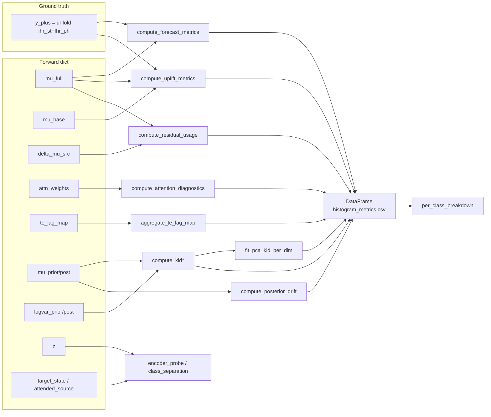

# VAE-TEB Lag-Attn v1 Testing Pipeline Architecture

## Overview

This document describes the testing pipeline for the lag-attentive
residual VAE-TEB v1 model (`SeqVaeLagAttnV1`). The pipeline evaluates
**feature-level forecast quality**, latent structure, causal lag
attention, and transfer-entropy attribution — not raw FHR
reconstruction. Every analysis respects *overall behaviour* semantics:
by default it aggregates over the entire test set and splits results by
outcome class when multiple classes are present in the data.

**Location**: `model/vae_teb_prediction/testing/`

**Model contract** (see `model/vae_teb_prediction/model/new_architecture.md`):

- **Inputs**: `y_st (B,T=300,43)`, `y_ph (B,T,44)`, `u_stream (B,T,101)`
  where `u_stream = concat(up_st, up_ph)` (or `(B,T,58)` = `up_ph` only
  when `use_up_st=False`).
- **Forward-dict outputs** (21 keys): latent moments
  `mu_prior/logvar_prior/mu_post/logvar_post (B,T,24)`, sampled
  `z (B,T,24)`, encoder states
  `target_state/source_state/decoder_state/attended_source (B,T,128)`,
  `attn_weights (B,T,M=4,L=91)`, baseline and full future feature
  forecasts `mu_base/mu_full (B,T,H_d=30,87)`, residual `delta_mu_src`,
  diagnostics `kld_per_t (B,T)` and `te_lag_map (B,T,L)`, plus
  `warmup_mask (T,)`, `mu_prior_sat_frac`, `delta_mu_sat_frac`.
- **Ground-truth forecast target**: `Y_plus (B, T−H_d=270, H_d=30, 87)`
  built via `TestRunner.build_future_target(batch)` from `fhr_st +
  fhr_ph`. Valid anchors are `t ∈ [warmup=30, T−H_d=270)`.
- **Loss mechanics**: full feature MSE + baseline MSE + closed-form KL,
  averaged over the valid anchor range.

---

## Design Principles

1. **Minimal** — least code necessary, no over-engineering.
2. **Composable** — collectors, metrics, and visualizers are standalone
   functions that analyses mix and match.
3. **Tied to the v1 forward contract** — the runner and collectors
   speak the v1 forward-dict schema directly; there is no model-agnostic
   abstraction layer.
4. **Single responsibility** — each module does one thing well.
5. **Composition over inheritance** — no deep class hierarchies.
6. **Feature-level evaluation** — every forecast metric compares
   `mu_full`/`mu_base` against the 87-channel future target trajectory
   `Y_plus`; raw FHR is only kept as a plotting context strip.
7. **Class-aware by default** — every aggregate analysis auto-detects
   the clinical classes `{1=HEALTHY, 2=ACIDOSIS, 3=HIE}` present in the
   test set and emits per-class variants alongside the pooled output.
8. **Memory-safe** — heavy collectors (`collect_predictions`,
   `collect_attention_maps`) are explicitly capped. The Step-0 probe
   captures exactly what class-separation needs (`z_mean` per sample)
   so no second loader pass is required for that analysis.

---

## Directory Structure

```text
testing/
├── __init__.py                 # Public API exports
├── base.py                     # TestRunner (model loading, batch dispatch, y_plus)
├── metrics.py                  # Pure metric functions + PCA + posterior drift
├── collectors.py               # Iteration patterns that populate DataFrames / lists
├── visualizers.py              # Matplotlib static plots + class palette
├── visualizers_interactive.py  # Plotly interactive plots
├── plot_single_samples.py      # Per-sample multi-row diagnostic figure
├── trajectory_analysis.py      # Cross-run latent trajectory analyser (legacy helper)
├── run_tests.py                # Main entry point (edit __main__ block)
├── config_lag_attn_v1.yaml     # Testing-only config (copy of training config)
├── analyses/
│   ├── __init__.py             # run_all_analyses + exports
│   ├── dataset_stats.py        # Dataset coverage statistics (model-agnostic)
│   ├── histogram.py            # Per-sample metric histograms (+ by-class variant)
│   ├── forecast_quality.py     # Feature forecast quality (+ by-class variants)
│   ├── temporal.py             # Horizon-step MSE + anchor-position MSE (+ by-class)
│   ├── uplift.py               # Baseline vs full uplift (by-class)
│   ├── residual_usage.py       # delta_mu_src activity / collapse (+ by-class)
│   ├── attention_diagnostics.py# Lag attention diagnostics (+ by-class)
│   ├── te_lag_analysis.py      # Lag-resolved TE by class
│   ├── encoder_probe.py        # Classifier probe on encoder features
│   ├── kld_pca.py              # PCA on per-dim KL trajectory + by-class
│   ├── kld_lag_diagnostics.py  # Per-sample KLD + lag-attention PDFs
│   ├── per_class_breakdown.py  # Post-processor: splits pooled CSVs per class
│   ├── latent.py               # Per-dim latent histograms + 3D PCA
│   ├── trajectory.py           # Per-patient latent trajectory + KLD
│   ├── class_separation.py     # Latent class-separation tiers (consumes probe)
│   ├── compare_trajectory_classes.py  # Cross-run trajectory comparison
│   ├── qualitative.py          # run_sample_diagnostics (per-sample PDFs)
│   ├── changepoint.py          # Ruptures-based changepoint detection
│   └── significance_tests.py   # Nonparametric stats helpers
└── TE_Calculated/
    ├── te_data_loader.py       # Load empirical IDTxl TE records
    ├── te_kld_analysis.py      # Match KLD ↔ empirical TE on (guid, epoch)
    │                           # + pca_trajectory + run_te_kld_pipeline_stratified
    ├── te_kld_comparison.py    # Statistical comparison + 6 new helpers
    ├── te_kld_visualizations.py # Plotters + 5 new class-aware plotters
    └── te_dtw.py               # DTW-based trajectory alignment
```

Removed compared to the legacy pipeline: `analyses/coherence.py`, plus
the raw-FHR `plot_reconstruction_sample`, `plot_temporal_accuracy`,
`plot_within_window_accuracy`, and all coherence plot functions from
`visualizers.py`.

---

## Module Specifications

### 1. `base.py` — TestRunner

Core dataclass that owns model loading, device management, batch
dispatch, and ground-truth construction.

**Class**: `TestRunner`

| Field | Type | Description |
|-------|------|-------------|
| `model` | `SeqVaeLagAttnV1` | Lag-attn v1 model instance |
| `device` | `torch.device` | Inference device |
| `output_dir` | `Path` | Base output directory |
| `warmup_steps` | `int` | Mirrors `model.warmup_period` (default 30) |
| `horizon` | `int` | Mirrors `model.horizon` (default 30) |
| `max_lag` | `int` | Mirrors `model.max_lag` (default 90) |
| `use_up_st` | `bool` | Mirrors `model.use_up_st` |

**Class methods**:

- `from_checkpoint(checkpoint_path, output_dir, config_path, device=None)`
  — **`config_path` is required**. Reads
  `cfg["model_config"]["VAE_model"]`, instantiates `SeqVaeLagAttnV1`,
  loads weights via `train.graph_models_utils.load_checkpoint_strict`,
  forces `attention_grad_checkpoint=False` for inference, and returns a
  runner on the target device.
- `from_trainer(trainer, output_subdir="test_results")` — build the
  runner from an existing `GraphModelVaeTebLagAttnV1Trainer` without
  reloading.

**Instance methods**:

- `inference_mode()` — context manager: `.eval()` + `torch.inference_mode()`.
- `iter_batches(loader, max_samples=None)` — yields batches with
  `fhr_st, fhr_ph, up_st, up_ph, up, fhr` moved to device (missing
  fields silently skipped). `max_samples=None` iterates the whole loader.
- `_build_u_stream(batch)` — mirrors `SeqVaeLagAttnPl._build_source_stream`
  to assemble the 101- or 58-channel source stream.
- `build_future_target(batch)` → `(B, T−H_d, H_d, 87)` — centralises
  the `unfold` formula for `Y_plus`. Used by every feature-forecast
  metric and by `plot_sample_lag_attn_diagnostic`.
- `valid_anchor_range(seq_len=None)` → `(warmup, T_valid)`.
- `forward(batch, compute_loss=False, beta=1.0, lambda_full=1.0, lambda_base=0.5)`
  — single dispatch into `SeqVaeLagAttnV1.forward(y_st, y_ph,
  u_stream)`. Optionally calls `model.compute_loss(...)` and attaches
  the resulting dict under `outputs["loss_dict"]`.
- `ensure_dir(subdir)` — create and return an output subdirectory.

### 2. `metrics.py` — Pure metric functions

Stateless, no side effects. KL mechanics are unchanged from the legacy
pipeline; the new functions all operate directly on forward-dict
tensors.

| Function | Input | Output | Purpose |
|----------|-------|--------|---------|
| `compute_reconstruction_metrics(y_true, y_pred, mask=None)` | `(B, ...)` | `{vaf, mse, snr}` each `(B,)` | Generic VAF/MSE/SNR — still useful on flattened feature tensors. |
| `compute_kld(outputs, warmup_steps=30)` | Forward dict | `(B, T, d_z)` | Closed-form KL, warmup NaN-filled. |
| `compute_kld_per_sample(outputs, warmup_steps=30)` | Forward dict | `(B,)` | `nanmean` over time + latent dims. |
| `compute_kld_per_timestep(outputs, warmup_steps=30)` | Forward dict | `(B, T)` | `nanmean` over latent dims only. |
| `compute_forecast_metrics(mu_full, y_plus, warmup, horizon)` | `(B,T,H_d,C)` + `(B,T−H_d,H_d,C)` | `{feat_mse_total, feat_mse_per_horizon, feat_r2_total, feat_mse_st, feat_mse_ph}` | Feature-forecast quality split into scattering (ch 0..42) and phase (ch 43..86). |
| `compute_uplift_metrics(mu_full, mu_base, y_plus, warmup, horizon)` | same as above | `{l_full, l_base, uplift_abs, uplift_rel}` | Baseline-vs-full uplift per sample. |
| `compute_residual_usage(delta_mu_src, mu_full, warmup, horizon)` | `(B,T,H_d,C)` | `{delta_norm, full_norm, residual_ratio, delta_norm_t}` | Source-branch activity and per-anchor trace. |
| `compute_attention_diagnostics(attn_weights, warmup)` | `(B,T,M,L)` | `{alpha_bar, argmax_lag, entropy, head_diversity, alpha_mass_by_lag}` | Lag-attention summary with NaN-filled warmup. |
| `aggregate_te_lag_map(te_lag_map, warmup)` | `(B,T,L)` | `{te_lag_mean (B,L), te_lag_argmax (B,)}` | Time-averaged TE lag signature per sample. |
| **`compute_posterior_drift(mu_prior, mu_post, warmup)`** | `(B,T,d_z)×2` | `(B,)` | Per-sample mean ‖μ_q − μ_p‖² over valid t — alternative TE surrogate independent of variance heads. |
| **`fit_pca_kld_per_dim(kld_per_dim_t, n_components=3)`** | `(N,T,d_z)` | `(PCA, projected, ev_ratio)` | Fits sklearn PCA on flattened per-time per-dim KL. NaN-safe. |
| **`project_kld_per_dim(kld_per_dim_t, pca_model)`** | `(N,T,d_z) + PCA` | `(N,T,n_components)` | Projects new trajectories through a previously-fit PCA. |
| `preprocess_latent`, `reduce_latent_dimensionality`, `compute_trajectory_*` | trajectory-level helpers (unchanged from legacy) | — | Reused by `trajectory.py` and `encoder_probe.py`. |

**KLD formula** (closed form, unchanged):

```text
KL(q || p) = 0.5 * (logvar_p − logvar_q
                    + (exp(logvar_q) + (μ_q − μ_p)²) / exp(logvar_p)
                    − 1)
```

### 3. `collectors.py` — Data collection patterns

Iteration patterns that compose `TestRunner` + metric functions.
Every collector lives under `runner.inference_mode()` and iterates via
`runner.iter_batches(...)`.

| Function | Returns | Description |
|----------|---------|-------------|
| `collect_metrics(runner, loader, max_samples=None, *, pca_components=3, pca_output_dir=None)` | `pd.DataFrame` | **Extended** columns: `guid, epoch, label, feat_mse_total, feat_mse_st, feat_mse_ph, feat_r2_total, base_mse_total, uplift_abs, uplift_rel, residual_ratio, delta_src_norm, kld_mean, kld` plus the TE surrogates `posterior_drift_norm, attention_entropy_mean, attention_concentration_mean, te_lag_peak, te_lag_total_mass, kld_dim_0..23, kld_pc1, kld_pc2, kld_pc3`. The `kld` column is an alias of `kld_mean` for `TE_Calculated` compatibility. Also writes `pca_kld/ev_ratio.json` + `components.npy` + `mean.npy`. |
| `collect_latents(runner, loader, max_samples=None)` | `np.ndarray (N*T, d_z)` | Flattened per-sample latent trajectories. |
| `collect_predictions(runner, loader, max_samples=None)` | `List[Dict]` | ⚠️ **Heavy** — ~13 MB per sample. Retains full `mu_full, mu_base, delta_src, y_plus, z, attn, te_lag, kld_t, kld_per_dim, fhr, up` plus metadata and a `metrics` sub-dict. Consumed by `plot_sample_lag_attn_diagnostic`. **Must be capped by the caller.** |
| `collect_kld_trajectory(runner, loader, max_samples=None, *, pca_model=None)` | `pd.DataFrame` | Long-format per-(sample, timestep) rows: `[guid, epoch, hours_before, label, timestep, kld_mean, latent_0 … latent_{d_z-1}]`. When `pca_model` is provided, adds `kld_pc1_t, kld_pc2_t, kld_pc3_t` columns. |
| `collect_attention_maps(runner, loader, max_samples=None)` | `List[Dict]` | ⚠️ **Moderate** — ~750 KB per sample. Per-sample `{guid, epoch, label, alpha_bar (T,L), argmax_lag (T,), entropy (T,M), head_diversity (T,), alpha_mass_by_lag (L,)}`. |
| `collect_te_lag_maps(runner, loader, max_samples=None)` | `pd.DataFrame` | One row per sample: `[guid, epoch, label, te_lag_mean_0 … te_lag_mean_{L-1}, te_lag_argmax]`. |
| `collect_forecast_errors_per_horizon(runner, loader, max_samples=None)` | `pd.DataFrame` | Long-format per-(sample, horizon step): `[guid, epoch, label, h, mse_step, mse_st, mse_ph]`. |

Private helpers: `_extract_guid`, `_extract_epoch`, `_extract_label` are
exported from the module for reuse by analyses that need the same
metadata extraction logic. `_extract_label` reads the first non-zero
value of `batch.target` (which encodes `class_id × weight`) and returns
`int(...)` — valid class IDs are `{1, 2, 3}`; pad-only segments return
`None`.

### 4. `visualizers.py` — Static plots (Matplotlib)

Pure functions: take data, save a figure. All plots obey the
project-wide style palette and use `_style_axes`, `_add_colorbar`,
`_tighten_xaxis`, `_format_stats_box` internally.

**Class palette & helpers (canonical source)**:

```python
CLASS_NAMES  = {1: "HEALTHY", 2: "ACIDOSIS", 3: "HIE"}
CLASS_COLORS = {1: COLOR_BLUE, 2: COLOR_ORANGE, 3: COLOR_VERMILLION}

def unique_labels_in(values) -> list[int]  # returns sorted class ids present
def class_label_for(label_id: int) -> str  # e.g. "HEALTHY"
def class_color_for(label_id: int, fallback=COLOR_GRAY) -> str
```

These helpers are imported by every class-aware analysis.

**Lag-attn v1 feature-forecast primitives**:

| Function | Output file | Purpose |
|----------|-------------|---------|
| `plot_feature_forecast_heatmap(mu_full_avg, y_plus_avg, warmup, out_path, fhr_st_end=43)` | PDF | 3-row `(C, T)` heatmap (prediction / truth / residual) with scattering↔phase separator. |
| `plot_forecast_error_by_horizon(df, out_path)` | PDF | Median + IQR ribbon of `mse_step` vs horizon step `h ∈ [0, H_d)` with scattering / phase overlays. |
| `plot_uplift_histogram(df, out_path)` | PDF | Overlaid histograms of `l_full` / `l_base` + second panel for `uplift_rel`. |
| `plot_residual_usage_trace(trace_df, out_path)` | PDF | Per-anchor `delta_norm_t` median + IQR ribbon. |
| `plot_lag_attention_heatmap(alpha_bar, argmax_lag, warmup, out_path)` | PDF | `(T, L)` attention imshow with argmax-lag overlay and warmup shading. |
| `plot_te_lag_distribution(te_lag_mean, labels, out_path, class_names=…)` | PDF | Per-class mean lag profile with bootstrap 95% CI. |
| `plot_attention_mass_by_lag(mass_df, out_path, fs=4, decim=16)` | PDF | Grouped bar chart of mean attention mass in coarse lag bins (0-10s, 10-30s, 30-60s, 60-120s, 120-360s, ≥360s). |
| `plot_metric_histograms(df, output_dir, ...)` | PDF | Pooled single-column histogram panel (v1 metrics or legacy fallback). |
| **`plot_metric_histograms_by_class(df, output_dir, ...)`** | PDF | Grid of metric × class subplots when ≤4 classes; overlaid densities when more. Falls back to the pooled plot when <2 classes present. |
| `plot_latent_distributions(latents, output_dir)` | `latent_distributions.png` |
| `plot_kld_trajectory`, `plot_kld_guid_trajectory`, `plot_kld_trajectory_3d` | KLD trajectory plots |
| `plot_latent_trajectory_2d/3d`, `plot_guid_absolute_trajectory`, `plot_guid_trajectory_3d` | Latent trajectory plots |
| `plot_latent_changepoints_with_raw` | Changepoints overlaid on raw FHR strip |
| `plot_segment_statistics`, `plot_trajectory_comparison`, `plot_recurrence` | Trajectory shape / comparison plots |
| `plot_feature_boxplots`, `plot_class_*`, `plot_dimension_significance_heatmap`, `plot_distributional_distances`, `plot_class_separation_scatter_2d`, `plot_per_dimension_boxplots`, `plot_centroid_distance_heatmap`, `plot_distance_to_centroid_violins`, `plot_temporal_class_separation` | Class separation plots |

### 5. `visualizers_interactive.py` — Interactive plots (Plotly)

All functions save HTML with `include_plotlyjs="cdn"`.

| Function | Description |
|----------|-------------|
| `plot_metrics_comparison_interactive(df, output_path)` | Scatter matrix; default columns `[feat_mse_total, uplift_rel, residual_ratio, kld_mean]` with legacy `[vaf, mse, snr, kld]` fallback. |
| `plot_kld_trajectory_interactive(df, output_path)` | KLD-vs-time with hover. |
| `plot_latent_space_3d(latents, labels, output_path)` | 3D PCA scatter coloured by class. |
| `plot_latent_trajectory_3d_interactive`, `plot_guid_trajectory_3d_interactive`, `plot_kld_trajectory_3d_interactive`, `plot_fhr_timeline`, `plot_fhr_up_timeline`, `plot_trajectory_animation`, `plot_trajectory_comparison_interactive`, `plot_class_latent_density_interactive` | Various latent/FHR timelines and trajectory plots. |

### 6. `plot_single_samples.py` — Per-sample diagnostic figure

Single public function:

```python
def plot_sample_lag_attn_diagnostic(
    sample: Dict[str, Any],
    out_path: Path,
    warmup: int,
    horizon: int,
    *,
    fhr_st_end: int = 43,
    fs_raw: float = 4.0,
) -> None
```

Produces an 8-row PDF with raw FHR/UP, averaged `mu_full` / `y_plus` /
residual heatmaps, latent `z`, per-dim KL, lag attention, and TE lag
attribution. All rows share the same physical time axis.

### 7. `analyses/` — High-level analysis functions

Every `run_*` function follows the same shape:

```python
def run_xxx(runner, loader, max_samples=..., output_dir=None) -> Dict[str, Any]:
    if output_dir is None:
        output_dir = runner.ensure_dir("xxx")
    # collect, compute, save CSVs, emit plots, detect classes,
    # emit per-class variants when >= 2 present
    return {"summary": ...}
```

Every analysis that produces aggregate metrics auto-detects the
clinical classes present via `unique_labels_in(df["label"])` and emits
`*_by_class.pdf` variants alongside the pooled output.

#### `dataset_stats.py`

Model-agnostic. Reports `n_samples`, `n_guids`, epochs-per-GUID stats,
time distribution, label distributions, and CS × BG breakdowns.

#### `histogram.py`

```python
def run_histogram_analysis(runner, loader, max_samples=None, *,
                           save_data=True, dataset_identifier=None) -> pd.DataFrame
```

Drives `collect_metrics` → `plot_metric_histograms` → CSV. When
`≥ 2` classes are found, also emits `metrics_histograms_by_class.pdf`.
The CSV retains a `kld` column aliased to `kld_mean` so
`TE_Calculated/te_kld_analysis.py::load_kld_from_metrics_csv` works.

#### `forecast_quality.py`

```python
def run_forecast_quality_analysis(runner, loader, max_samples=500, output_dir=None)
```

Outputs `forecast_per_sample.csv`, `forecast_per_horizon.csv`, the
pooled `forecast_error_by_horizon.pdf`, and the per-class variants
`forecast_error_by_horizon_by_class.pdf`,
`feat_mse_total_hist_by_class.pdf`, `feat_r2_total_hist_by_class.pdf`.

#### `temporal.py`

```python
def run_horizon_error_profile(runner, loader, max_samples=200, output_dir=None) -> pd.DataFrame
def run_anchor_position_analysis(runner, loader, max_samples=200, output_dir=None) -> pd.DataFrame
```

Horizon profile answers "how fast does the forecast decay?"; anchor
position answers "does the model trust its forecast more at the start
or end of the 20-minute window?". Emits pooled `horizon_error.pdf` /
`anchor_error.pdf` plus per-class overlays `horizon_error_by_class.pdf`
and `anchor_error_by_class.pdf`.

#### `uplift.py`

```python
def run_uplift_analysis(runner, loader, max_samples=500, output_dir=None)
```

Outputs `per_sample.csv`, `uplift_histogram.pdf`,
`uplift_rel_by_class.pdf`. Summary: `{mean_uplift_rel,
frac_positive_uplift, by_class, n_samples}`.

#### `residual_usage.py`

```python
def run_residual_usage_analysis(runner, loader, max_samples=500,
                                output_dir=None, collapse_threshold=0.01)
```

Outputs `per_sample.csv`, `per_sample_trace.csv`,
`residual_ratio_hist.pdf`, `delta_norm_trace.pdf`, plus
`residual_ratio_hist_by_class.pdf` and `delta_norm_trace_by_class.pdf`.
**A trained checkpoint with `mean_residual_ratio ≈ 0` is a red flag**
that the source/latent branch has been turned off.

#### `attention_diagnostics.py`

```python
def run_attention_diagnostics(runner, loader, max_samples=200,
                              output_dir=None, n_heatmap_examples=6)
```

Outputs per-sample CSVs (`argmax_lag_per_sample.csv`,
`alpha_mass_by_lag.csv`, `head_entropy_summary.csv`), per-sample
heatmaps, pooled histograms, and per-class variants
`argmax_lag_histogram_by_class.pdf`,
`attention_mass_by_lag_by_class.pdf`.

#### `te_lag_analysis.py`

```python
def run_te_lag_class_analysis(runner, loader, max_samples=1000, output_dir=None)
```

Aggregates `te_lag_map` over time, groups by outcome class, runs
per-lag Kruskal-Wallis test, bootstraps 95% CI.

#### `encoder_probe.py`

```python
def run_encoder_probe(runner, loader, max_samples=2000, output_dir=None)
```

Computes three time-averaged feature vectors per sample —
`z_mean (d_z=24)`, `target_state_mean (128)`,
`attended_source_mean (128)` — and evaluates class separability via
`compute_linear_separability` and `compute_cluster_quality_metrics`
from `class_separation.py`.

#### `kld_pca.py` **(new)**

```python
def run_kld_pca_analysis(runner, loader, max_samples=500, output_dir=None)
```

Fits / loads PCA on per-dim KL trajectory, emits:
- `kld_pca/scree.pdf` — per-component and cumulative explained variance.
- `kld_pca/pc12_scatter_by_class.pdf` — per-sample PC1×PC2 scatter coloured by class.
- `kld_pca/pc_trajectories_overlay.pdf` — per-class mean PC trajectory vs time with SEM ribbon.

Reuses the `pca_kld/{ev_ratio.json, components.npy, mean.npy}` artifacts
already written by `collect_metrics` (no refit).

#### `kld_lag_diagnostics.py`

Per-sample diagnostic PDFs showing KL per-dim heatmap aligned with
lag-attention trace. Capped by `analysis_samples` (per-sample
diagnostic, not aggregate).

#### `per_class_breakdown.py` **(new, post-processor)**

```python
def run_per_class_breakdown(output_root: Path, *, parts=None) -> Dict[str, Any]
```

Pure post-processor: reads existing pooled CSVs
(`histograms/histogram_metrics.csv`,
`forecast_quality/forecast_per_horizon.csv`,
`residual_usage/per_sample.csv`, `attention/argmax_lag_per_sample.csv`,
`uplift/per_sample.csv`) and writes per-class subfolders
`per_class_breakdown/class_healthy/`, `class_acidosis/`, `class_hie/`
plus a `class_overlay/` folder with cross-class overlay plots. Runs
after all other analyses so the input CSVs exist.

#### `latent.py`

```python
def run_latent_distribution_analysis(runner, loader, max_samples=500) -> np.ndarray
def run_latent_space_visualization(runner, loader, max_samples=500) -> np.ndarray
def run_latent_interpolation(runner, loader, num_pairs=5, num_steps=10) -> List[Dict]
```

`run_latent_interpolation` is a **no-op stub** under v1 — raw-signal
interpolation is not supported because v1 does not reconstruct raw FHR.

#### `trajectory.py` + `trajectory_analysis.py`

```python
class TrajectoryAnalyzer:
    def run(skip_dashboards: bool = False) -> Dict[str, Any]
def run_trajectory_analysis(runner, loader, ...)  -> Dict[str, Any]
```

Operates on per-patient latent trajectories (`z`) and per-timestep KLD
(`outputs["kld_per_t"]`). Requires a GUID-based DataLoader.

#### `class_separation.py` **(now probe-driven)**

Four-tier latent class separability analysis:

- Tier 1 — clustering quality (Silhouette, DB, Calinski-Harabasz).
- Tier 2 — cohesion/separation (Fisher ratio, centroid distances).
- Tier 3 — linear separability (LogReg + LDA, stratified K-fold CV).
- Tier 4 — discriminative center-loss effectiveness. Skips for v1 checkpoints.

**Crucially, this step no longer iterates the loader.** The Step 0
probe (see §8) captures the per-sample `z_mean` and `(label, src_file,
epoch, guid)` in a single loader pass. Class separation consumes that
in-memory data directly. This is what makes per-class analysis
deterministic even when later analyses poison their own iterations.

#### `qualitative.py`

```python
def run_sample_diagnostics(runner, loader, max_samples=10, output_dir=None)
```

Iterates `collect_predictions` (capped) and emits per-sample PDFs under
`samples_diag/`.

#### `changepoint.py`, `significance_tests.py`, `compare_trajectory_classes.py`

Unchanged from legacy.

#### `analyses/__init__.py`

Registers every analysis + `run_all_analyses`. Each analysis runs under
a shared `_safe(name, fn, ...)` wrapper so a single failure does not
block the rest. Also registers `run_kld_pca_analysis` and
`run_per_class_breakdown`.

### 8. `run_tests.py` — Main entry point + Step 0 probe

```python
def run_full_test_pipeline(
    checkpoint_path: Optional[str],
    data_path: Optional[Union[str, List[str]]],
    output_dir: Optional[str] = None,
    stats_path: Optional[str] = None,
    config_path: Optional[Union[str, Path]] = None,   # REQUIRED
    device: Optional[str] = None,
    max_samples: Optional[int] = None,
    batch_size: Optional[int] = None,
    num_workers: Optional[int] = None,     # FORCED to 0 internally
    skip_trajectory: bool = False,
    skip_attention: bool = False,
    skip_forecast_heatmaps: bool = False,
    skip_kld_pca: bool = False,
    skip_per_class_breakdown: bool = False,
    skip_interactive: bool = False,
    analysis_samples: int = 10,
    min_epochs_per_guid: int = 10,
    max_guids: Optional[int] = None,
    normalize_fields: Optional[Sequence[str]] = None,
    dataset_kwargs: Optional[Dict[str, Any]] = None,
) -> Dict[str, Any]
```

#### Sample-cap policy (`_cap` helper)

`max_samples=None` **= process every sample in the test set**. The
pipeline defines a sentinel constant `_FULL_DATASET_CAP = 10_000_000`
used whenever the user passes `None`, and three explicit sub-caps for
the memory-heavy collectors:

```python
aggregate_cap    = max_samples or _FULL_DATASET_CAP   # all lightweight analyses
HEAVY_PRED_CAP   = min(aggregate_cap, 2000)           # collect_predictions consumers
HEAVY_ATTN_CAP   = min(aggregate_cap, 2000)           # collect_attention_maps consumers
PROBE_CAP        = min(aggregate_cap, 5000)           # linear probe / latent stats
```

| Analysis | Cap used | Rationale |
|---|---|---|
| `dataset_stats` | no cap (model-agnostic) | cheap, iterates raw loader |
| `histogram`, `forecast_quality`, `horizon_error`, `anchor_error`, `uplift`, `residual_usage`, `te_lag`, `kld_pca` | `aggregate_cap` | light per-sample memory; we want full coverage |
| `attention` | `HEAVY_ATTN_CAP=2000` | `(T,L)+(T,M)+(L,)` per sample ≈ 750 KB |
| `encoder_probe` | `PROBE_CAP=5000` | linear probe stable at 5K |
| `latent_distribution` | `PROBE_CAP=5000` | per-dim histograms stable at 5K |
| `latent_space` | `HEAVY_PRED_CAP=2000` | calls `collect_predictions` |
| `sample_diagnostics`, `kld_lag_diagnostics` | `analysis_samples` | per-sample PDFs, intentionally bounded |
| `class_separation` | — (reads probe data) | zero additional loader passes |
| `per_class_breakdown` | — (post-processor) | reads existing CSVs |

#### DataLoader construction (important)

`_create_dataloader` **forces `num_workers=0`** (logs a warning when
the config requested more). Rationale: `create_optimized_dataloader`
in `hdf5_dataset/hdf5_dataset.py:1047` hard-codes
`persistent_workers=True` whenever `num_workers > 0`. Combined with
spawn multiprocessing and the multi-file HDF5 dataset, PyTorch workers
enter a degraded state after the first full loader iteration: subsequent
iterations silently truncate to the first file's index range (~1000
samples), producing the infamous "Only 1 class(es) found" symptom.
`num_workers=0` is slower but deterministic and correct.

`_create_guid_dataloader` applies the same override (`num_workers=0,
persistent_workers=False`).

#### Step 0 — dataloader probe + one-pass z_mean capture

Before any analysis runs, `run_full_test_pipeline` performs a single
loader iteration that:

1. Logs the full sample count (`len(loader.dataset)`).
2. Tallies **per-file counts** via the `source_file_basename` attribute
   that `HDF5Dataset.__getitem__` stamps on every sample
   (`hdf5_dataset.py:904`).
3. Tallies **per-label counts** via `_extract_label`.
4. Records a **raw-target first-non-zero histogram** — catches truncation
   (e.g. `int(0.5)→0`) and confirms that `target` really does contain
   the expected `{1.0, 2.0, 3.0}` values.
5. Runs **`runner.forward(batch)`** on every batch and stores
   `z_mean = z.mean(dim=1) (B, d_z)` per sample (~96 bytes).
6. Persists `<output_dir>/loader_probe.json` with the probe summary.

The probe stores:

```python
probe = {
    "n_samples_in_dataset": int,
    "n_batches": int,
    "n_samples_seen": int,
    "per_file_counts": {filename: count, ...},
    "per_label_counts": {label_int_or_None: count, ...},
    "raw_target_first_nonzero_hist": {rounded_val: count, ...},
    "sample_index": [(label, src_file, epoch, guid), ...],
}
probe_z_means: List[np.ndarray (d_z,)]
```

Two hard-fail signals fire as `ERROR` logs immediately if they trigger,
before any analysis runs:

- `"loader probe: only X HDF5 file yielded samples (config lists multiple)"`.
- `"loader probe: only X canonical clinical class(es) {1,2,3} found in target"`.

Class separation reads `probe["sample_index"]` + `probe_z_means`
directly — it does **not** iterate the loader.

#### Run order (as executed in `run_full_test_pipeline`)

0. **`loader_probe` (Step 0)** — single loader pass, per-file/per-label counts, `z_mean` capture.
1. `dataset_stats`
2. `histogram`
3. `forecast_quality`
4. `horizon_error`
5. `anchor_error`
6. `uplift`
7. `residual_usage`
8. `attention` *(gated by `skip_attention`)*
9. `te_lag` *(gated by `skip_attention`)*
10. `encoder_probe`
11. `latent_distribution`
12. `latent_space`
13. **`class_separation`** *(consumes probe data, no loader pass)*
14. `trajectory` *(gated by `skip_trajectory`, uses GUID loader)*
15. `sample_diagnostics` *(gated by `skip_forecast_heatmaps`)*
16. `kld_lag_diagnostics` *(gated by `skip_forecast_heatmaps`)*
17. `kld_pca` *(gated by `skip_kld_pca`)*
18. `per_class_breakdown` *(gated by `skip_per_class_breakdown`, post-processor)*
19. `metrics_comparison_interactive` *(gated by `skip_interactive`)*
20. `_save_summary` → `test_summary.json`

Both `stat_path` and `stats_path` spellings of the stats HDF5 path are
accepted (the v1 config uses `stat_path`).

The `__main__` block at the bottom of `run_tests.py` is the canonical
entry point — edit `CHECKPOINT`, `DATA`, `STATS`, `CONFIG`, and `OUTPUT`
constants and run `python -m model.vae_teb_prediction.testing.run_tests`.

```python
def quick_test(checkpoint_path, data_path, output_dir="quick_test_results",
               n_samples=100, config_path=..., ...) -> Dict[str, Any]
```

is available as a fast-path that skips slow analyses.

### 9. `TE_Calculated/` — Transfer entropy comparison

| File | Contents |
|------|----------|
| `te_data_loader.py` | IDTxl CSV loader, `fuzzy_time_match` ±300s matching. |
| `te_kld_analysis.py` | `load_kld_from_metrics_csv` (now carries through `kld_pc*`, `posterior_drift_norm`, `attention_entropy_mean`, `te_lag_total_mass`, `delta_src_norm`, `label`), `merge_te_kld`, correlation + bootstrap + concordance helpers, **new `pca_trajectory(df, mode='pc1'|'l2_top3'|'sum_top3')`**, **new `run_te_kld_pipeline_stratified(merged_df, output_dir, pipeline_fn, ...)`** that runs an existing pipeline once per class subset into `te_kld_class_healthy/`, `te_kld_class_acidosis/`, `te_kld_class_hie/`, plus pooled `te_kld_class_all/`. |
| `te_kld_comparison.py` | `run_comparison(...)` orchestrator plus **six new helpers**: `cross_correlation_per_guid`, `bland_altman`, `roc_auc_high_te`, `per_guid_regression`, `conditional_ks_by_quartile`, `per_guid_r2`, and `run_pca_vs_dims_comparison(merged, output_dir)` that ranks every TE surrogate by Pearson / Spearman / Kendall / MI against `ite_valid`. |
| `te_kld_visualizations.py` | Pooled scatter, per-GUID histograms, DTW overlays, correlation heatmaps, **five new plotters**: `plot_xcorr_lag_hist`, `plot_bland_altman`, `plot_roc_curve`, `plot_per_guid_slope_hist`, `plot_conditional_ks_grid`. |
| `te_dtw.py` | Per-GUID DTW alignment (Sakoe-Chiba band). |

`load_kld_from_metrics_csv` requires `kld` (mandatory) and silently
pulls through all v1 TE-surrogate columns if present.

---

## Usage Examples

### Full pipeline via config

```python
from testing.run_tests import run_full_test_pipeline

results = run_full_test_pipeline(
    checkpoint_path=None,          # pulled from config.model_config.core_model_checkpoint
    data_path=None,                # pulled from config.dataset_config.vae_test_datasets
    output_dir=None,               # timestamped folder under out_dir_base
    config_path="model/vae_teb_prediction/testing/config_lag_attn_v1.yaml",
    max_samples=None,              # process everything
    analysis_samples=10,           # per-sample diagnostic PDFs
)

hist = results["histogram"]
print(f"feat_mse_total: {hist['feat_mse_total'].mean():.6f}")
print(f"uplift_rel:     {hist['uplift_rel'].mean():.4f}")
print(f"kld_mean:       {hist['kld_mean'].mean():.4f}")

probe = results["loader_probe"]
print(f"Files seen:  {probe['per_file_counts']}")
print(f"Classes:     {probe['per_label_counts']}")
```

### Quick smoke test (100 samples, slow analyses off)

```python
from testing.run_tests import quick_test

results = quick_test(
    checkpoint_path=None,
    data_path=None,
    n_samples=100,
    config_path="model/vae_teb_prediction/testing/config_lag_attn_v1.yaml",
)
```

### Manual composition

```python
from testing import TestRunner
from testing.analyses import (
    run_histogram_analysis,
    run_forecast_quality_analysis,
    run_attention_diagnostics,
    run_trajectory_analysis,
    run_kld_pca_analysis,
    run_per_class_breakdown,
)
from hdf5_dataset.hdf5_dataset import (
    create_optimized_dataloader,
    build_guid_filtered_dataloader,
)

runner = TestRunner.from_checkpoint(
    checkpoint_path="checkpoints/best.ckpt",
    output_dir="results/",
    config_path="model/vae_teb_prediction/testing/config_lag_attn_v1.yaml",
)

# NOTE: use num_workers=0 when iterating the same loader multiple times.
standard_loader = create_optimized_dataloader([...], batch_size=64, num_workers=0)
_, guid_loader = build_guid_filtered_dataloader([...], min_samples=10,
                                                 dataloader_overrides={"num_workers": 0})

run_histogram_analysis(runner, standard_loader, max_samples=None)
run_forecast_quality_analysis(runner, standard_loader, max_samples=None)
run_attention_diagnostics(runner, standard_loader, max_samples=2000)
run_kld_pca_analysis(runner, standard_loader, max_samples=None)
run_trajectory_analysis(runner, guid_loader, time_range_hours=12.0)
run_per_class_breakdown(runner.output_dir)
```

---

## Key Dependencies

| Module | External dependencies |
|--------|----------------------|
| `base.py` | `train.graph_models_utils.load_checkpoint_strict`, `model.vae_teb_prediction.model.vae_teb_lag_attn_v1.SeqVaeLagAttnV1`, `yaml` |
| `metrics.py` | `torch`, `scipy.signal` (Savitzky-Golay), `sklearn.decomposition.PCA`, `sklearn.manifold` (t-SNE/Isomap), `umap-learn` (optional) |
| `collectors.py` | `pandas`, `numpy`, `torch`, `sklearn.decomposition.PCA` (via metrics) |
| `visualizers.py` | `matplotlib`, `scipy.stats` |
| `visualizers_interactive.py` | `plotly`, `pillow` (for GIFs) |
| `plot_single_samples.py` | `matplotlib`, helpers imported from `plotting_callback_lag_attn_v1` |
| `analyses/changepoint.py` | `ruptures` (optional, gradient fallback) |
| `analyses/trajectory.py` | `pandas`, `scipy`, `sklearn`, `umap-learn` (optional) |
| `run_tests.py` | `hdf5_dataset.hdf5_dataset.create_optimized_dataloader`, `build_guid_filtered_dataloader` |

Optional: `ruptures`, `umap-learn`, `pillow`.

---

## Data Flow

```text
┌──────────────┐    ┌─────────────┐    ┌──────────────┐    ┌──────────────┐
│ Checkpoint   │───▶│ TestRunner  │───▶│  Collectors  │───▶│  Visualizers │
│ + YAML config│    │             │    │              │    │              │
│ + HDF5 data  │    │ - build_    │    │ - metrics    │    │ - PDF/PNG    │
└──────────────┘    │   model     │    │ - preds      │    │ - HTML       │
                    │ - load_     │    │ - latents    │    │              │
                    │   strict    │    │ - attention  │    └──────┬───────┘
                    │ - forward   │    │ - te_lag     │           │
                    │ - y_plus    │    │ - horizon    │           ▼
                    └──────┬──────┘    └──────┬───────┘     ┌──────────────┐
                           │ Step 0 probe     │             │   Analyses   │
                           │ (z_mean capture) │             │   run_*      │
                           ├──────────────────┘             │              │
                           │                                │ - histogram  │
                           ▼                                │ - forecast   │
                    ┌──────────────┐                        │ - uplift     │
                    │ probe data   │                        │ - residual   │
                    │ sample_index │────────────────────────│ - attention  │
                    │ probe_z_mean │                        │ - te_lag     │
                    └──────────────┘                        │ - encoder_pr │
                                                            │ - kld_pca    │
                                                            │ - latent     │
                                                            │ - class_sep  │
                                                            │ - trajectory │
                                                            │ - samples    │
                                                            │ - per_class_ │
                                                            │   breakdown  │
                                                            └──────────────┘
```

---

## Output Directory Structure

```text
output_dir/
├── loader_probe.json                           # Step 0 probe summary
├── dataset_stats/                              # Dataset coverage
│   ├── dataset_statistics.png
│   ├── time_distribution_detailed.png
│   ├── epochs_per_guid_ranked.png
│   ├── label_statistics.png
│   ├── dataset_statistics.json
│   └── *.csv
├── histograms/
│   ├── histogram_metrics.csv                   # Also carries `kld` alias + all v1 TE surrogates
│   ├── histogram_metadata.json
│   ├── metrics_histograms.pdf
│   └── metrics_histograms_by_class.pdf
├── pca_kld/                                    # Written by collect_metrics (v1)
│   ├── ev_ratio.json
│   ├── components.npy
│   └── mean.npy
├── forecast_quality/
│   ├── forecast_per_sample.csv
│   ├── forecast_per_horizon.csv
│   ├── forecast_error_by_horizon.pdf
│   ├── forecast_error_by_horizon_by_class.pdf
│   ├── feat_mse_total_hist.pdf
│   ├── feat_mse_total_hist_by_class.pdf
│   ├── feat_r2_total_hist.pdf
│   └── feat_r2_total_hist_by_class.pdf
├── horizon_error/
│   ├── horizon_error.csv
│   ├── forecast_errors_per_horizon.csv
│   ├── horizon_error.pdf
│   └── horizon_error_by_class.pdf
├── anchor_error/
│   ├── anchor_error.csv
│   ├── anchor_error.pdf
│   └── anchor_error_by_class.pdf
├── uplift/
│   ├── per_sample.csv
│   ├── uplift_histogram.pdf
│   └── uplift_rel_by_class.pdf
├── residual_usage/
│   ├── per_sample.csv
│   ├── per_sample_trace.csv
│   ├── residual_ratio_hist.pdf
│   ├── residual_ratio_hist_by_class.pdf
│   ├── delta_norm_trace.pdf
│   └── delta_norm_trace_by_class.pdf
├── attention/
│   ├── argmax_lag_per_sample.csv
│   ├── alpha_mass_by_lag.csv
│   ├── head_entropy_summary.csv
│   ├── attention_heatmap_<guid>.pdf
│   ├── argmax_lag_histogram.pdf
│   ├── argmax_lag_histogram_by_class.pdf
│   ├── attention_mass_by_lag_bars.pdf
│   ├── attention_mass_by_lag_by_class.pdf
│   └── head_diversity_hist.pdf
├── te_lag/
│   ├── te_lag_mean_per_sample.csv
│   ├── te_lag_by_class.csv
│   ├── significance.csv
│   └── te_lag_by_class.pdf
├── encoder_probe/
│   ├── feature_matrix.csv
│   ├── probe_results.csv
│   └── encoder_probe_separation_bar.pdf
├── kld_pca/
│   ├── scree.pdf
│   ├── pc12_scatter_by_class.pdf
│   ├── pc_trajectories_overlay.pdf
│   └── kld_pc_trajectory.csv
├── latent_distribution/
│   └── latent_distributions.png
├── latent_space/
│   └── latent_space_3d.html
├── class_separation/
│   ├── class_separation_report.json
│   └── *.png / *.csv
├── trajectory/
│   ├── plots/
│   ├── dashboards/
│   ├── latent_trajectories_stitched.csv
│   ├── kld_trajectory_raw.csv
│   ├── kld_trajectory_aggregated.csv
│   ├── guid_trajectory_features.csv
│   └── summary.json
├── samples_diag/
│   ├── <guid>_<epoch>.pdf
│   └── sample_metrics.csv
├── kld_lag_diag/
│   └── <guid>_<epoch>.pdf
├── per_class_breakdown/
│   ├── class_healthy/
│   │   ├── histogram_metrics.csv
│   │   ├── metrics_histograms.pdf
│   │   ├── forecast_per_horizon.csv
│   │   ├── forecast_error_by_horizon.pdf
│   │   ├── residual_per_sample.csv
│   │   ├── delta_norm_trace.pdf
│   │   └── ...
│   ├── class_acidosis/...
│   ├── class_hie/...
│   └── class_overlay/
│       ├── feat_mse_total_overlay.pdf
│       ├── forecast_mse_step_overlay.pdf
│       ├── residual_residual_ratio_overlay.pdf
│       └── ...
├── metrics_comparison.html
└── test_summary.json
```

---

## Mermaid Diagram — System Architecture

```mermaid
flowchart TB
    subgraph Entry["Entry Points"]
        A1[run_full_test_pipeline]
        A2[TestRunner.from_checkpoint]
        A3[TestRunner.from_trainer]
    end

    subgraph Core["Core Layer"]
        B[TestRunner]
        BY[build_future_target → y_plus]
    end

    subgraph Data["Data Layer (num_workers=0)"]
        C1[Standard DataLoader]
        C2[GUID DataLoader]
    end

    subgraph Step0["Step 0 — Probe"]
        P1[Per-file + per-label counts]
        P2[z_mean capture]
        P3[sample_index list]
        P4[loader_probe.json]
    end

    subgraph Metrics["Metrics Layer"]
        D1[compute_forecast_metrics]
        D2[compute_uplift_metrics]
        D3[compute_residual_usage]
        D4[compute_attention_diagnostics]
        D5[aggregate_te_lag_map]
        D6[compute_kld*]
        D7[compute_posterior_drift]
        D8[fit_pca_kld_per_dim]
    end

    subgraph Collectors["Collectors Layer"]
        E1[collect_metrics]
        E2[collect_predictions]
        E3[collect_latents]
        E4[collect_attention_maps]
        E5[collect_te_lag_maps]
        E6[collect_forecast_errors_per_horizon]
        E7[collect_kld_trajectory]
    end

    subgraph Analyses["Analyses"]
        G1[histogram]
        G2[forecast_quality]
        G3[temporal horizon + anchor]
        G4[uplift]
        G5[residual_usage]
        G6[attention_diagnostics]
        G7[te_lag_analysis]
        G8[encoder_probe]
        G9[latent + class_separation]
        G10[trajectory]
        G11[sample_diagnostics + kld_lag_diag]
        G12[kld_pca]
        G13[per_class_breakdown]
    end

    subgraph Viz["Visualizers"]
        F1[visualizers.py]
        F2[visualizers_interactive.py]
        F3[plot_single_samples]
    end

    A1 --> B
    A2 --> B
    A3 --> B
    B --> BY
    B --> C1
    B --> C2
    C1 --> P1 & P2 & P3 & P4
    P2 & P3 --> G9
    C1 --> E1 & E2 & E3 & E4 & E5 & E6 & E7
    C2 --> G10
    E1 & E2 --> D1 & D2 & D3 & D6 & D7 & D8
    E4 --> D4
    E5 --> D5
    E1 --> G1 & G4 & G5 & G12
    E2 --> G2 & G3 & G11
    E4 --> G6
    E5 --> G7
    E3 --> G8 & G9
    G1 & G2 & G3 & G4 & G5 & G6 & G7 & G8 & G9 & G10 & G12 --> F1
    G1 --> F2
    G11 --> F3
    G1 & G2 & G3 & G4 & G5 & G6 --> G13
```



---

## Mermaid — Metric Pipeline



---

## Preserved consumers (backward compatibility)

- `histograms/histogram_metrics.csv` still carries `guid`, `epoch`, and
  a `kld` column (aliased to `kld_mean`), so
  `TE_Calculated/te_kld_analysis.py::load_kld_from_metrics_csv` keeps
  working unchanged. New TE-surrogate columns are additive.
- `trajectory/kld_trajectory.csv` (from `collect_kld_trajectory`)
  retains `[guid, epoch, hours_before, label, timestep, kld_mean,
  latent_0 … latent_{d_z-1}]`. `kld_pc1_t/…/kld_pc3_t` columns are
  added only when a `pca_model` is supplied.
- `latent_distribution/`, `latent_space/`, `class_separation/`,
  `trajectory/`, and `dataset_stats/` output layouts are unchanged.

---

## Sanity checks

After running the pipeline on a trained checkpoint, look for these
signals:

- `loader_probe.per_file_counts` should list **every** HDF5 file from
  the config with a non-zero count; `per_label_counts` should include
  all 3 clinical classes `{1, 2, 3}` when the test set is mixed-class.
  A mismatch here is a data-layer problem and will be logged as ERROR.
- `residual_usage.mean_residual_ratio` should be **non-trivial** (not
  near zero). Near-zero on a trained checkpoint means the source/latent
  branch has collapsed or the checkpoint wasn't loaded.
- `uplift.mean_uplift_rel` should be positive on most samples; if it
  averages near zero, `load_checkpoint_strict` may have silently
  fallen through.
- `attention.median_argmax_lag` should not sit uniformly at lag 0 on a
  trained checkpoint.
- `forecast_quality.mean_r2` is the headline number. Untrained models
  give `residual_ratio ≈ 0`, `uplift_rel ≈ 0`, `r2 ≈ 0` because
  `delta_mu_src` is zero-initialised (see
  `SeqVaeLagAttnV1._zero_init_delta_heads`).
- `class_separation` per-file coverage (logged) should equal the
  probe's per-file counts. If it doesn't, the loader was poisoned
  between Step 0 and this step — but since class_separation reads from
  probe data directly, this is structurally impossible and the
  cross-check is just a sanity assert.

---

## Known failure modes and the fixes that prevent them

| Symptom | Root cause | Fix baked in |
|---|---|---|
| Exit code 137 (SIGKILL) mid-run | `collect_predictions` retains ~13 MB/sample; `max_samples=None` explodes RAM | `HEAVY_PRED_CAP=2000`, class_separation no longer uses `collect_predictions` |
| "Only 1 class(es) found" at class_separation | Loader silently truncated to first file after ~1000 samples due to `persistent_workers=True` + multi-file HDF5 + multiple iterations | `_create_dataloader` forces `num_workers=0, persistent_workers=False` |
| `encoder_probe` reports "not enough data" on a multi-class test set | Caller passed finite `max_samples` that exhausted only file 0 (one class) | Use `max_samples=None`; `PROBE_CAP=5000` per step |
| `per_class_breakdown` shows `n_classes=1` | Same as above — upstream CSV only contains one class | Use `max_samples=None`, fixed by `num_workers=0` |
| Partial-weight `int()` truncation of class IDs | `_extract_label` did `int(0.5)=0` at fade edges | Dataset weights are binary in practice; probe's `raw_target_first_nonzero_hist` exposes any truncation |

---

## Summary

| Property | Value |
|----------|-------|
| Core modules | 8 (`base`, `metrics`, `collectors`, `visualizers`, `visualizers_interactive`, `plot_single_samples`, `trajectory_analysis`, `run_tests`) |
| Analysis modules | 17 (`dataset_stats`, `histogram`, `forecast_quality`, `temporal`, `uplift`, `residual_usage`, `attention_diagnostics`, `te_lag_analysis`, `encoder_probe`, `kld_pca`, `kld_lag_diagnostics`, `per_class_breakdown`, `latent`, `trajectory`, `class_separation`, `compare_trajectory_classes`, `qualitative`, plus helpers `changepoint` and `significance_tests`) |
| Lag-attn v1 analyses | 9 (`forecast_quality`, `uplift`, `residual_usage`, `attention_diagnostics`, `te_lag_analysis`, `encoder_probe`, `kld_pca`, `kld_lag_diagnostics`, `per_class_breakdown`) |
| Step 0 probe | single loader pass, z_mean capture, loader_probe.json |
| Visualizer primitives (v1-new) | 8 (`plot_feature_forecast_heatmap`, `plot_forecast_error_by_horizon`, `plot_uplift_histogram`, `plot_residual_usage_trace`, `plot_lag_attention_heatmap`, `plot_te_lag_distribution`, `plot_attention_mass_by_lag`, `plot_metric_histograms_by_class`) |
| TE-surrogate metric helpers | 3 (`compute_posterior_drift`, `fit_pca_kld_per_dim`, `project_kld_per_dim`) |
| TE_Calculated comparison helpers (new) | 7 (`cross_correlation_per_guid`, `bland_altman`, `roc_auc_high_te`, `per_guid_regression`, `conditional_ks_by_quartile`, `per_guid_r2`, `run_pca_vs_dims_comparison`), plus `pca_trajectory` and `run_te_kld_pipeline_stratified` in `te_kld_analysis`, and 5 new plotters in `te_kld_visualizations`. |
| Removed | `aggregate_predictions`, `plot_reconstruction_sample`, `plot_temporal_accuracy`, `plot_within_window_accuracy`, all coherence plots, `plot_reconstruction_interactive`, `analyses/coherence.py` |
| Forecast target | 87-channel future FHR feature trajectory (scattering + phase) over the valid anchor range `[warmup, T−H_d)` |
| Latent dim | 24 (v1 default) |
| Lag window length | `max_lag + 1 = 91` (~6 min at 4 Hz / 16× decimation) |
| DataLoader types | Standard (batched) + GUID-based (1 batch = 1 patient) |
| DataLoader workers | **0 (forced by `_create_dataloader`)** — prevents persistent-workers HDF5 corruption |
| Checkpoint loading | `train.graph_models_utils.load_checkpoint_strict` (wraps `SeqVaeLagAttnV1` built from YAML) |
| `max_samples=None` semantics | Process the **entire** test set for all aggregate analyses |
