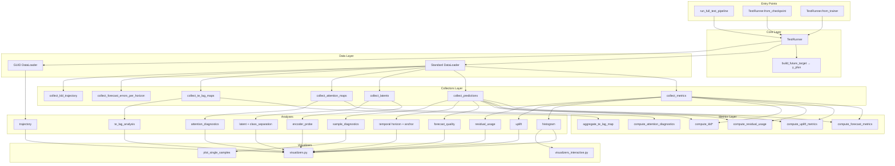
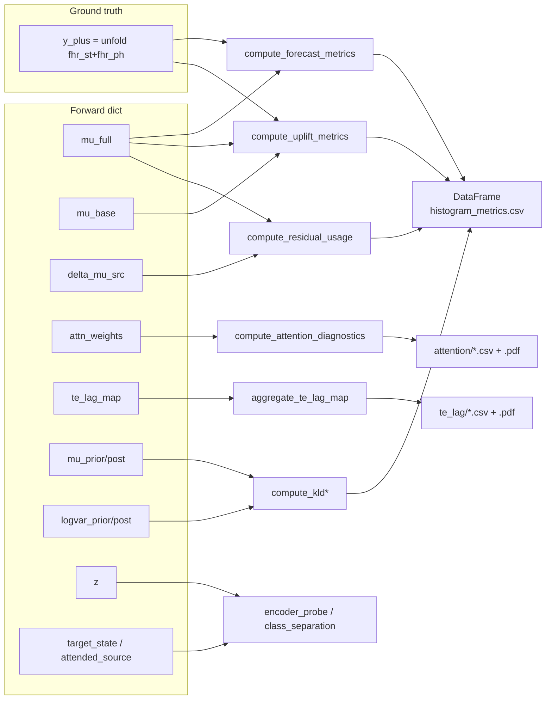

# VAE-TEB Lag-Attn v1 Testing Pipeline Architecture

## Overview

This document describes the testing pipeline for the lag-attentive
residual VAE-TEB v1 model (`SeqVaeLagAttnV1`). The pipeline evaluates
**feature-level forecast quality**, latent structure, causal lag
attention, and transfer-entropy attribution — not raw FHR
reconstruction. The old raw-FHR reconstruction / coherence stack has
been removed.

**Location**: `model/vae_teb_prediction/testing/`

**Model contract** (see `model/vae_teb_prediction/model/new_architecture.md`):

- **Inputs**: `y_st (B,T=300,43)`, `y_ph (B,T,44)`, `u_stream (B,T,101)`
  where `u_stream = concat(up_st, up_ph)` (or `(B,T,58)` = `up_ph` only
  when `use_up_st=False`).
- **Forward-dict outputs** (19 keys): latent moments
  `mu_prior/logvar_prior/mu_post/logvar_post (B,T,24)`, sampled
  `z (B,T,24)`, encoder states
  `target_state/source_state/decoder_state/attended_source (B,T,128)`,
  `attn_weights (B,T,M=4,L=91)`, baseline and full future feature
  forecasts `mu_base/mu_full (B,T,H_d=30,87)`, residual `delta_mu_src`,
  diagnostics `kld_per_t (B,T)` and `te_lag_map (B,T,L)`, plus
  `warmup_mask (T,)`.
- **Ground-truth forecast target**: `Y_plus (B, T−H_d=270, H_d=30, 87)`
  built via `TestRunner.build_future_target(batch)` from `fhr_st +
  fhr_ph`. Valid anchors are `t ∈ [warmup=30, T−H_d=270)`.
- **Loss mechanics**: full feature MSE + baseline MSE + closed-form KL,
  averaged over the valid anchor range.

---

## Design Principles

1. **Minimal** — least code necessary, no over-engineering.
2. **Composable** — collectors, metrics, and visualizers are standalone
   functions that analyses mix and match.
3. **Tied to the v1 forward contract** — the runner and collectors
   speak the v1 forward-dict schema directly; there is no model-agnostic
   abstraction layer.
4. **Single responsibility** — each module does one thing well.
5. **Composition over inheritance** — no deep class hierarchies.
6. **Feature-level evaluation** — every forecast metric compares
   `mu_full`/`mu_base` against the 87-channel future target trajectory
   `Y_plus`; raw FHR is only kept as a plotting context strip.

---

## Directory Structure

```text
testing/
├── __init__.py                 # Public API exports
├── base.py                     # TestRunner (model loading, batch dispatch, y_plus)
├── metrics.py                  # Pure metric functions (feature forecast, uplift, attention)
├── collectors.py               # Iteration patterns that populate DataFrames / lists
├── visualizers.py              # Matplotlib static plots
├── visualizers_interactive.py  # Plotly interactive plots
├── plot_single_samples.py      # Per-sample multi-row diagnostic figure
├── trajectory_analysis.py      # Cross-run latent trajectory analyser (legacy helper)
├── run_tests.py                # Main entry point (edit __main__ block)
├── analyses/
│   ├── __init__.py             # run_all_analyses + exports
│   ├── dataset_stats.py        # Dataset coverage statistics (model-agnostic)
│   ├── histogram.py            # Per-sample metric histograms
│   ├── forecast_quality.py     # NEW: feature forecast quality (mu_full vs y_plus)
│   ├── temporal.py             # NEW: horizon-step MSE + anchor-position MSE
│   ├── uplift.py               # NEW: baseline vs full uplift
│   ├── residual_usage.py       # NEW: delta_mu_src activity / collapse detection
│   ├── attention_diagnostics.py# NEW: lag attention diagnostics
│   ├── te_lag_analysis.py      # NEW: lag-resolved TE by class
│   ├── encoder_probe.py        # NEW: classifier probe on encoder features
│   ├── latent.py               # Per-dim latent histograms + 3D PCA
│   ├── trajectory.py           # Per-patient latent trajectory + KLD
│   ├── class_separation.py     # Latent class-separation tiers
│   ├── compare_trajectory_classes.py  # Cross-run trajectory comparison
│   ├── qualitative.py          # run_sample_diagnostics (per-sample PDFs)
│   ├── changepoint.py          # Ruptures-based changepoint detection
│   └── significance_tests.py   # Nonparametric stats helpers
└── TE_Calculated/
    ├── te_data_loader.py       # Load empirical IDTxl TE records
    ├── te_kld_analysis.py      # Match KLD ↔ empirical TE on (guid, epoch)
    ├── te_kld_comparison.py    # Statistical comparison
    └── te_kld_visualizations.py
```

Removed compared to the legacy pipeline: `analyses/coherence.py`, plus
the raw-FHR `plot_reconstruction_sample`, `plot_temporal_accuracy`,
`plot_within_window_accuracy`, and all coherence plot functions from
`visualizers.py`.

---

## Module Specifications

### 1. `base.py` — TestRunner

Core dataclass that owns model loading, device management, batch
dispatch, and ground-truth construction.

**Class**: `TestRunner`

| Field | Type | Description |
|-------|------|-------------|
| `model` | `SeqVaeLagAttnV1` | Lag-attn v1 model instance |
| `device` | `torch.device` | Inference device |
| `output_dir` | `Path` | Base output directory |
| `warmup_steps` | `int` | Mirrors `model.warmup_period` (default 30) |
| `horizon` | `int` | Mirrors `model.horizon` (default 30) |
| `max_lag` | `int` | Mirrors `model.max_lag` (default 90) |
| `use_up_st` | `bool` | Mirrors `model.use_up_st` |

**Class methods**:

- `from_checkpoint(checkpoint_path, output_dir, config_path, device=None)`
  — **`config_path` is required**. Reads
  `cfg["model_config"]["VAE_model"]`, instantiates `SeqVaeLagAttnV1`,
  loads weights via `train.graph_models_utils.load_checkpoint_strict`,
  forces `attention_grad_checkpoint=False` for inference, and returns a
  runner on the target device.
- `from_trainer(trainer, output_subdir="test_results")` — build the
  runner from an existing `GraphModelVaeTebLagAttnV1Trainer` without
  reloading.

**Instance methods**:

- `inference_mode()` — context manager: `.eval()` + `torch.inference_mode()`.
- `iter_batches(loader, max_samples=None)` — yields batches with
  `fhr_st, fhr_ph, up_st, up_ph, up, fhr` moved to device (missing
  fields silently skipped).
- `_build_u_stream(batch)` — mirrors `SeqVaeLagAttnPl._build_source_stream`
  to assemble the 101- or 58-channel source stream.
- `build_future_target(batch)` → `(B, T−H_d, H_d, 87)` — centralises
  the `unfold` formula for `Y_plus`. Used by every feature-forecast
  metric and by `plot_sample_lag_attn_diagnostic`.
- `valid_anchor_range(seq_len=None)` → `(warmup, T_valid)`.
- `forward(batch, compute_loss=False, beta=1.0, lambda_full=1.0, lambda_base=0.5)`
  — single dispatch into `SeqVaeLagAttnV1.forward(y_st, y_ph,
  u_stream)`. Optionally calls `model.compute_loss(...)` and attaches
  the resulting dict under `outputs["loss_dict"]`.
- `ensure_dir(subdir)` — create and return an output subdirectory.

### 2. `metrics.py` — Pure metric functions

Stateless, no side effects. KL mechanics are unchanged from the legacy
pipeline; the new functions all operate directly on forward-dict
tensors.

| Function | Input | Output | Purpose |
|----------|-------|--------|---------|
| `compute_reconstruction_metrics(y_true, y_pred, mask=None)` | `(B, ...)` | `{vaf, mse, snr}` each `(B,)` | Generic VAF/MSE/SNR — still useful on flattened feature tensors. |
| `compute_kld(outputs, warmup_steps=30)` | Forward dict | `(B, T, d_z)` | Closed-form KL, warmup NaN-filled. |
| `compute_kld_per_sample(outputs, warmup_steps=30)` | Forward dict | `(B,)` | `nanmean` over time + latent dims. |
| `compute_kld_per_timestep(outputs, warmup_steps=30)` | Forward dict | `(B, T)` | `nanmean` over latent dims only. |
| `compute_forecast_metrics(mu_full, y_plus, warmup, horizon)` | `(B,T,H_d,C)` + `(B,T−H_d,H_d,C)` | `{feat_mse_total, feat_mse_per_horizon, feat_r2_total, feat_mse_st, feat_mse_ph}` | Feature-forecast quality split into scattering (ch 0..42) and phase (ch 43..86). |
| `compute_uplift_metrics(mu_full, mu_base, y_plus, warmup, horizon)` | same as above | `{l_full, l_base, uplift_abs, uplift_rel}` | Baseline-vs-full uplift per sample. |
| `compute_residual_usage(delta_mu_src, mu_full, warmup, horizon)` | `(B,T,H_d,C)` | `{delta_norm, full_norm, residual_ratio, delta_norm_t}` | Source-branch activity and per-anchor trace. |
| `compute_attention_diagnostics(attn_weights, warmup)` | `(B,T,M,L)` | `{alpha_bar, argmax_lag, entropy, head_diversity, alpha_mass_by_lag}` | Lag-attention summary with NaN-filled warmup. |
| `aggregate_te_lag_map(te_lag_map, warmup)` | `(B,T,L)` | `{te_lag_mean (B,L), te_lag_argmax (B,)}` | Time-averaged TE lag signature per sample. |
| `preprocess_latent`, `reduce_latent_dimensionality`, `compute_trajectory_*` | trajectory-level helpers (unchanged from legacy) | — | Reused by `trajectory.py` and `encoder_probe.py`. |

**KLD formula** (closed form, unchanged):

```text
KL(q || p) = 0.5 * (logvar_p − logvar_q
                    + (exp(logvar_q) + (μ_q − μ_p)²) / exp(logvar_p)
                    − 1)
```

### 3. `collectors.py` — Data collection patterns

Iteration patterns that compose `TestRunner` + metric functions.
Every collector lives under `runner.inference_mode()` and iterates via
`runner.iter_batches(...)`.

| Function | Returns | Description |
|----------|---------|-------------|
| `collect_metrics(runner, loader, max_samples=None)` | `pd.DataFrame` | Columns: `guid, epoch, label, feat_mse_total, feat_mse_st, feat_mse_ph, feat_r2_total, base_mse_total, uplift_abs, uplift_rel, residual_ratio, kld_mean, kld`. The `kld` column is an alias of `kld_mean` so `TE_Calculated/te_kld_analysis.py` keeps working unchanged. |
| `collect_latents(runner, loader, max_samples=None)` | `np.ndarray (N*T, d_z)` | Flattened per-sample latent trajectories. |
| `collect_predictions(runner, loader, max_samples=None)` | `List[Dict]` | Per-sample record with numpy copies of `mu_full, mu_base, delta_src, y_plus, z, attn, te_lag, kld_t, kld_per_dim, fhr, up`, plus metadata and a `metrics` sub-dict. Consumed by `plot_sample_lag_attn_diagnostic`. |
| `collect_kld_trajectory(runner, loader, max_samples=None)` | `pd.DataFrame` | Long-format per-(sample, timestep) rows: `[guid, epoch, hours_before, label, timestep, kld_mean, latent_0 … latent_{d_z-1}]`. Reads `outputs["kld_per_t"]` directly (cheap, matches the model's TE analysis head). |
| `collect_attention_maps(runner, loader, max_samples=None)` | `List[Dict]` | Per-sample `{guid, epoch, label, alpha_bar (T,L), argmax_lag (T,), entropy (T,M), head_diversity (T,), alpha_mass_by_lag (L,)}`. |
| `collect_te_lag_maps(runner, loader, max_samples=None)` | `pd.DataFrame` | One row per sample: `[guid, epoch, label, te_lag_mean_0 … te_lag_mean_{L-1}, te_lag_argmax]`. |
| `collect_forecast_errors_per_horizon(runner, loader, max_samples=None)` | `pd.DataFrame` | Long-format per-(sample, horizon step): `[guid, epoch, label, h, mse_step, mse_st, mse_ph]`. |

Private helpers: `_extract_guid`, `_extract_epoch`, `_extract_label` are
exported from the module for reuse by analyses that need the same
metadata extraction logic.

### 4. `visualizers.py` — Static plots (Matplotlib)

Pure functions: take data, save a figure. All plots obey the
project-wide style palette (`COLOR_BLUE`, `COLOR_ORANGE`, `COLOR_GREEN`,
`COLOR_SKY`, `COLOR_PURPLE`, `COLOR_VERMILLION`, `COLOR_GRAY`,
`COLOR_BLACK`, `COLOR_LIGHT_GRAY`, `COLOR_SAGE`, `COLOR_TEAL_DARK`) and
use `_style_axes`, `_add_colorbar`, `_tighten_xaxis`, `_format_stats_box`
internally.

**Lag-attn v1 feature-forecast primitives (new)**:

| Function | Output file | Purpose |
|----------|-------------|---------|
| `plot_feature_forecast_heatmap(mu_full_avg, y_plus_avg, warmup, out_path, fhr_st_end=43)` | PDF | 3-row `(C, T)` heatmap (prediction / truth / residual) with scattering↔phase separator. |
| `plot_forecast_error_by_horizon(df, out_path)` | PDF | Median + IQR ribbon of `mse_step` vs horizon step `h ∈ [0, H_d)` with scattering / phase overlays. |
| `plot_uplift_histogram(df, out_path)` | PDF | Overlaid histograms of `l_full` / `l_base` + second panel for `uplift_rel`. |
| `plot_residual_usage_trace(trace_df, out_path)` | PDF | Per-anchor `delta_norm_t` median + IQR ribbon. |
| `plot_lag_attention_heatmap(alpha_bar, argmax_lag, warmup, out_path)` | PDF | `(T, L)` attention imshow with argmax-lag overlay and warmup shading. |
| `plot_te_lag_distribution(te_lag_mean, labels, out_path, class_names=…)` | PDF | Per-class mean lag profile with bootstrap 95% CI. |
| `plot_attention_mass_by_lag(mass_df, out_path, fs=4, decim=16)` | PDF | Grouped bar chart of mean attention mass in coarse lag bins (0-10s, 10-30s, 30-60s, 60-120s, 120-360s, ≥360s). |

**Kept from legacy (still useful)**:

| Function | Output file |
|----------|-------------|
| `plot_metric_histograms(df, output_dir, ...)` | `metrics_histograms.pdf` — auto-detects v1 vs legacy column set. |
| `plot_latent_distributions(latents, output_dir)` | `latent_distributions.png` |
| `plot_kld_trajectory`, `plot_kld_guid_trajectory`, `plot_kld_trajectory_3d` | KLD trajectory plots |
| `plot_latent_trajectory_2d/3d`, `plot_guid_absolute_trajectory`, `plot_guid_trajectory_3d` | Latent trajectory plots |
| `plot_latent_changepoints_with_raw` | Changepoints overlaid on raw FHR strip |
| `plot_segment_statistics`, `plot_trajectory_comparison`, `plot_recurrence` | Trajectory shape / comparison plots |
| `plot_feature_boxplots`, `plot_class_*`, `plot_dimension_significance_heatmap`, `plot_distributional_distances`, `plot_class_separation_scatter_2d`, `plot_per_dimension_boxplots`, `plot_centroid_distance_heatmap`, `plot_distance_to_centroid_violins`, `plot_temporal_class_separation` | Class separation plots |

**Deleted**: `plot_reconstruction_sample`, `plot_temporal_accuracy`,
`plot_within_window_accuracy`, and the entire coherence block
(`plot_coherence_analysis`, `plot_reconstruction_coherence`,
`plot_coherence_spectrum`, `plot_horizon_spectra`, `plot_spectrum_delta`,
`plot_time_frequency_map`, `plot_psd_comparison`, `plot_cross_correlation`,
`plot_coherence_signals`, `plot_time_frequency_coherence`).

### 5. `visualizers_interactive.py` — Interactive plots (Plotly)

All functions save HTML with `include_plotlyjs="cdn"`.

| Function | Description |
|----------|-------------|
| `plot_metrics_comparison_interactive(df, output_path)` | Scatter matrix; default columns now `[feat_mse_total, uplift_rel, residual_ratio, kld_mean]`. Falls back to legacy `[vaf, mse, snr, kld]` on old CSVs. |
| `plot_kld_trajectory_interactive(df, output_path)` | KLD-vs-time with hover. |
| `plot_latent_space_3d(latents, labels, output_path)` | 3D PCA scatter coloured by class. |
| `plot_latent_interpolation_interactive(samples, output_path)` | Interpolation morph (kept for other tools). |
| `plot_latent_trajectory_3d_interactive`, `plot_guid_trajectory_3d_interactive`, `plot_kld_trajectory_3d_interactive`, `plot_fhr_timeline`, `plot_fhr_up_timeline`, `plot_trajectory_animation`, `plot_trajectory_comparison_interactive`, `plot_class_latent_density_interactive` | Various latent/FHR timelines and trajectory plots. |

**Deleted**: `plot_reconstruction_interactive` (raw-FHR panel).

### 6. `plot_single_samples.py` — Per-sample diagnostic figure

Single public function:

```python
def plot_sample_lag_attn_diagnostic(
    sample: Dict[str, Any],
    out_path: Path,
    warmup: int,
    horizon: int,
    *,
    fhr_st_end: int = 43,
    fs_raw: float = 4.0,
) -> None
```

Produces an 8-row PDF with:

1. Raw FHR / UP traces (when present on the batch).
2. Average `mu_full` over 87 feature channels (heatmap).
3. Same for `y_plus_avg` (ground truth).
4. Residual `mu_full − y_plus`.
5. Latent `z` heatmap.
6. KL per latent dim heatmap.
7. Head-averaged lag attention.
8. TE lag attribution.

All rows share the same physical time axis. The overlap-averaging and
axis helpers are imported from
`model.vae_teb_prediction.model.plotting_callback_lag_attn_v1`
(`_average_forecast_per_channel`, `_time_axes`, `_shade_warmup`, etc.)
so testing-time and training-time diagnostics use identical semantics.

### 7. `analyses/` — High-level analysis functions

Every `run_*` function follows the same shape:

```python
def run_xxx(runner, loader, max_samples=..., output_dir=None) -> Dict[str, Any]:
    if output_dir is None:
        output_dir = runner.ensure_dir("xxx")
    # ... collect, compute, save CSVs, emit plots ...
    return {"summary": ...}
```

#### `dataset_stats.py`

Unchanged from the legacy pipeline — model-agnostic, operates on the
DataLoader only. Reports `n_samples`, `n_guids`, epochs-per-GUID stats,
time distribution, label distributions, and CS × BG breakdowns. Emits
`dataset_statistics.png`, `time_distribution_detailed.png`,
`epochs_per_guid_ranked.png`, `label_statistics.png`, plus several CSVs
and a summary JSON.

#### `histogram.py`

```python
def run_histogram_analysis(runner, loader, max_samples=None, *,
                           save_data=True, dataset_identifier=None) -> pd.DataFrame
```

Drives `collect_metrics` → `plot_metric_histograms` → CSV. The CSV
retains a `kld` column aliased to `kld_mean` so
`TE_Calculated/te_kld_analysis.py::load_kld_from_metrics_csv` keeps
working unchanged.

#### `forecast_quality.py`

```python
def run_forecast_quality_analysis(runner, loader, max_samples=500, output_dir=None)
    -> Dict[str, Any]
```

Outputs:

- `forecast_quality/forecast_per_sample.csv` — `[guid, epoch, label,
  feat_mse_total, feat_mse_st, feat_mse_ph, feat_r2_total]`.
- `forecast_quality/forecast_per_horizon.csv` — long format
  `[guid, epoch, label, h, mse_step, mse_st, mse_ph]`.
- `forecast_error_by_horizon.pdf`, `feat_mse_total_hist.pdf`,
  `feat_r2_total_hist.pdf`.
- Summary dict: `{mean_mse_total, mean_r2, mean_mse_per_horizon,
  n_samples}`.

#### `temporal.py`

Two functions replacing the legacy raw-FHR accuracy checks:

```python
def run_horizon_error_profile(runner, loader, max_samples=200, output_dir=None) -> pd.DataFrame
def run_anchor_position_analysis(runner, loader, max_samples=200, output_dir=None) -> pd.DataFrame
```

Horizon profile answers "how fast does the forecast decay?"; anchor
position answers "does the model trust its forecast more at the start
or end of the 20-minute window?". Emits `horizon_error.csv`,
`forecast_errors_per_horizon.csv`, `horizon_error.pdf`,
`anchor_error.csv`, and `anchor_error.pdf`.

#### `uplift.py`

```python
def run_uplift_analysis(runner, loader, max_samples=500, output_dir=None) -> Dict[str, Any]
```

Outputs `uplift/per_sample.csv`, `uplift_histogram.pdf`,
`uplift_rel_by_class.pdf`. Summary: `{mean_uplift_rel,
frac_positive_uplift, by_class, n_samples}`.

#### `residual_usage.py`

```python
def run_residual_usage_analysis(runner, loader, max_samples=500,
                                output_dir=None, collapse_threshold=0.01) -> Dict[str, Any]
```

Outputs `residual_usage/per_sample.csv`, `per_sample_trace.csv`,
`residual_ratio_hist.pdf`, `delta_norm_trace.pdf`. Summary:
`{mean_residual_ratio, n_collapsed, frac_collapsed}`. **A trained
checkpoint with `mean_residual_ratio ≈ 0` is a red flag** that the
source/latent branch has been turned off.

#### `attention_diagnostics.py`

```python
def run_attention_diagnostics(runner, loader, max_samples=200,
                              output_dir=None, n_heatmap_examples=6) -> Dict[str, Any]
```

Outputs:

- `attention/argmax_lag_per_sample.csv` (long format).
- `attention/alpha_mass_by_lag.csv` (wide format).
- `attention/head_entropy_summary.csv`.
- `attention_heatmap_<guid>.pdf` for `n_heatmap_examples` samples.
- `argmax_lag_histogram.pdf`, `attention_mass_by_lag_bars.pdf`,
  `head_diversity_hist.pdf`.

Summary: `{n_samples, median_argmax_lag, mean_head_entropy}`.

#### `te_lag_analysis.py`

```python
def run_te_lag_class_analysis(runner, loader, max_samples=1000, output_dir=None)
    -> Dict[str, Any]
```

Aggregates `te_lag_map` over time, groups by outcome class, runs a
per-lag Kruskal-Wallis test across classes, and bootstraps 95% CI.

Outputs `te_lag/te_lag_mean_per_sample.csv`, `te_lag_by_class.csv`,
`significance.csv`, `te_lag_by_class.pdf`. Summary:
`{n_samples, best_lag_by_class, median_p_value, n_significant_lags}`.

#### `encoder_probe.py`

```python
def run_encoder_probe(runner, loader, max_samples=2000, output_dir=None)
    -> Dict[str, Any]
```

Computes three time-averaged feature vectors per sample —
`z_mean (d_z=24)`, `target_state_mean (128)`,
`attended_source_mean (128)` — and evaluates class separability via
`compute_linear_separability` and `compute_cluster_quality_metrics`
from `analyses/class_separation.py`.

Outputs `encoder_probe/feature_matrix.csv`, `probe_results.csv`, and
`encoder_probe_separation_bar.pdf`.

#### `latent.py`

```python
def run_latent_distribution_analysis(runner, loader, max_samples=500) -> np.ndarray
def run_latent_space_visualization(runner, loader, max_samples=500) -> np.ndarray
def run_latent_interpolation(runner, loader, num_pairs=5, num_steps=10) -> List[Dict]
```

`run_latent_interpolation` is a **no-op stub** under v1 — it logs a
warning and returns `[]`. Raw-signal interpolation is not supported
because v1 does not reconstruct raw FHR.

#### `trajectory.py` + `trajectory_analysis.py`

```python
class TrajectoryAnalyzer:
    def run(skip_dashboards: bool = False) -> Dict[str, Any]
def run_trajectory_analysis(runner, loader, ...)  -> Dict[str, Any]
```

Operates on per-patient latent trajectories (`z`) and per-timestep KLD
(`outputs["kld_per_t"]`). Requires a GUID-based DataLoader where each
batch contains all segments from one patient. Dim-reduction methods:
`pca`, `umap`, `tsne`, `isomap`, `diffusion`.

#### `class_separation.py`

Four-tier latent class separability analysis:

- Tier 1 — clustering quality (Silhouette, Davies-Bouldin,
  Calinski-Harabasz).
- Tier 2 — cohesion/separation ratios (Fisher ratio, between/within
  class distances).
- Tier 3 — linear separability (Logistic Regression + LDA, stratified
  K-fold CV).
- Tier 4 — discriminative center-loss effectiveness. Gracefully skips
  for v1 checkpoints (no `center_loss.centers` tensor in the state
  dict).

#### `qualitative.py`

```python
def run_sample_diagnostics(runner, loader, max_samples=10, output_dir=None)
    -> Dict[str, Any]
```

Iterates `collect_predictions` and calls
`plot_sample_lag_attn_diagnostic` per sample. Emits per-sample PDFs
under `samples_diag/` plus `sample_metrics.csv`.

#### `changepoint.py`, `significance_tests.py`, `compare_trajectory_classes.py`

Unchanged from legacy. `changepoint.py` still wraps `ruptures` (PELT,
Dynp, Binseg) with a gradient-based fallback.

#### `analyses/__init__.py`

```python
def run_all_analyses(
    runner, loader, max_samples=None, *,
    skip_trajectory=False, skip_attention=False, skip_forecast_heatmaps=False,
    trajectory_loader=None,
    trajectory_dim_reduction="pca",
    trajectory_n_changepoints=5,
    trajectory_plot_3d=True,
    trajectory_plot_animations=False,
) -> Dict[str, Any]
```

Each analysis runs under a shared `_safe(name, fn, ...)` wrapper so a
failure in one analysis doesn't prevent the rest from completing. The
run order is cheap → expensive:

1. `histogram`
2. `forecast_quality`
3. `horizon_error`
4. `anchor_error`
5. `uplift`
6. `residual_usage`
7. `attention` *(gated by `skip_attention`)*
8. `te_lag` *(gated by `skip_attention`)*
9. `encoder_probe`
10. `latent_distribution`
11. `latent_space`
12. `trajectory` *(gated by `skip_trajectory`, prefers `trajectory_loader`)*
13. `sample_diagnostics` *(gated by `skip_forecast_heatmaps`)*

### 8. `run_tests.py` — Main entry point

```python
def run_full_test_pipeline(
    checkpoint_path: Optional[str],
    data_path: Optional[Union[str, List[str]]],
    output_dir: Optional[str] = None,
    stats_path: Optional[str] = None,
    config_path: Optional[Union[str, Path]] = None,   # REQUIRED
    device: Optional[str] = None,
    max_samples: Optional[int] = None,
    batch_size: Optional[int] = None,
    num_workers: Optional[int] = None,
    skip_trajectory: bool = False,
    skip_attention: bool = False,
    skip_forecast_heatmaps: bool = False,
    skip_interactive: bool = False,
    analysis_samples: int = 10,
    min_epochs_per_guid: int = 10,
    max_guids: Optional[int] = None,
    normalize_fields: Optional[Sequence[str]] = None,
    dataset_kwargs: Optional[Dict[str, Any]] = None,
) -> Dict[str, Any]

def quick_test(checkpoint_path, data_path, output_dir="quick_test_results",
               n_samples=100, config_path=..., ...) -> Dict[str, Any]
```

`config_path` is **required** — `TestRunner.from_checkpoint` needs it
to build the model from `model_config.VAE_model.*`. It is also used to
resolve `stat_path`, `normalize_fields`, `dataset_kwargs`, default
test datasets, and the output root.

Both `stat_path` and `stats_path` spellings are accepted (the v1 config
uses `stat_path`; older configs used `stats_path`).

The `__main__` block at the bottom of `run_tests.py` is the canonical
way to drive the pipeline — edit the `CHECKPOINT`, `DATA`, `STATS`,
`CONFIG`, and `OUTPUT` constants and run
`python -m model.vae_teb_prediction.testing.run_tests`.

### 9. `TE_Calculated/` — Transfer entropy comparison

Unchanged. `te_kld_analysis.py` now passes `config_path` into
`TestRunner.from_checkpoint` and reads both `stat_path` and `stats_path`
spellings. `load_kld_from_metrics_csv` continues to read `guid`,
`epoch`, `kld` columns from `histogram_metrics.csv`, which the new
collectors preserve as an alias column.

---

## Usage Examples

### Full pipeline via config

```python
from testing.run_tests import run_full_test_pipeline

results = run_full_test_pipeline(
    checkpoint_path=None,          # pulled from config.model_config.core_model_checkpoint
    data_path=None,                # pulled from config.dataset_config.vae_test_datasets
    output_dir=None,               # timestamped folder under out_dir_base
    config_path="model/vae_teb_prediction/model/config_lag_attn_v1.yaml",
    max_samples=None,              # process everything
)

hist = results["histogram"]
print(f"feat_mse_total: {hist['feat_mse_total'].mean():.6f}")
print(f"uplift_rel:     {hist['uplift_rel'].mean():.4f}")
print(f"kld_mean:       {hist['kld_mean'].mean():.4f}")
```

### Quick smoke test (64 samples, slow analyses off)

```python
from testing.run_tests import quick_test

results = quick_test(
    checkpoint_path=None,
    data_path=None,
    n_samples=64,
    config_path="model/vae_teb_prediction/model/config_lag_attn_v1.yaml",
)
```

### Manual composition

```python
from testing import TestRunner
from testing.analyses import (
    run_histogram_analysis,
    run_forecast_quality_analysis,
    run_attention_diagnostics,
    run_trajectory_analysis,
)
from hdf5_dataset.hdf5_dataset import (
    create_optimized_dataloader,
    build_guid_filtered_dataloader,
)

runner = TestRunner.from_checkpoint(
    checkpoint_path="checkpoints/best.ckpt",
    output_dir="results/",
    config_path="model/vae_teb_prediction/model/config_lag_attn_v1.yaml",
)

standard_loader = create_optimized_dataloader([...], batch_size=64, ...)
_, guid_loader = build_guid_filtered_dataloader([...], min_samples=10)

run_histogram_analysis(runner, standard_loader, max_samples=1000)
run_forecast_quality_analysis(runner, standard_loader, max_samples=500)
run_attention_diagnostics(runner, standard_loader, max_samples=200)
run_trajectory_analysis(runner, guid_loader, time_range_hours=12.0)
```

---

## Key Dependencies

| Module | External dependencies |
|--------|----------------------|
| `base.py` | `train.graph_models_utils.load_checkpoint_strict`, `model.vae_teb_prediction.model.vae_teb_lag_attn_v1.SeqVaeLagAttnV1`, `yaml` |
| `metrics.py` | `torch`, `scipy.signal` (Savitzky-Golay), `sklearn` (PCA/t-SNE/Isomap), `umap-learn` (optional) |
| `collectors.py` | `pandas`, `numpy`, `torch` |
| `visualizers.py` | `matplotlib`, `scipy.stats` |
| `visualizers_interactive.py` | `plotly`, `pillow` (for GIFs) |
| `plot_single_samples.py` | `matplotlib`, helpers imported from `plotting_callback_lag_attn_v1` |
| `analyses/changepoint.py` | `ruptures` (optional, gradient fallback) |
| `analyses/trajectory.py` | `pandas`, `scipy`, `sklearn`, `umap-learn` (optional) |
| `run_tests.py` | `hdf5_dataset.hdf5_dataset.create_optimized_dataloader`, `build_guid_filtered_dataloader` |

Optional: `ruptures`, `umap-learn`, `pillow`.

---

## Data Flow

```text
┌──────────────┐    ┌─────────────┐    ┌──────────────┐    ┌──────────────┐
│ Checkpoint   │───▶│ TestRunner  │───▶│  Collectors  │───▶│  Visualizers │
│ + YAML config│    │             │    │              │    │              │
│ + HDF5 data  │    │ - build_    │    │ - metrics    │    │ - PDF/PNG    │
└──────────────┘    │   model     │    │ - preds      │    │ - HTML       │
                    │ - load_     │    │ - latents    │    │              │
                    │   strict    │    │ - attention  │    └──────┬───────┘
                    │ - forward   │    │ - te_lag     │           │
                    │ - y_plus    │    │ - horizon    │           ▼
                    └──────┬──────┘    └──────┬───────┘     ┌──────────────┐
                           │                   │            │   Analyses   │
                           └───────────────────┴───────────▶│   run_*      │
                                                            │              │
                                                            │ - forecast   │
                                                            │ - uplift     │
                                                            │ - residual   │
                                                            │ - attention  │
                                                            │ - te_lag     │
                                                            │ - latent     │
                                                            │ - trajectory │
                                                            │ - samples    │
                                                            └──────────────┘
```

---

## Output Directory Structure

```text
output_dir/
├── dataset_stats/                              # Dataset coverage
│   ├── dataset_statistics.png
│   ├── time_distribution_detailed.png
│   ├── epochs_per_guid_ranked.png
│   ├── label_statistics.png
│   ├── dataset_statistics.json
│   └── *.csv
├── histograms/
│   ├── histogram_metrics.csv                   # Also carries `kld` alias
│   ├── histogram_metadata.json
│   └── metrics_histograms.pdf
├── forecast_quality/
│   ├── forecast_per_sample.csv
│   ├── forecast_per_horizon.csv
│   ├── forecast_error_by_horizon.pdf
│   ├── feat_mse_total_hist.pdf
│   └── feat_r2_total_hist.pdf
├── horizon_error/
│   ├── horizon_error.csv
│   ├── forecast_errors_per_horizon.csv
│   └── horizon_error.pdf
├── anchor_error/
│   ├── anchor_error.csv
│   └── anchor_error.pdf
├── uplift/
│   ├── per_sample.csv
│   ├── uplift_histogram.pdf
│   └── uplift_rel_by_class.pdf
├── residual_usage/
│   ├── per_sample.csv
│   ├── per_sample_trace.csv
│   ├── residual_ratio_hist.pdf
│   └── delta_norm_trace.pdf
├── attention/
│   ├── argmax_lag_per_sample.csv
│   ├── alpha_mass_by_lag.csv
│   ├── head_entropy_summary.csv
│   ├── attention_heatmap_<guid>.pdf
│   ├── argmax_lag_histogram.pdf
│   ├── attention_mass_by_lag_bars.pdf
│   └── head_diversity_hist.pdf
├── te_lag/
│   ├── te_lag_mean_per_sample.csv
│   ├── te_lag_by_class.csv
│   ├── significance.csv
│   └── te_lag_by_class.pdf
├── encoder_probe/
│   ├── feature_matrix.csv
│   ├── probe_results.csv
│   └── encoder_probe_separation_bar.pdf
├── latent_distribution/
│   └── latent_distributions.png
├── latent_space/
│   └── latent_space_3d.html
├── class_separation/
│   ├── class_separation_report.json
│   └── *.png / *.csv
├── trajectory/
│   ├── plots/
│   ├── dashboards/
│   ├── latent_trajectories.parquet
│   ├── epoch_summary.parquet
│   └── summary.json
├── samples_diag/
│   ├── <guid>_<epoch>.pdf
│   └── sample_metrics.csv
├── metrics_comparison.html
└── test_summary.json
```

---

## Mermaid Diagram — System Architecture



---

## Mermaid — Metric Pipeline



---

## Preserved consumers

For backward compatibility:

- `histograms/histogram_metrics.csv` still carries `guid`, `epoch`, and
  a `kld` column (aliased to `kld_mean`), so
  `TE_Calculated/te_kld_analysis.py::load_kld_from_metrics_csv` keeps
  working unchanged.
- `trajectory/kld_trajectory.csv` (from `collect_kld_trajectory`)
  retains `[guid, epoch, hours_before, label, timestep, kld_mean,
  latent_0 … latent_{d_z-1}]`.
- `latent_distribution/`, `latent_space/`, `class_separation/`,
  `trajectory/`, and `dataset_stats/` output layouts are unchanged.

---

## Sanity checks

After running the pipeline on a trained checkpoint, look for these
quick signals:

- `residual_usage.mean_residual_ratio` should be **non-trivial** (not
  near zero). Near-zero on a trained checkpoint means the source/latent
  branch has collapsed or the checkpoint wasn't loaded.
- `uplift.mean_uplift_rel` should be positive on most samples; if it
  averages near zero, `load_checkpoint_strict` may have silently
  fallen through — inspect its log output for candidate-module
  alignment.
- `attention.median_argmax_lag` should not sit uniformly at lag 0 (the
  most recent step) on a trained checkpoint — distribution across lags
  indicates that causal cross-attention actually learned.
- `forecast_quality.mean_r2` is a reasonable headline number. On an
  untrained / freshly-initialised model expect `residual_ratio ≈ 0`,
  `uplift_rel ≈ 0`, and `r2` near zero because `delta_mu_src` is
  zero-initialised (see `SeqVaeLagAttnV1._zero_init_delta_heads`).

---

## Summary

| Property | Value |
|----------|-------|
| Core modules | 8 (`base`, `metrics`, `collectors`, `visualizers`, `visualizers_interactive`, `plot_single_samples`, `trajectory_analysis`, `run_tests`) |
| Analysis modules | 14 (`dataset_stats`, `histogram`, `forecast_quality`, `temporal`, `uplift`, `residual_usage`, `attention_diagnostics`, `te_lag_analysis`, `encoder_probe`, `latent`, `trajectory`, `class_separation`, `compare_trajectory_classes`, `qualitative`, plus helpers `changepoint` and `significance_tests`) |
| New lag-attn v1 analyses | 6 (`forecast_quality`, `uplift`, `residual_usage`, `attention_diagnostics`, `te_lag_analysis`, `encoder_probe`) |
| Visualizer primitives (v1-new) | 7 (`plot_feature_forecast_heatmap`, `plot_forecast_error_by_horizon`, `plot_uplift_histogram`, `plot_residual_usage_trace`, `plot_lag_attention_heatmap`, `plot_te_lag_distribution`, `plot_attention_mass_by_lag`) |
| Removed | `aggregate_predictions`, `plot_reconstruction_sample`, `plot_temporal_accuracy`, `plot_within_window_accuracy`, all coherence plots, `plot_reconstruction_interactive`, `analyses/coherence.py` |
| Forecast target | 87-channel future FHR feature trajectory (scattering + phase) over the valid anchor range `[warmup, T−H_d)` |
| Latent dim | 24 (v1 default) |
| Lag window length | `max_lag + 1 = 91` (~6 min at 4 Hz / 16× decimation) |
| DataLoader types | Standard (batched) + GUID-based (1 batch = 1 patient) |
| Checkpoint loading | `train.graph_models_utils.load_checkpoint_strict` (wraps `SeqVaeLagAttnV1` built from YAML) |
