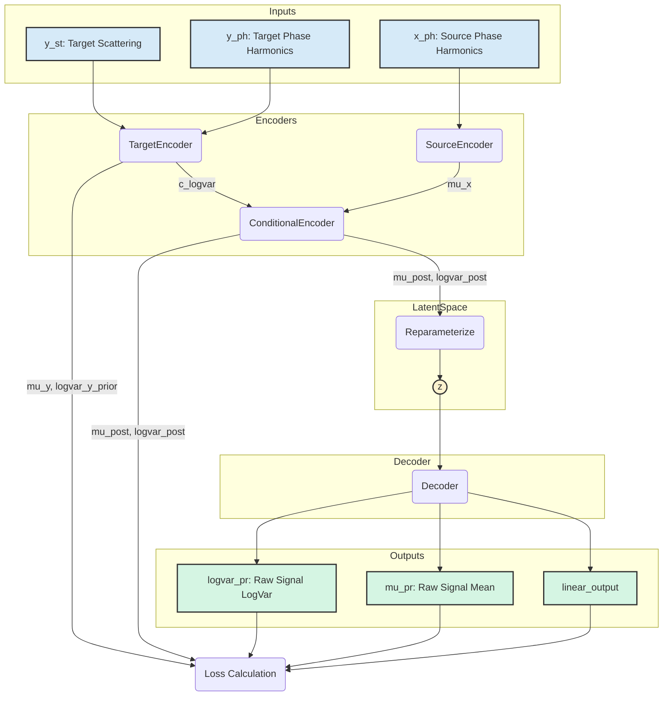
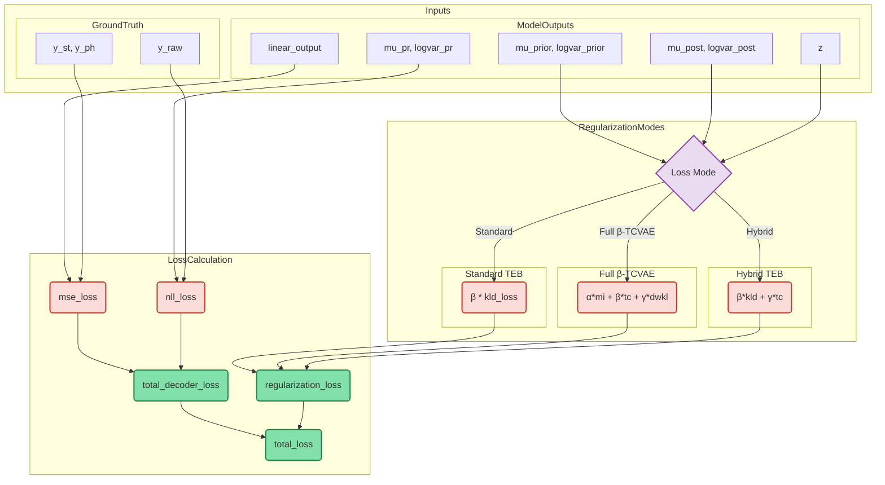

# SeqVaeTeb Model Documentation

## Overview

The `SeqVaeTeb` is a sophisticated sequence-to-sequence Variational Autoencoder (VAE) designed to model time-series data. Its core principle is the **Transfer Entropy Bottleneck (TEB)**, which aims to learn a compressed latent representation (`z`) of a target signal (`y`) that is highly predictive of the target's future while simultaneously minimizing the information it contains about a related source signal (`x`).

This makes the model particularly useful for tasks where the goal is to disentangle the predictive information in one signal from the influence of another, such as separating fetal heart rate dynamics from maternal signals.

## Model Architecture

The model is composed of four main modules:

1.  **Source Encoder (`SourceEncoder`)**:
    *   **Input**: Source signal features (`x_ph`).
    *   **Function**: It processes the source signal to produce a deterministic latent representation, $\mu_x$. This captures the characteristics of the source signal that might influence the target.

2.  **Target Encoder (`TargetEncoder`)**:
    *   **Input**: Target signal features (`y_st`, `y_ph`).
    *   **Function**: It processes the target signal to define the parameters of the *prior distribution* $p_{\theta}(z|y)$. It outputs the mean ($\mu_y$) and log-variance ($\log\sigma^2_y$) of this distribution, along with a separate conditioning feature (`c_logvar`) used by the Conditional Encoder.

3.  **Conditional Encoder (`ConditionalEncoder`)**:
    *   **Input**: The source representation ($\\mu_x$) and the target conditioning feature (`c_logvar`).
    *   **Function**: This module models the *posterior distribution* $q_{\\phi}(z|x, y)$. By combining information from both the source and target, it computes the posterior mean ($\\mu_{post}$) and log-variance ($\\log\sigma^2_{post}$). The key idea is that the posterior, conditioned on both signals, will be different from the prior, which is conditioned only on the target.

4.  **Decoder (`Decoder`)**:
    *   **Input**: A latent sample $z$ drawn from the posterior distribution.
    *   **Function**: It reconstructs the original signal from the compressed latent representation $z$. It has two main outputs:
        *   `linear_output`: Reconstructed auxiliary features (scattering and phase harmonics).
        *   `mu_pr`, `logvar_pr`: The mean and log-variance of the reconstructed raw signal, modeling it as a Gaussian distribution.

---

### SeqVaeTeb Model Architecture

This diagram illustrates the data flow through the `SeqVaeTeb` model, from the input signals to the final reconstructed outputs.



---

## Loss Calculation

The total loss is a combination of a **Reconstruction Loss** and a **Regularization Loss**.

### 1. Reconstruction Loss

This loss ensures that the decoder can accurately reconstruct the original target signal from the latent representation $z$. It has two parts:

*   **MSE Loss (`mse_loss`)**: A Mean Squared Error that compares the decoder's reconstructed auxiliary features (`linear_output`) with the ground truth target features ($y_{st}$ and $y_{ph}$). 
*   **NLL Loss (`nll_loss`)**: The decoder outputs the parameters of a Gaussian distribution for the raw signal ($\\mu_{pr}$, $\\log\sigma^2_{pr}$). This loss is the Gaussian Negative Log-Likelihood of the true raw signal $y_{raw}$ under that predicted distribution.

The `total_decoder_loss` is the sum of these two components.

### 2. Regularization Loss

This loss enforces the desired properties on the latent space. The model can be configured to use one of three different regularization schemes:

*   **Standard TEB Loss**:
    *   **Calculation**: This is the Kullback-Leibler (KL) divergence between the posterior and the prior: $\text{KL}(q_{\\phi}(z|x,y) || p_{\\theta}(z|y))$.
    *   **Purpose**: It minimizes the "information flow" or Transfer Entropy from the source $x$ to the latent representation $z$, forcing $z$ to only contain information from $y$ that is necessary for prediction.

*   **$\beta$-TCVAE Loss (Full Decomposition)**:
    *   **Detailed Explanation**: The $\\beta$-TCVAE (Total Correlation Variational Autoencoder) loss is a modification of the standard VAE objective that specifically aims to learn *disentangled* latent representations. Instead of just penalizing the KL divergence as a whole, it decomposes it into three meaningful components, allowing for more fine-grained control over the learning process. The decomposition starts with the KL divergence term from the Evidence Lower Bound (ELBO), assuming a standard normal prior $p(z) = \mathcal{N}(0, I)$:
    $$
    \text{KL}(q_{\\phi}(z|x,y) || p(z)) = \underbrace{\mathbb{E}_{q(z|x,y)}[\log q_{\\phi}(z|x,y) - \log q(z)]}_{\text{I. Index-Code Mutual Information}} + \underbrace{\mathbb{E}_{q(z)}[\log q(z) - \sum_j \log q(z_j)]}_{\text{II. Total Correlation}} + \underbrace{\mathbb{E}_{q(z)}[\sum_j \log q(z_j) - \log p(z)]}_{\text{III. Dimension-wise KL}}
    $$
    *   **Final Loss**: The final regularization loss is a weighted sum: $\\mathcal{L}_{\text{Reg}} = \alpha \cdot I(z;x,y) + \beta \cdot \text{TC}(z) + \gamma \cdot \text{KL}_{\text{dim-wise}}$.

*   **Hybrid $\\beta$-TCVAE Loss**:
    *   **Calculation**: This is a combination of the TEB objective and the disentanglement objective. The loss is a weighted sum of the standard `kld_loss` (from TEB) and the `tc_loss` (from $\\beta$-TCVAE).
    *   **Purpose**: To achieve the primary goal of minimizing transfer entropy while simultaneously encouraging the learned latent representation to be disentangled.

### Relationship Between Index-Code MI and the TEB Objective

When using the **Full $\\beta$-TCVAE Loss (Approach 1)**, the original TEB loss term, $\\text{KL}(q_{\\phi}(z|x,y) || p_{\\theta}(z|y))$, is removed. A natural question is: what happens to the goal of minimizing the information transfer from source $x$ to latent $z$?

The answer lies in the **Index-Code Mutual Information ($I(z;x,y)$)** term. While the two terms are mathematically different, the Index-Code MI takes over the role of the information bottleneck in a more general way.

*   **TEB Objective**: $\\text{KL}(q_{\\phi}(z|x,y) || p_{\\theta}(z|y))$
    *   This measures the information that source $x$ provides about the latent code $z$ that is **not already present** in the target $y$. It is a *conditional* information measure. Minimizing it directly prevents $z$ from encoding information unique to $x$.

*   **Index-Code MI**: $I(z;x,y) = \\text{KL}(q_{\\phi}(z|x,y) || q(z))$
    *   This measures the mutual information between the latent code $z$ and the **entire input pair** $(x,y)$. It is a *total* information measure. Minimizing it forces the model to find the most compressed representation of the combined input.

**How Index-Code MI implicitly performs the TEB task:**

The overall goal of the VAE is to reconstruct the target $y$ from the latent code $z$. To minimize the total loss, the model must be efficient. If the source signal $x$ contains information that is irrelevant or redundant for the task of reconstructing $y$, the most efficient way for the model to minimize the Index-Code MI is to **discard that irrelevant information from $z$**.

In other words, by penalizing the total information $I(z;x,y)$, the model learns that the optimal latent code $z$ is one that is a *minimal sufficient representation* of the input $(x,y)$ needed for reconstruction. This naturally encourages the model to ignore the non-essential parts of $x$, which directly aligns with the goal of the Transfer Entropy Bottleneck.

Therefore, in the full $\\beta$-TCVAE approach, the TEB objective is not lost; it is achieved as a natural consequence of optimizing a more general information bottleneck, $I(z;x,y)$, in conjunction with the disentanglement pressure from the Total Correlation term.

### Loss Calculation Diagram

This diagram shows how the different loss components are calculated and combined.



---

## Information Bottleneck Terms: Index-Code MI vs TEB KL Divergence

This section explains the mathematical differences and computational approaches between the Index-Code Mutual Information term in β-TCVAE Approach 1 and the TEB KL divergence term in Approach 2.

### Mathematical Foundations

#### β-TCVAE Approach 1: Index-Code Mutual Information (MI)

In the full β-TCVAE decomposition, the Index-Code MI term is defined as:

$$I_q(z; x,y) = \mathbb{E}_{q(z|x,y)} \left[ \log q_{\phi}(z|x,y) - \log q(z) \right]$$

**Key Properties:**
- **Total Information Measure**: Measures mutual information between latent code $z$ and the **entire input pair** $(x,y)$
- **Prior**: Uses fixed standard normal prior $p(z) = \mathcal{N}(0, I)$
- **Aggregated Posterior**: $q(z)$ is the aggregated posterior across all data samples
- **Information Bottleneck**: Encourages minimal sufficient representation of $(x,y)$ for reconstruction

#### TEB Approach 2: Conditional KL Divergence

In the standard TEB and Hybrid approaches, the KL term is:

$$\text{KL}(q_{\phi}(z|x,y) \| p_{\theta}(z|y)) = \mathbb{E}_{q(z|x,y)} \left[ \log q_{\phi}(z|x,y) - \log p_{\theta}(z|y) \right]$$

**Key Properties:**
- **Conditional Information Measure**: Measures information from source $x$ about $z$ that is **not already in** target $y$
- **Prior**: Uses learned conditional prior $p_{\theta}(z|y)$ generated by `TargetEncoder`
- **Transfer Entropy Proxy**: Directly minimizes information transfer from $x$ to $z$
- **Conditional Bottleneck**: Prevents $z$ from encoding $x$-specific information given $y$

### Computational Implementation

#### Index-Code MI Computation (β-TCVAE Approach 1)

The implementation uses **Minibatch Weighted Sampling (MWS)** to estimate the intractable $q(z)$:

```python
def compute_mi_loss(self, z_flat, mu_flat, logvar_flat, dataset_size):
    """
    Computes Index-Code MI: I(z; x,y) = E[log q(z|x,y) - log q(z)]
    
    Step 1: Compute log q(z|x,y) for each sample
    """
    log_q_z_xy = self._gaussian_log_density(z_flat, mu_flat, logvar_flat)
    
    """
    Step 2: Estimate log q(z) using MWS
    For each sample z_i, compute its density under ALL encoders in the minibatch
    """
    # Broadcast computation: z_i evaluated under q(z|x_j,y_j) for all j
    z_expanded = z_flat.unsqueeze(1)      # (N, 1, D)
    mu_expanded = mu_flat.unsqueeze(0)    # (1, N, D)  
    logvar_expanded = logvar_flat.unsqueeze(0)  # (1, N, D)
    
    # Compute log q(z_i | x_j, y_j) for all i,j pairs
    _log_q_z = self._gaussian_log_density_broadcast(z_expanded, mu_expanded, logvar_expanded)
    
    # MWS estimator: log q(z_i) ≈ logsumexp_j(log q(z_i|x_j,y_j)) - log(dataset_size * batch_size)
    log_q_z = torch.logsumexp(_log_q_z, dim=1) - math.log(dataset_size * num_samples)
    
    """
    Step 3: Compute Index-Code MI
    """
    mi_loss = (log_q_z_xy - log_q_z).mean()
    return mi_loss
```

**Mathematical Details:**
- **Complexity**: $O(N^2 \cdot D)$ where $N$ = batch size × sequence length, $D$ = latent dimension
- **Approximation**: MWS provides unbiased estimate of intractable $q(z) = \frac{1}{|\mathcal{D}|} \sum_{n=1}^{|\mathcal{D}|} q_{\phi}(z|x_n,y_n)$
- **Memory Scaling**: Requires computing all pairwise densities between samples

#### TEB KL Divergence Computation (Approach 2)

The TEB term uses **analytical KL divergence** between two Gaussian distributions:

```python
def compute_kld_loss(self, mu_prior, logvar_prior, mu_post, logvar_post):
    """
    Computes KL(q(z|x,y) || p(z|y)) analytically
    
    Both distributions are Gaussian, so KL has closed form
    """
    kld = (
        logvar_prior - logvar_post - 1 +
        (logvar_post.exp() + (mu_post - mu_prior).pow(2)) / logvar_prior.exp()
    )
    kld = 0.5 * kld
    return kld.sum(dim=-1).mean()
```

**Mathematical Details:**
- **Complexity**: $O(B \cdot S \cdot D)$ where $B$ = batch size, $S$ = sequence length, $D$ = latent dimension  
- **Exact Computation**: No approximation needed due to Gaussian assumption
- **Memory Scaling**: Linear in batch size and sequence length

### Functional Differences

#### Information Bottleneck Mechanism

**Index-Code MI (β-TCVAE):**
- **Mechanism**: Forces $z$ to be a **minimal sufficient statistic** of $(x,y)$ for reconstruction
- **Selection Pressure**: Model learns to discard information from $(x,y)$ that doesn't improve reconstruction
- **Implicit TEB**: If $x$ contains information irrelevant for reconstructing $y$, minimizing $I(z;x,y)$ naturally discards it
- **Generality**: Works with any reconstruction task, not specifically designed for source-target separation

**TEB KL Divergence:**
- **Mechanism**: Directly penalizes information from $x$ that is **not already captured by $y$**
- **Selection Pressure**: Model explicitly learns to ignore $x$-specific information when $y$ is available
- **Explicit TEB**: Directly implements transfer entropy minimization between source and target
- **Specificity**: Specifically designed for source-target information separation tasks

#### Prior Distribution Impact

**Index-Code MI (Standard Normal Prior):**
```python
# Prior: p(z) = N(0, I) - fixed and simple
log_p_z = -0.5 * (math.log(2 * math.pi) + z_flat.pow(2)).sum(dim=1)

# Consequences:
# 1. Unconditional generation possible: z ~ N(0,I) → decode
# 2. Latent space has fixed structure
# 3. Disentanglement encouraged by fixed prior
```

**TEB KL (Conditional Learned Prior):**
```python  
# Prior: p(z|y) = N(μ_y, σ²_y) - learned from TargetEncoder
mu_y, logvar_y_prior = self.target_encoder(y_st, y_ph)

# Consequences:
# 1. Conditional generation only: need y → get p(z|y) → sample z → decode
# 2. Latent space adapts to target signal structure  
# 3. Prior complexity matches target signal complexity
```

### Computational Efficiency Comparison

| Aspect | Index-Code MI (β-TCVAE) | TEB KL Divergence |
|--------|-------------------------|-------------------|
| **Time Complexity** | $O(N^2 D)$ | $O(BSD)$ |
| **Memory Usage** | $O(N^2 D)$ | $O(BSD)$ |
| **Batch Size Scaling** | Quadratic | Linear |
| **Approximation Error** | MWS estimation error | None (analytical) |
| **Numerical Stability** | Requires careful logvar clamping | Standard Gaussian operations |

### Implementation Trade-offs

#### β-TCVAE Approach 1 Advantages:
- **Principled Disentanglement**: Direct TC penalization
- **Unconditional Generation**: Can sample from $p(z) = \mathcal{N}(0,I)$
- **Factor Interpretability**: Each latent dimension can be independently controlled
- **Theoretical Foundation**: Well-established β-TCVAE framework

#### β-TCVAE Approach 1 Disadvantages:
- **Computational Cost**: $O(N^2)$ complexity limits batch sizes
- **Memory Requirements**: May require chunked processing for large sequences
- **Hyperparameter Sensitivity**: Need to tune $\alpha$, $\beta$, $\gamma$ simultaneously

#### TEB Approach 2 Advantages:
- **Computational Efficiency**: Linear complexity allows larger batch sizes
- **Direct Transfer Entropy**: Explicitly measures information transfer from source to target
- **Analytical Exactness**: No approximation errors in KL computation
- **Established Baseline**: Well-understood TEB framework

#### TEB Approach 2 Disadvantages:
- **Limited Generation**: Only conditional generation possible
- **Entangled Representations**: No explicit disentanglement mechanism
- **Complex Prior**: Learned prior may be difficult to interpret or control

### Relationship Between the Terms

While mathematically different, both terms serve as **information bottlenecks** with complementary strengths:

1. **Index-Code MI** provides a **general information bottleneck** that naturally leads to TEB-like behavior when reconstruction is the primary objective
2. **TEB KL Divergence** provides a **specific information bottleneck** designed explicitly for source-target separation

The choice between approaches depends on the primary objective:
- **Choose β-TCVAE (Approach 1)** for interpretable, controllable, unconditional generation with disentangled factors
- **Choose TEB (Approach 2)** for efficient, direct transfer entropy measurement with conditional generation
