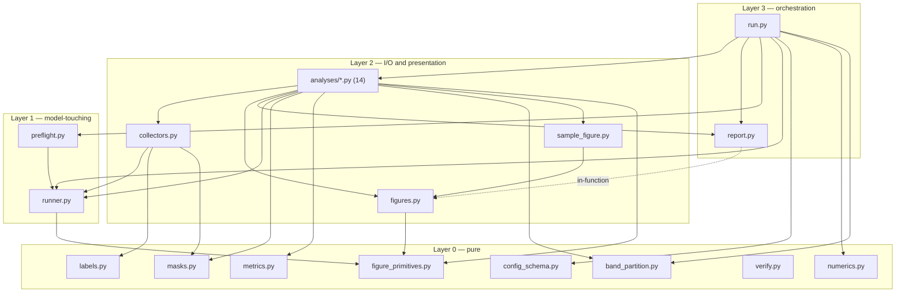

# `teb_vae/lag_attn/eval` — evaluation contract and reference

This document is the standalone reference for the evaluation pipeline. It is written to be read on
its own: what a run does, how the modules compose, what each analysis measures and under what
preconditions, what every `eval_config` key means, and which interpretation rules the code
*enforces* rather than merely documents.

Every factual claim below was checked against the code as it stands. Where a rule exists, this
document leads with the rule and then names the concrete failure it prevents — that is the whole
value of the file, and the reason a reader should be able to trust it without opening the source.

For how to *read* the figures a run emits — and the seven traps that make a figure say something
other than what it looks like — see [`FIGURE_GUIDE.md`](FIGURE_GUIDE.md). This document does not
duplicate it.

## Who this is for, and where to start

Three readers, three paths.

**Running the pipeline.** Read §1 (what a run is), §6 (configuration), §17 (operations — launching,
memory, exit codes, safe re-runs, recovering from each hard-fail guard). Skim §5 if you are
pointing it at the k-fold split for the first time.

**Reading a run's output.** Read §9 (interpretation rules — the traps that make a number mean
something else), §10 (what each analysis measures), §12 (reading `summary.json`), §13 (mechanically
verifying a run), §18 (what is still open). Then `FIGURE_GUIDE.md` for the figures.

**Extending the pipeline.** Read §2 (architecture and the layering rules), §3 (data flow), §14
(module reference), §15 (six recipes, each naming the test that fails if you skip a step), §16
(test architecture).

**In a hurry.** Two things dominate every misreading of this pipeline's output. The lag-ablation
mask **keeps** rather than removes, so it measures sufficiency and not necessity (§10,
`lag_ablation`). And source specificity is decided in *prediction* space, never in KL space (§9).

---

## Contents

1. [What a run is](#1-what-a-run-is)
2. [Architecture](#2-architecture)
3. [Data flow: checkpoint + shard → `summary.json`](#3-data-flow-checkpoint--shard--summaryjson)
4. [Three rules the code enforces](#4-three-rules-the-code-enforces)
5. [The k-fold repoint, and what it changes](#5-the-k-fold-repoint-and-what-it-changes)
6. [Configuration](#6-configuration)
7. [Numerics and reproducibility](#7-numerics-and-reproducibility)
8. [Preflight, the health probe, and `preflight.json`](#8-preflight-the-health-probe-and-preflightjson)
9. [Interpretation rules](#9-interpretation-rules)
10. [The analyses](#10-the-analyses)
11. [The band partition](#11-the-band-partition)
12. [Reading `summary.json`](#12-reading-summaryjson)
13. [Verifying a run](#13-verifying-a-run)
14. [Module reference](#14-module-reference)
15. [Extending the pipeline](#15-extending-the-pipeline)
16. [Test architecture](#16-test-architecture)
17. [Operations](#17-operations)
18. [Known limitations and open questions](#18-known-limitations-and-open-questions)

---

## 1. What a run is

One command, one checkpoint, one timestamped directory of CSVs, PDFs and JSON:

```bash
python -m teb_vae.lag_attn.eval.run \
    --config teb_vae/lag_attn/eval/configs/eval.yaml \
    --checkpoint /path/to/lag-attn-epoch=412.ckpt
```

Or from an IDE's Run button with no command line at all, via the `RUN_ARGS` dict at the bottom of
`run.py`. Resolution is **per key**: a flag passed on the command line wins for that key alone and
leaves the rest to the dict, so the common iteration — varying only the checkpoint — needs no edit.
A `RUN_ARGS` key that is not an argparse `dest` raises at startup; the dict is a launch
convenience, not a second configuration surface, and everything that shapes the run itself lives in
the YAML, which is dumped into the run directory as the durable record. Which source supplied each
value is recorded in `results.arguments.sources`.

The run answers five questions: does the forecast work, does the source pathway carry information,
is that information *source-specific*, at what lag does it arrive, and is the latent actually being
used.

### The order of operations

Everything before the probe is deliberately **outside** `report.step`. A run that cannot be trusted
must not produce a summary that looks like a result: a rejected run leaves a directory holding its
*inputs* — the resolved config and the log, which are what one needs to see why it was rejected —
and no results of any kind.

| # | Call | What it establishes |
|---|---|---|
| 1 | `load_config(config)` | Walks the `base:` chain and deep-merges into one dict. |
| 2 | `--max-samples` injected into `merged_config["eval_config"]` | **Before** validation, so the override passes the same `minimum=1` bound the YAML key does. |
| 3 | `validate_eval_config(merged_config)` | Before the model, the loader or the output directory exist: a misspelling costs a parse, not a checkpoint load and a first pass over the shards. |
| 4 | `force_single_process_loader(...)` | Forces `num_workers=0` and `persistent_workers=False`, with a warning (§6). |
| 5 | `select_analyses(ANALYSES, only, skip)` | Resolves `--only` / `--skip` against the registry and `ANALYSIS_DEPENDENCIES`. |
| 6 | `configure_numerics(seed)` | fp32, TF32 off, `cudnn.benchmark` off, every generator seeded (§7). |
| 7 | `make_output_dir(...)` → `_preserve_prior_summary` | Creates the results directory. Re-running into a finished one backs up its `summary.json` and `preflight.json` (§17). |
| 8 | `configure_logging`, `dump_resolved_config` | `eval.log` and `resolved_config.yaml`. |
| 9 | `Report()` + `report.set(...)` | Records `checkpoint`, `config`, `output_dir`, `numerics`, `eval_config`, `arguments`, `analyses_selected`. |
| 10 | `EvalRunner.from_checkpoint(...)` | `check_model_class` → `load_checkpoint_strict` → `Objective.from_checkpoint`; then `geometry` and `objective` are recorded. |
| 11 | `preflight.run_preflight(...)` | The hard-fail guards. Raises rather than recording (§8). |
| 12 | `GraphDataModule(...).test_dataloader()` | The one loader every analysis iterates. |
| 13 | `preflight.first_batch(loader)` | `None` raises, naming `vae_test_datasets` and the `dataset_kwargs` filters. |
| 14 | `preflight.probe_load_health(...)` | Behavioural reading; warns, never raises. |
| 15 | `lag_seconds_convention` recorded; `write_preflight` | `preflight.json` (§8). |
| 16 | `report.step("probe", ...)` | One loader pass, **no forward** (§10, `probe`). |
| 17 | `report.step("band_partition", ...)` | Writes `band_partition.json` and `band_channel_map.csv` into the results root (§11). |
| 18 | `configure_figure_style()` | Once, here — not as an import side effect, since it mutates global `rcParams`. |
| 19 | The analysis loop | Each under `report.step`, so one failure does not discard the rest of a multi-hour run. |
| 20 | Verdict promotion | `scalars["collapse"]` → `results.collapse`; `perm_control["specificity"]` → `results.source_specificity`. |
| 21 | `max_memory_allocated_gb` | CUDA only; **absent, not zero**, on CPU. |
| 22 | `report.finalise(...)` | `headline`, `coverage`, `sanity`, `config_warnings`, then `artifacts` last. |
| 23 | `console_table()`, `report.write(...)`, `exit_code()` | `summary.json`, then non-zero on any failed step. |

### Output layout

```
<out_dir_base>/<tag>/<YYYY-MM-DD--[HH-MM-SS]>/eval_results/
    summary.json           headline scalars, sanity verdicts, manifest, per-step errors
    preflight.json         health probe, widths, preconditions, lag-seconds convention
    loader_probe.json      per-file and per-label counts
    band_partition.json    the c_y channel map (§11)
    band_channel_map.csv   one row per channel
    resolved_config.yaml
    eval.log
    summary.bak.<stamp>.json      only when re-running into a finished directory (§17)
    preflight.bak.<stamp>.json
    forecast/ frequency_band/ uplift/ residual/ scalars/ attention/ te_lag/
    latent/ calibration/ perm_control/ lag_ablation/ samples/ cross_subgroup/
```

The two band-partition artifacts sit in the **root** of `eval_results/`, beside `summary.json`,
not in an analysis subdirectory: they describe the *data*, not the model, and nothing about them
depends on a forward pass.

The default path is timestamped to second resolution with a numeric collision guard (`-2`, `-3`,
…), so two runs launched in the same minute — normal while iterating on a checkpoint — cannot write
into each other's directory.

---

## 2. Architecture

The pipeline is four layers, and the direction of dependency between them is the property that
keeps it testable. A pure function on tensors can be handed a hand-built input whose answer is
known by arithmetic; a function that also opens a checkpoint cannot. So the boundary is drawn at
what each layer is allowed to touch, not at what it is about.

| Layer | Modules | May touch | May not touch |
|---|---|---|---|
| 0 — pure | `masks`, `metrics`, `config_schema`, `numerics`, `band_partition`, `labels`, `stats`, `verify`, `figure_primitives` | tensors, arrays, paths it is handed | the runner, a loader, another eval module (except as noted) |
| 1 — model-touching | `runner`, `preflight` | the checkpoint, the model, one batch | figures, DataFrames, the report |
| 2 — I/O and presentation | `collectors`, `figures`, `sample_figure`, `analyses/*` | the loader, the filesystem, layers 0–1 | **another analysis** |
| 3 — orchestration | `run`, `report` | everything | — |

**The import graph is acyclic at module scope, and every edge points downward.** `masks`,
`config_schema`, `numerics`, `band_partition` and `verify` import nothing from anywhere in
`teb_vae`; `metrics` imports exactly one name from the model package (`nets.model._KLD_ACTIVE_EPS`,
so the eval's notion of an "active" latent dimension cannot drift from the model's); `figures` and
`runner` import `figure_primitives`; `preflight` imports `runner` and, under a named exemption, two
guards from `trainer`; every analysis imports from `figures` / `masks` / `metrics` / `report` /
`collectors` / `runner` and **never** from another analysis; `run.py` imports everything.



Six imports of *another module in this tree* are written inside functions rather than at module
scope — `runner.forecast_view` → `masks.feature_mask`, `labels.batch_labels` → `runner.get_field`,
`report.emit_grouped_variants` → `figures` and `labels`, `collectors.collect_predictions` and
`forecast._heatmap_triple` → `figure_primitives.average_forecast_per_channel`, `cross_subgroup` →
`report.json_safe`. Each defers a cost or keeps a lower layer's import surface narrow — most
usefully, it keeps `matplotlib` off `report`'s import path, and `report` is imported by nearly every
analysis.

Six more defer a *third-party* import for cost alone: `pandas` in `report` and `band_partition`,
`h5py` in `band_partition`, `warnings` in `figures`, `torch` in `run`, and — the one worth naming —
`scipy.stats` inside `stats.py` — the Layer-0 module holding the rank tests that `cross_subgroup`
and `kld_time_to_delivery` share, imported lazily at each call site. SciPy is the only third-party
package any analysis pulls in beyond the pipeline-wide four; a box without it loses those two
analyses and nothing else. §17 lists what a run needs installed.

**Writing an import in-function buys no exemption from the layering rules.**
`tests/test_self_contained.py` and `train/tests/test_layering.py` both AST-walk every file and
count lazy imports exactly like module-level ones, because a lazy `import model.something` is
precisely the shortcut a future change reaches for and is invisible to a module-level check.

Those rules are absolute, not stylistic. No module under `eval/` may import `model` (the superseded
tree), `lightning`, `pytorch_lightning`, `teb_vae.lag_attn.task`, `teb_vae.lag_attn.trainer` or
`teb_vae.lag_attn.plotting`. There is exactly one exemption, and it is **per-module**:
`EXEMPTIONS = {"preflight": {"teb_vae.lag_attn.trainer"}}` permits `preflight` to import from
`trainer` and nothing else to. What it in fact imports is two symbols — `_check_stat_path` and
`_check_declared_widths_against_shard` — because copying ninety lines of guard is how those guards'
long actionable error messages drift out of agreement with the trainer's. The exemption is narrow in
the dimension that matters: `test_self_contained.py` pins that `preflight` importing `task` still
violates, and a reverse guard fails if `preflight` ever stops importing `trainer`, so a dead
permission cannot linger.

### `figure_primitives.py`, the shared seam

`figure_primitives.py` sits outside `eval/`, at `teb_vae/lag_attn/figure_primitives.py`, and is the
only module in the tree that both the training-time callback and the evaluation pipeline import. It
exists because the two need the same conversions — the same overlap averaging, the same symmetric
colour limit, the same lag-seconds axis — and the alternatives were both bad: import a Lightning
`Callback` module into an offline analysis script, or keep a second copy that a test would then
have to keep proving identical to the first. Every helper in it is pure `numpy` / `torch` /
duck-typed matplotlib, so lifting them into a module of their own leaves one copy in the tree,
importable from both sides, and drags no framework into the eval path.

The eight colour literals travel with them, and are deliberately *not* re-exported from
`utils.style`: two of the eight genuinely differ there, and the figures depend on the exact hues
the model's own plots use, so that a training figure and an eval figure of the same quantity are
the same colour. `eval/figures.py` re-exports the colours and four of the helpers, so an analysis
imports its entire plotting surface from one place and never reaches across the package boundary
itself.

---

## 3. Data flow: checkpoint + shard → `summary.json`

Inside one analysis the tensor path is the same shape every time:

```
batch (moved to device by runner.to_device, inside runner.iter_batches)
  -> runner.build_target_streams(batch)  -> (y_st, y_ph),  c_y re-checked every batch
  -> runner.build_source_stream(batch)   -> u_stream,      c_u re-checked every batch
  -> runner.forward(...)                 -> the model's 24-key dict, unmodified
  -> runner.forecast_view(...)           -> ForecastView, every field (B, T-H_d, H_d, c_y)
                                            + mask (B, T-H_d, H_d, 1) from masks.feature_mask
  -> metrics.*                           -> per-sample tensors of length B
  -> collectors.collect_metrics          -> DataFrame + composition + plan
  -> frame.to_csv(directory / "per_sample.csv")
  -> report.emit_grouped_variants(frame, directory, value_columns=[...])
  -> return summary dict                 -> Report.set(name, summary)
```

Three properties of that path are worth stating once, because every analysis inherits them.

**Every reported number is masked exactly as the loss masks.** `masks.feature_mask` is elementwise
identical to the mask `compute_loss` builds internally, and it is the *only* mask constructor in the
pipeline (§14, `masks.py`). An analysis that wants a narrower window narrows this one.

**The forward's dict passes through unmodified.** `runner.forward` renames and drops nothing, so a
key in an analysis is the key the model emitted.

**Two reductions exist and they are different numbers.** Per-sample (each sample divided by its own
mask sum) is what every `per_sample.csv` carries; pooled (one global denominator, matching
`compute_loss`) is what `scalars` carries and what reconciles with training. §14, `metrics.py`.

---

## 4. Three rules the code enforces

These are the ones that would otherwise produce plausible numbers under false premises. Each is a
raise or a recorded verdict, not a comment.

**The objective comes from the checkpoint, not from the config.** `compute_loss`'s behaviour is set
by nine arguments — `likelihood`, `sigma_obs`, `free_bits`, `detach_baseline_in_full`,
`lambda_full`, `lambda_base`, `lambda_lag`, `beta_schedule`, `kld_beta` — and **none of them is a
constructor argument**, so none appears in `model_kwargs`. They live in
`checkpoint["hyper_parameters"]`. A pipeline that rebuilt only from `model_kwargs` and took the
objective from its own YAML would silently score under `compute_loss`'s defaults —
`likelihood='mse'`, `sigma_obs=1.0` — rather than the shipped `gaussian_nll` and `learned`, and
every loss, the uplift and the source-specificity ordering would be computed under an objective the
model was never trained with. Preflight reads them, records them, and **raises** when the eval
config disagrees, comparing only the keys the config actually sets.

**Load is verified in weight space, not only in behaviour space.** A behavioural probe on
`residual_ratio` cannot distinguish "the checkpoint never loaded" from "a real model whose source
pathway collapsed" — both read near zero, and hard-failing on the second would destroy a genuine
finding. The hard check is that the delta heads' weights differ from their zero initialisation,
which only a real load can produce. The behavioural reading is recorded and warned on, never
raised.

**Preconditions are enforced, not annotated.** `causal_norm=False` blocks every TE-labelled output
with a raised `TEPreconditionUnmet` naming the reason; `head_structured_latent=False` blocks the
per-head decomposition and downgrades `te_lag_map` from an *attribution* to a *diagnostic*, which
every figure, the summary, and a dedicated `te_lag_map_label` column on the CSV then say. A number
that looks like a transfer entropy but is not one is worse than no number.

---

## 5. The k-fold repoint, and what it changes

`configs/eval.yaml` points `dataset_config.vae_test_datasets` at
`k_fold_cross_validation_dataset/test/` — one HDF5 per canonical subgroup, all eight of
`healthy_no_bg_no_cs`, `healthy_no_bg_cs`, `healthy_bg_no_cs`, `healthy_bg_cs`, `acidosis_no_cs`,
`acidosis_cs`, `hie_no_cs`, `hie_cs` — rather than at the pretraining test files `default.yaml`
uses.

**This is a deliberate semantic change, not a bug fix.** "Test" in an eval run means all eight
subgroups and all three clinical classes; "test" in a training run means the healthy-only
pretraining split, which is healthy by construction and carries a uniformly zero `target`. A
forecast MSE from an eval run is therefore **not** comparable with a `test_feat_loss` logged during
training: the populations differ, and nothing in either number says so. The pretraining split
remains usable — override `vae_test_datasets` back to it in a variant config — and the class-aware
paths self-skip below two classes rather than raising, so the same code runs against either and
neither produces a one-violin figure that invites a comparison there is nothing to compare against.

Both paths in the shipped config still carry the deliberate `REPOINT_ME_new_channel_selection`
placeholder. Preflight **raises** on any resolved dataset path containing `REPOINT_ME`, and it runs
that check *first*, before the existence guards, so the failure names the real cause instead of
surfacing as a missing file the operator then goes looking for.

---

## 6. Configuration

Every key below is validated at load by `config_schema.py`, before the model, the loader or the
output directory exist. An unknown key raises and names the valid set, because YAML silently
absorbs whatever it is given: `max_sample` instead of `max_samples` parses cleanly, is never read,
and means "no cap" — a run that took four hours instead of twenty minutes and reported nothing
about why.

### The `eval_config` block

The table is `config_schema.VALID_KEYS` exactly; there are eight keys and no others. `bool` is
rejected everywhere an integer is expected — it is an `int` subclass in Python, so
`caps: {attention: true}` would otherwise validate and then cap that analysis at one sample.

The **Default** column is `config_schema.DEFAULTS`, which is what a variant config that omits the
block — or omits that key — actually runs under. Two of them differ from the shipped value in a way
that changes behaviour rather than tuning it, and both are marked below.

| Key | Type and bound | Default | Shipped | Meaning, and what a wrong value costs |
| --- | --- | --- | --- | --- |
| `seed` | int, $0 \le s < 2^{32}$ | `42` | `42` | Seeds torch, numpy and `random`. `forward` samples $z$ unconditionally, so the sampling is seeded rather than suppressed — evaluating a mean-$z$ model would report a forecast the model never actually makes. KL readouts are unaffected either way, being functions of $\mu$ and $\log\sigma^2$ only. The upper bound is numpy's, the binding one of the three libraries. |
| `max_samples` | int $\ge 1$, or `null` | `null` | `null` | Prefix cap on loader iteration, overshooting by up to $B - 1$ because it is checked per batch. `--max-samples` is injected into the block **before** validation, so it passes the same `minimum=1` bound: `--max-samples 0` and `--max-samples -1` are rejected. Assigned after validation they bypassed it, and both evaluated exactly one batch — indistinguishable in the output from a legitimate `--max-samples 1`, so a `-1` meaning "no cap" silently became the smallest run the pipeline can do. |
| `caps` | mapping of name to (int $\ge 1$ or `null`) | `{}` (no caps) | `predictions: 2000`, `attention: 2000`, `samples: 8` | Per-analysis retention caps, for the analyses that hold per-sample tensors or emit per-sample files. A cap of $0$ is **rejected** — it would retain nothing while still reporting success, which is indistinguishable from an analysis that found nothing. `null` means no cap. Cap *names* are deliberately not validated: the set grows with every analysis, and an unread name only ever narrows, so it is inert. `report.check_inert_caps` separately warns about a cap at or above `max_samples`, which never fires; those warnings land in `results.config_warnings` and the console table. |
| `bands` | mapping of name to an inclusive `[lo, hi]` integer pair | `{}` (the ablation then raises) | four bands over $[0, 90]$ | Lag bands for the ablation, in model-lag units. `lo > hi` raises: an empty band produces an all-`False` keep mask, and `entmax15` — which the shipped config enables — raises on a zero-support row rather than degrading like `softmax`. `hi > max_lag` raises and names $L = \mathrm{max\_lag} + 1$. `max_lag` is read from `model_config.VAE_model`, i.e. the config's claim about the geometry; the checkpoint's is authoritative and is re-checked in preflight, but a band outside the config's own claim is already wrong this early. |
| ~~`up_shift_secs`~~ | — | **removed** | — | **Removed on 2026-09-05.** The key mapped a lag index onto a "raw-file" timeline by undoing the dataset builder's UP shift. The stored UP/FHR timeline is canonical: the dataset builder shifts the UP channel when it writes the shards, that shift is part of how the stored signals are, and nothing downstream adds it back, subtracts it, budgets it or interprets it. Every lag axis is $4\ell$ on the stored timeline, `metrics.lag_to_seconds` takes no offset, and a config naming the key is refused as unknown. |
| `health_probe_floor` | float $\ge 0$ | **`0.0`** — a floor that can never fire | `0.01` | Floor on the load health probe's `residual_ratio`. Below it the probe **warns and records**; it never raises. A negative value is rejected: the quantity is a ratio of RMS magnitudes and non-negative by construction, so a negative floor could never fire and would read as an active check that is not one. **Chosen a priori and uncalibrated** — see §8 for the procedure to recalibrate it. |
| `saturation_flag_threshold` | float in $[0, 1]$ | `0.05` | `0.05` | Fraction of saturated elements above which `mu_prior_sat_frac` and `delta_mu_sat_frac` are flagged. Both are `tanh`-squashed to a configured scale, so a saturated element is one whose gradient has effectively vanished: a high reading is a mis-set hyperparameter, not a property of the data. On `delta_mu_scale` it additionally **caps every transfer-entropy number the run reports**, since the measured coupling is being clipped by the bound rather than by the model. The flag is applied to the `_masked` readings only (§9). A value outside $[0, 1]$ is rejected as either always-firing or never-firing. |
| `ablation_batch_size` | int $\ge 1$, or `null` | `null` | `null` | Splits each loader batch into micro-batches for the lag ablation alone, which runs one forward per band on top of the attention window's dense clone. It bounds memory and does not change what is *measured* — though it is not exactly neutral: `forward` samples $z$ and the noise tensor's shape follows the batch, so splitting moves every absolute number by that sampling noise. Bands within one run are compared under common random numbers regardless, so the band-to-band differences — which are the measurement — are unaffected. |
| `figure_format` | matplotlib filetype, or `null` | **`null`** — the `pdf` default | `svg` | Image format every figure of the run is written in (`pdf`, `svg`, `png`, `eps`, …). Validated at config load against the **installed** matplotlib's own list, so a typo is refused before the model is built and the message names the supported set. `null` keeps `figures.DEFAULT_FIGURE_FORMAT`, which is `pdf` — the format every committed figure manifest records. DPI applies only to rasterised content, so heatmap-bearing pages stay raster inside an `svg`. |
| `max_hours_before_delivery` | float $\ge 0.5$, or `null` | **`null`** — no bound | `4.0` | How far before delivery a segment may be recorded and still be evaluated, in hours. **The bound is on the population, not on an axis**: it is applied to the delivery clock ($h = -\mathrm{epoch}/3600$) before anything is binned. It changes what every downstream number is computed over — cohort sizes, window counts, the trajectory and its tests all move — so a bounded run is **not** comparable with an unbounded one, and the resolved config dumped into the run directory is the only durable record of which this run was. Minimum one $0.5$ h bin, below which there is no whole window to draw. Here it reaches `kld_time_to_delivery`, the one analysis with a time-before-delivery axis. |

**The bolded default is the one to watch in a variant config.** A config that omits
`eval_config` entirely — or that overrides `caps` alone and drops the rest of the block, which the
partial-block rule makes legal — runs with `health_probe_floor: 0.0`, so the load health probe's
warning can never fire. That is the honest default for a schema that must accept a config having
said nothing; it is not what the shipped run does. Every lag axis is the bare $4\ell$ on the
stored timeline regardless of configuration.

**The cap names the code actually reads** are eleven, and since a name is never validated (§6, the
`caps` row) a misspelling here is inert rather than loud: `forecast` and `predictions` (the scalar
frame and the heatmap accumulation, two independent plans in one analysis), `frequency_band`,
`uplift`, `residual`, `latent`, `calibration`, `te_lag`, `perm_control`, `attention`, and `samples`
— which has two consumers, bounding both the `samples` pages and `attention`'s per-sample heatmaps.

### Load-bearing settings outside `eval_config`

Four, all in `configs/eval.yaml`, all of which fail silently rather than loudly:

- **`general_config.batch_size.test: 32`**, not the training 128. Under `no_grad` the activation
  retention that dominates training is gone, but the transients are not: the horizon core
  materialises $(B, T, H_d, d_{\mathrm{hidden}})$ tensors of roughly 590 MB at $B = 128$ and the
  attention window is cloned dense at roughly 1.79 GB, on top of which the permutation control adds
  a third decoder pass and the lag ablation one forward per band. `test` is the key
  `GraphDataModule` actually reads; a `batch_size` under `eval_config` would be a dead key — and is
  now a rejected one — and the loader would quietly run at 128, which is the exact configuration
  this bound exists to avoid. Results are batch-size-invariant (GroupNorm and LayerNorm, no
  BatchNorm), so this costs only time.
- **`dataloader_config.num_workers: 0`**, re-forced in code with a warning by
  `run.force_single_process_loader`, which additionally sets `persistent_workers: False`. Not
  tuning: `create_optimized_dataloader` hardcodes `persistent_workers=True` whenever
  `num_workers > 0`, and with spawn multiprocessing over a multi-file HDF5 dataset the workers
  degrade after the first full iteration, silently truncating the second pass to the first file's
  index range. Eval makes many passes over one loader, so it meets that failure every time. In the
  predecessor pipeline it presented as "only 1 class found".
- **Inherited training-time filters, turned off explicitly**: `epoch_min: null`, `epoch_max: null`,
  `label: null`. Each *drops eval samples* rather than failing. `label` filters by exact float
  equality against the one-hot target and would quietly exclude whole subgroups — and, on
  fractional-weight data, individual steps; `eval/labels.py` does that work correctly instead
  (§10).
- **`cache_size: 0`**, not the inherited 10000. Under training that cache is per-worker and bounded
  by the worker count; at `num_workers: 0` it becomes main-process RAM, roughly 240 KB per sample,
  so 10000 entries is about 2.4 GB held for the whole run. It is FIFO with no reuse policy, so
  against a test split larger than the cache it thrashes and buys nothing.

`load_fields` restates the inherited list rather than extending it, because a list replaces
wholesale on merge. It adds `target`, `cs_label`, `bg_label` and `epoch`.

### Caps are subsamples, never prefixes

The test loader is built `shuffle=False` over eight concatenated per-subgroup files, so a naive cap
takes a **prefix** — file 0 alone, a single subgroup and a single class. That is precisely the
predecessor's documented "only 1 class found" failure arriving by a second route, and its only
recorded workaround was "do not use a cap". Every cap here is instead a seeded index subsample over
the full index space, stratified by source file from the composition the loader probe recorded, and
each capped analysis records the per-file composition it *actually* drew — so a skewed draw is
visible rather than invisible, in the analysis's own summary and again in `results.coverage`.

**The coverage guarantee is literal, not probabilistic: every group with at least one member
receives at least one whenever the cap is at least the group count.** `masks._allocate_quotas`
allocates the per-group floor **first** and never trims it (§14, `masks.py`). `test_masks.py` pins
it at the boundary the shipped config sits on, sweeping `cap ∈ {8, 9, 16}` over the eight-group
unbalanced case and asserting full coverage at each. The shipped `caps.samples: 8` over eight
subgroup shards reaches all eight.

`max_samples` is the one exception and is documented as such: it is a prefix cap on iteration,
correct for a smoke run or a single-file split and nothing else.

### What is deliberately not configurable

Two thresholds are hard-coded on the same argument, and the argument is worth stating once: **an
operator who can raise a threshold can make any run pass it**, and both of these gate a verdict
promoted to the top of `summary.json`.

- `scalars.DEFAULT_COLLAPSE_THRESHOLDS` — `pred_gap: 1e-4`, `kld_raw: 1e-3`. An earlier form read
  them from `eval_config['collapse_thresholds']`, a key `VALID_KEYS` rejects, so the branch was
  unreachable *and* the comment claiming they were overridable was false in both directions at
  once. Both are gone. Chosen a priori and worth revisiting against the first genuinely trained
  checkpoint — as an edit here, recorded in the diff, not a per-run knob.
- `cross_subgroup.DEFAULT_ALPHA = 0.05` and `MIN_GROUP_SIZE = 3`, for the same reason.

---

## 7. Numerics and reproducibility

`configure_numerics(seed)` is called once, before the model is built, and pins:

```python
torch.set_default_dtype(torch.float32)
torch.set_float32_matmul_precision("highest")
torch.backends.cuda.matmul.allow_tf32 = False
torch.backends.cudnn.allow_tf32       = False
torch.backends.cudnn.benchmark        = False
torch.set_autocast_enabled("cpu",  False)
torch.set_autocast_enabled("cuda", False)
random.seed(seed); np.random.seed(seed); torch.manual_seed(seed)
```

fp32 everywhere, and **that means TF32 off too**. `MEMORY_AND_EFFICIENCY.md` warns that $K_t$ is a
small difference of larger quantities and bf16 has 8 mantissa bits; TF32 matmul, which is on by
default on Ampere and later, has 10 — the same argument with two bits more headroom, which is not
enough to make it safe by inspection, so it is disabled explicitly rather than assumed away.
`"highest"` and the two `allow_tf32` flags are belt-and-braces: they are separate switches in torch
and a future version could route around either alone. Autocast is disabled for **both** device
types, because a stale flag on either would silently reintroduce reduced precision and disabling an
unavailable device type is free.

`cudnn.benchmark` is the reproducibility one. `default.yaml` sets it `true` for training, where it
is the right trade; it selects convolution algorithms by timing them at the first call of each
shape, so the algorithm chosen — and with it the summation order, and with it the last bits of the
result — depends on what else the machine was doing.

**A rerun with the same config, checkpoint and seed produces identical numbers.** Three generators
are seeded, covering every draw the pipeline makes: the stratified subsample in
`masks.subsample_indices` uses its own `torch.Generator` seeded from the config, and the permutation
control's derangement is Sattolo over a seeded stream — with the global RNG pinned too, because
`reparameterize` calls `torch.randn_like`, which takes no generator.

The returned dict — seed, dtype, matmul precision, the TF32 and benchmark flags, autocast, CUDA
availability, torch version — lands in `summary.json` under `results.numerics`. **Every value is
read back from global state after it was set**, never echoed from the assignment, so the record
reports what is actually in force including on a build where one of these knobs does not exist.

---

## 8. Preflight, the health probe, and `preflight.json`

The expensive failures in this pipeline are the silent ones: a checkpoint that did not load, an
objective taken from the config instead of the run, a shard whose widths moved — each produces a
full set of plausible-looking numbers and no error. Preflight runs before the loader is built and
before any analysis writes anything, so a rejected run costs a checkpoint load and two HDF5 shape
reads.

### Order, and what raises

| # | Guard | Verdict on failure |
|---|---|---|
| 1 | Any resolved dataset path containing `REPOINT_ME` | **raises `ValueError`** |
| 2 | `stat_path` missing or unset — delegated to `trainer.py::_check_stat_path` | **raises** |
| 3 | Declared $c_y$ / $c_u$ against the shard — `trainer.py::_check_declared_widths_against_shard` | **raises** |
| 4 | `runner.objective.reconcile_with_config(config)` (§4) | **raises `ValueError`** |
| 5 | `verify_weights_loaded(runner.model)` (§4) | **raises `RuntimeError`** |
| 6 | `interpretation_preconditions(runner)` | **recorded only** |
| 7 | `probe_load_health(...)`, after the loader is built | **warns only** |

The placeholder check is first so its message is not pre-empted by a missing-file error.

The two trainer guards are **reused rather than copied**, so their long actionable messages can
never drift. Both need a remapped config view, and each remapping fixes a guard that would
otherwise silently no-op: `_check_declared_widths_against_shard` reads `vae_train_datasets`, which
an eval config does not set, so without the remap it returns early having checked nothing; and the
widths compared must be the **model's**, not the config's, since eval rebuilds from the
checkpoint's `model_kwargs` and a checkpoint whose geometry differs from the config's would
otherwise pass a config-versus-shard check and then fail inside the forward with a channel error
naming neither.

`verify_weights_loaded` reads the three tensors `_zero_init_delta_heads` zeroes at construction —
`posterior_head.delta_mu_head[*]`, `posterior_head.delta_logvar_head[*]` and
`residual_decoder.mean_head` — and raises unless at least one has a nonzero maximum absolute
weight. Each starts at exactly $0$ and each receives gradient during training, so a nonzero value
can only come from a real load.

### The health probe

`probe_load_health` runs one batch under `inference_mode` and records

$$\texttt{residual\_ratio} = \frac{\mathrm{RMS}\left(\Delta\mu_{\mathrm{src}}\right)}{\mathrm{RMS}\left(\mu_{\mathrm{full}}\right)}$$

over a coarse $[\mathrm{warmup},\ T - H_d)$ anchor slice — deliberately not the shared weight-aware
mask, because this is a probe rather than a metric and telling "alive" from "identically zero" does
not need it — alongside `delta_mu_src_rms`, `mu_full_rms`, `feat_loss`, `base_loss`, `uplift_rel`,
`kld_raw`, `kld_active_frac` and `raised: False`. Below `health_probe_floor` it warns. It never
raises: a genuinely collapsed source pathway is a finding to report, not a run to abort.

`uplift_rel` is recorded but **not gated on**. Under `gaussian_nll` with `sigma_obs='learned'` the
full and baseline losses consume *different* log-variance heads and therefore differ even when
$\Delta\mu_{\mathrm{src}}$ is identically zero.

> **The shipped floor of `0.01` is a priori and uncalibrated.** It was chosen before any real
> checkpoint was available, against no measured distribution of `residual_ratio`. To
> **recalibrate**: run the pipeline against a genuinely trained checkpoint, read `preflight.json`'s
> `health_probe.residual_ratio` and the per-anchor distribution in `residual/per_sample.csv`, and
> set the floor an order of magnitude below the observed healthy value — low enough that a healthy
> model never trips it, high enough that a dead pathway does. Record the measurement that justified
> the new value here when it lands. Until then the floor is a hint, treat a fired warning as a
> prompt to read the uplift and `kld_raw` for corroboration, and note that the weight-space check
> in §4 is the one doing the real work.

### Preconditions, recorded here and enforced elsewhere

`interpretation_preconditions` records three entries, each with its `value`, a `blocks` list and a
prose `consequence`:

| Precondition | Blocks when false |
|---|---|
| `causal_norm` | `te_lag_map`, `kld_raw_as_te`, `per_head_te` |
| `head_structured_latent` | `per_head_kl_decomposition` |
| `kld_support` | nothing — it records which anchor range the KL was reduced over |

None fails the run: the forecast, uplift, residual and calibration analyses remain perfectly valid
under either flag. What each blocks is blocked at the point of computation, by
`require_causal_norm` / `require_head_structured_latent`, both raising `TEPreconditionUnmet` — a
distinct `RuntimeError` subclass, so that a failed step reading
`TEPreconditionUnmet: causal_norm=False ...` is legibly a *refusal* rather than a crash.

### `preflight.json`

Carries `checkpoint`, `device`, `geometry`, `model_kwargs`, `objective`, `dataset_paths`, a
`checks` block with one entry per hard guard (`repoint_placeholder`, `stat_path`,
`declared_widths`, `objective_matches_config`, `weights_loaded`), and `preconditions`. `run.py` then
adds `health_probe` and:

```json
"lag_seconds_convention": {
  "step_seconds": 4.0,
  "formula": "seconds = step_seconds * lag",
  "timeline": "stored (canonical): the dataset builder's UP shift is part of the signal and is never undone downstream"
}
```

This exists so that every lag figure's axis convention is recorded by the run that drew it. A run
written before 2026-09-05 carries an `up_shift_secs` entry here instead; its seconds axes are on a
"raw-file" timeline this pipeline no longer draws, and differ from the stored timeline by that
entry's value.

---

## 9. Interpretation rules

**Source specificity is read in prediction space.** The predecessor's acceptance criterion was
$K_{\mathrm{shuffled}} < K_{\mathrm{true}}$, which the model documentation records as unachievable:
a mismatched source is out of distribution and typically moves the posterior *more*. The pipeline
reports both readouts but states the ordering

$$L_{\mathrm{feat}} < L_{\mathrm{base}} < L_{\mathrm{feat,\ shuffled}}$$

as the criterion. The KL-space reading is emitted with an explicit label and **cannot flip the
verdict** — `source_specificity_verdict` takes the three losses and nothing else, so the KL is not
an argument to it.

**The lag axis is the stored timeline, and it carries no offset.** The stored UP/FHR timeline is canonical: the dataset builder shifts the UP channel when it writes the shards, that shift is part of how the stored signals are, and nothing downstream adds it back, subtracts it, budgets it or interprets it.
The former `eval_config.up_shift_secs` key, which mapped a peak at lag $\ell$ onto a "raw-file"
timeline, was removed on 2026-09-05 together with the sign debate that surrounded it; every lag
figure now reads $\mathrm{seconds}(\ell) = 4\ell$. **The model-lag axis was exact throughout**,
which is why it remains the axis to read first.

Two things are *not* fixed by this and are worth keeping straight. The **training-callback** figures
in `teb_vae/lag_attn/plotting.py` are still fed `getattr(model, "delta_up_seconds", 0.0)` and the
model has no such attribute, so their seconds axis is the bare $4\ell$ — no offset, therefore no
sign error, but also no lead. And the sibling cells' `lag_compensated_seconds` is a **different
quantity**, $\Delta(\ell + \delta)$ with no $\pm 20$ at all; it was correct before this
correction and is untouched by it. Every run records the convention it used, with
`sign_verified: true`, so a figure's caption can be checked against what the run actually did.

**`kld_support='anchor'` makes the final $H_d$ anchors look decoupled.** They collapse toward the
prior with nothing pulling back, which reads as a real drop in coupling and is not one. `latent`'s
$K_t$ curve shades that region for exactly this reason.

**Masked and raw saturation readings differ, and both are reported.** The model's own in-forward
diagnostics are computed differently from everything else it reports, in two different directions:
`kld_active_frac` honours the KL support but ignores the per-step validity `weight` entirely, and
the two saturation fractions apply *no* masking at all — a flat mean over every element, warm-up
prefix and untrained tail included. Neither is a bug in the model; they are cheap in-forward
diagnostics logged every step. But they contradict this pipeline's rule that every reported metric
is masked exactly as the loss masks, so `latent` emits both, under `_raw` (the model's own) and
`_masked` (recomputed over the supervised mask): `kld_active_frac_raw` / `kld_active_frac_masked`,
`mu_prior_sat_frac_raw` / `mu_prior_sat_frac_masked`, `delta_mu_sat_frac_raw` /
`delta_mu_sat_frac_masked`. They routinely disagree, and the disagreement is informative rather
than a defect: a large gap means the diagnostic is dominated by steps the loss never scored. The
`saturation_flag_threshold` is applied to the **masked** pair, because those describe the region
the objective actually optimised.

**The lag-ablation mask keeps rather than removes**, so its ranking measures sufficiency and not
necessity, and reads exactly backwards if taken for a removal ablation. Stated in full under
`lag_ablation` in §10.

**Three quantities differing by $d_z = 24$ once shared one name.** `perm_control`'s KL columns are
now `kld_true_per_t` / `kld_shuffled_per_t` and carry a `normalisation` string, because they are the
$d_z$-summed per-step KL — $24\times$ `scalars`'s `kld_raw` and $24\times$ `latent`'s `kld_mean`,
all three in one `summary.json`. Compare ratios, not levels.

**$K_{\mathrm{shuffled}} \ge K_{\mathrm{true}}$ is the *expected* reading on a healthy model**, for
the same reason the KL-space criterion was abandoned: a mismatched source is out of distribution and
moves the posterior more, not less. `perm_control`'s summary therefore carries a
`kl_space.shuffled_exceeds_true` boolean that sits at `true` on a good run. It is a description, not
a check, and nothing consumes it as one.

---

## 10. The analyses

Every analysis is a module in `analyses/` exposing one entry point with an identical signature:

```python
def run_<name>_analysis(
    runner: EvalRunner,
    loader: Any,
    *,
    eval_config: Dict[str, Any],
    output_dir: Any,
    probe: Optional[Dict[str, Any]] = None,
) -> Dict[str, Any]:
    """Returns a JSON-safe summary for summary.json."""
```

None reads another's return value — the import graph enforces it — so `--only` and `--skip` can
select any subset. `run.py::ANALYSIS_DEPENDENCIES` is the table where a future analysis that *does*
consume another's output declares it; it is empty today, and that is a statement about the current
design rather than an omission. The mechanism exists because the cost of the table being wrong is
asymmetric: an analysis added later that consumes another's output has one line to write, and
without it would instead produce quietly wrong numbers under `--only` — exactly the mode `--only`
is most used in, re-running one analysis after a long run failed at its ninth step. Only a
*correctness* dependency belongs there; over-declaring would turn `--only` into a flag that keeps
refusing.

Fourteen analyses are registered, in run order: `forecast`, `frequency_band`, `uplift`, `residual`,
`scalars`, `attention`, `te_lag`, `latent`, `kld_time_to_delivery`, `calibration`, `perm_control`,
`lag_ablation`, `samples`, `cross_subgroup`. The last is ordered last and that ordering is
load-bearing. The probe is a fifteenth module, is deliberately not on the registry, and is the one
module that does not carry the signature above.

### probe

The pipeline's only real input validator, and the artifact that would have caught the predecessor's
hardest bug: a loader that silently truncated its second pass to the first file's index range,
invisible in every other output and presenting only as "only 1 class found". Nothing else in a run
reports per-file coverage, so nothing else can see that failure.

**Measures.** One pass over the loader, recording per-file counts, per-`cs_label` and per-`bg_label`
counts, a per-clinical-class histogram, the `weight` distribution, a raw-`target` value summary, the
batch field names, and the GUID and source-file vectors.

The class histogram is keyed by clinical class **name**, through `labels.clinical_class_code`, which
divides the per-step `weight` back out of the weight-scaled target. Keying on the raw stored value
was a real defect: a fractional first valid step produced a key like `"0.75"` that
`report.check_classes_present` counted as a distinct class, so one such recording permanently
defeated the very coverage check the counter exists to feed.

`target_values` is a separate, deliberately different reduction: the class histogram records one
value per recording, this records every value. The `target_not_truncated` sanity check needs the
second and cannot be answered by the first, because a recording's first nonzero step is almost
always in a full-weight region. `weight.binary` is the load-bearing field — it answers whether
`weight` is ever fractional in production data, which decides whether the class-recovery division
and that check matter at all (§18).

**It performs no forward.** `build_target_streams` is assembled for the batch size and for the
width checks that function performs, and nothing else. An earlier form cached a per-sample `z_mean`
through `encode_only` on the reasoning that the latent analyses could then skip a pass — but nothing
ever read it: `latent` takes its own full pass and needs the per-step posterior, not a
support-averaged coordinate. The cache cost an extra encode over the whole split on every run and
saved nothing. It is gone; `IN_MEMORY_KEYS` is `("guids", "source_files")`.

**Preconditions.** None. **Not selectable** via `--only` / `--skip`, for two structural reasons: it
is the run's only coverage record, and it supplies the per-file grouping every stratified capped
draw stratifies over — skipping it would silently unstratify every cap.

**Raises.** If the split yields no samples at all, naming both causes (an unresolvable
`vae_test_datasets` path, or a `dataset_kwargs` filter that excluded everything); and if a
configured shard contributed none, because a zero-count file silently narrows the population every
headline number is computed over. Under an active `max_samples` cap the second **warns instead**,
since a prefix cap over concatenated shards legitimately reaches only the first ones — but the
warning says plainly that the capped analyses therefore saw a biased draw.

**Signature.** Its own, not the registry's — it takes no `eval_config` and no `probe`, because it is
what produces the `probe` every other analysis is handed:

```python
run_probe(runner, loader, *, configured_files=None, max_samples=None, output_dir=None)
```

**Outputs.** `loader_probe.json`. `guids` and `source_files` are returned in memory only; written
out they would repeat every GUID in the split inside a summary meant to be read at a glance.
`summary_view(record)` is what strips `IN_MEMORY_KEYS` before the record reaches `summary.json`, so
the two views of the probe cannot drift.

**Reading it.** `per_file` is the first thing to look at on any surprising run. A shard at a much
lower count than its siblings is a filter doing something unintended, not sampling noise.

### forecast

**Measures.** Masked MSE and $R^2$ over the whole feature vector and over each block separately —
the scattering and phase-harmonic halves are different quantities on different scales and a single
number hides which one the model actually predicts. Plus the per-horizon-step and per-anchor error
profiles.

Every number is a **per-sample** mean, each sample divided by its own mask sum. That is a different
quantity from `compute_loss`'s pooled mask-weighted mean over the batch, and the two do not agree
unless every sample has the same mask density, which real recordings never have. The pooled form,
which *does* reconcile with training, is reported by `scalars`.

**Why the horizon profile matters.** The forecast is *supposed* to get worse with $h$. A flat
profile is the signature of a model predicting a constant, which can post a respectable aggregate
MSE.

**Caps.** Two independent plans: `caps.forecast` bounds the per-sample scalar frame, and
`caps.predictions` bounds the heatmap accumulation, which retains roughly 262 KB per sample.

**Outputs.** `per_sample.csv`, `horizon_error.csv`, `anchor_error.csv`; `horizon_error.pdf`,
`anchor_error.pdf`, `distributions.pdf`, `heatmaps.pdf`; plus the two grouped variants.

The residual panel of `heatmaps.pdf` is an RMS, not a signed mean, precisely because a signed mean
cancels: a channel the model over-predicts as often as it under-predicts averages to zero and reads
as perfectly forecast.

### frequency_band

**Measures.** The same masked forecast error as `forecast`, resolved two further ways over the same
$c_y$ channels, plus a per-channel pass beneath both.

*Clinical* — the fetal-monitoring bands `slow_baseline` / `deceleration` / `variability` /
`beat_to_beat`, plus `unknown` for the scattering channels whose centre frequency the shard's
provenance does not determine. *By kind* — the coefficient kinds: the order-0 lowpass, the order-1
scattering channels, and the phase-harmonic channels grouped by harmonic step $k$.

**Why both.** `forecast`'s scattering / phase split is a property of *how the features were
computed*, not of what they describe: a $0.5$ Hz scattering channel and a $0.5$ Hz phase-harmonic
channel are both beat-to-beat structure. The clinical partition asks the question a reader actually
has — does the model predict slow drift better than beat-to-beat variability — and the kind
partition asks whether the phase-harmonic block is earning its $66$ channels, which the clinical one
cannot show because it mixes both blocks into every band.

**One loader pass.** Both partitions and the per-channel accumulator are computed from the same
forward. The channel accumulator is bounded by $O(c_y \cdot H_d)$ and the band profiles by
$O(\mathrm{bands} \cdot A)$, so neither grows with the split.

**The weighted-mean identity.** Each band's MSE divides by its own channel count against the same
mask sum, so the channel-count-weighted mean over a partition's bands reproduces the overall masked
MSE exactly. That holds only when the labels tile the channel space, which is what makes it worth
asserting: a partition carrying a gap or an overlap fails it, and nothing on the face of a per-band
number would show either. An empty label is dropped rather than reported as zero — zero is a
legitimate MSE, so an empty band would read as the run's best band and would break the identity.

**Preconditions.** The run must have produced `band_partition.json` — see §11. On shards written
before `_write_selection_attrs` there is no channel provenance, and this analysis records a
**skip**, not a failure: the frequency resolution is unavailable, there is nothing to fix in the
pipeline, and every other number in the run is unaffected. A partition whose channel count disagrees
with the checkpoint's $c_y$ *does* raise, because every band would then be assembled from the wrong
channels and the numbers would look entirely ordinary.

**Outputs.** `clinical/` and `by_kind/`, each with `per_sample.csv`, `horizon.csv`, `anchor.csv`,
`band_violins.pdf`, `band_horizon.pdf`, and grouped variants under the stem `band_mse` — i.e.
`band_mse_by_clinical_class.{csv,pdf}` and `band_mse_by_subgroup.{csv,pdf}`. Plus `per_channel/`
with `per_channel.csv`, `per_channel_horizon.csv` and `per_channel_frequency.pdf`. The per-channel
tables are joined to the channel map, so a downstream plot against frequency needs no second file.

### uplift

**Measures.** $L_{\mathrm{base}} - L_{\mathrm{full}}$ per sample, absolute and relative, plus the
fraction of samples where the residual pathway helped at all. This is the plainest statement that
the source pathway does something. The relative form divides by the **magnitude** of the baseline
loss, because under `gaussian_nll` a well-calibrated baseline loss is routinely negative and
dividing by the signed value would flip the sign of the uplift on exactly the healthy runs.

**Preconditions.** None. Scored under the checkpoint's own objective, so an `mse`-trained and a
`gaussian_nll`-trained checkpoint each get the loss they were optimised for.

**Reading it — the failure mode.** A near-zero uplift is **not** automatically a collapsed pathway.
Under `gaussian_nll` with `sigma_obs='learned'` the two losses read *different variance heads*, so
they differ even when $\delta\mu_{\mathrm{src}}$ is identically zero, and can differ in either
direction. This analysis therefore *flags* rather than declaring collapse, and names `residual` —
which isolates the mean pathway — as the readout that settles it. The joint verdict lives in
`scalars`.

**Outputs.** `per_sample.csv`; `uplift.pdf`; the two grouped variants.

### residual

$\delta\mu_{\mathrm{src}}$ is the *entire* mean-space contribution of the source pathway: the full
forecast is $\mu_{\mathrm{base}} + \delta\mu_{\mathrm{src}}$, so if this is zero the source changed
nothing about what the model predicts, whatever the KL says. That makes it the one readout that
isolates the mean pathway — the uplift cannot, for the variance-head reason above, and the KL
cannot either, being a property of the posterior that says nothing about whether the decoder used
it.

**Measures.** `residual_ratio` — the masked RMS of `delta_mu_src` relative to the full forecast —
per sample and per anchor, against the same `health_probe_floor` the preflight probe uses, so the
run-level probe and this analysis cannot disagree about what "collapsed" means — a floor that is
itself a priori and uncalibrated (§8), so the agreement is about the *definition*, not about the
threshold being right. The ratio rather
than the raw RMS because an absolute magnitude is uninterpretable without the scale of the thing it
corrects.

**Reading it.** A ratio near zero means the residual head is contributing nothing, which is a
*finding* about the checkpoint, not an error — the checkpoint loaded, which the weight-space
preflight check established separately. The per-anchor trace is the other half of the measurement: a
pathway that is active early and flat later is a different finding from one that never activates,
and the per-sample scalar averages both into the same number.

**Outputs.** `per_sample.csv`, `per_anchor.csv`; `residual.pdf`; the two grouped variants.

### scalars

The only analysis that reports the **pooled** form — one global denominator over the whole split,
exactly as `compute_loss` reduces — so its numbers are directly comparable with a row of the
training run's `metrics.csv`. Everything else in the pipeline reports a per-sample quantity. The
pass is uncapped by any `caps` key — a scalar table is one row, and a capped one would not reconcile
with training. `max_samples` still applies, and that is the caveat: a run under `--max-samples`
produces a scalar table pooled over a prefix of the split, which is the one thing this analysis
exists to make comparable and is no longer comparable at all.

**Measures.** Every metric the task logs. `METRIC_SUFFIXES` mirrors `trainer.py::_METRIC_SUFFIXES`
and a test asserts the two are equal, so a metric added to the task and not here fails the suite
rather than going missing from a table that looks complete. It is mirrored rather than imported
because `trainer.py` pulls in Lightning, and an eval run has no business standing up a training
framework to read a tuple of strings.

**What actually reconciles with a training log, and why.** Three things, each of which was a way to
get it wrong.

*The same mask, KL support and anchor range.* Each metric is pooled against the denominator it was
reduced over — the feature mask's sum, the KL mask's sum, or the batch size for per-run constants. A
pooled mean over a split is not the mean of the per-batch means unless every batch has the same mask
density, and the last batch of a split is routinely short.

*The effective $\beta$, not the configured constant.* `kld_beta` in the config is documented as the
fallback for `beta_schedule.kind == constant`; the shipped config ships a `linear_warmup`, and
`task.py` logs the schedule's value under the name `kld_beta`. `Objective.effective_beta(epoch)`
mirrors `task.py::_resolve_beta` term for term, with the epoch taken from the checkpoint blob's own
top-level `epoch` key — not from a config key, which would be a second unverifiable claim about
which epoch this checkpoint came from. A `linear_warmup` schedule with no recoverable epoch
**raises** rather than reporting the ramp's start for a checkpoint hundreds of epochs past its end,
and an unknown schedule kind raises in both implementations. On the shipped schedule at epoch $412$
the effective $\beta$ is $0.1$ against a configured $0.001$ — a hundredfold difference, which also
shifts `total_loss` and `main_loss` by $(\beta_{\mathrm{eff}} - \beta_{\mathrm{cfg}})L_{KL}$, in the
one row whose whole purpose is to line up against training. The provenance is a named block so
neither number can be read as the other:

```text
beta: {kld_beta_effective, kld_beta_configured, beta_schedule, checkpoint_epoch}
```

*Root-of-pooled-mean for the two RMS diagnostics.* `delta_mu_rms` and `mu_post_prior_gap_rms` fold
the batch `weight` into both masks and accumulate $\left(\sum m\,v^2,\ \sum m\right)$ across
batches, rooting **once** at the end — which is what `task.py::_compute_residual_diagnostics`
computes:

$$\mathrm{rms} = \sqrt{\frac{\sum m\,v^2}{\max\left(\sum m,\ 1\right)}}$$

Averaging finished per-sample RMS values is a different quantity and, by Jensen, always the smaller
one — about $9\%$ low at realistic mask densities, in the direction that flatters the model.
Omitting `weight` from the masks would additionally count steps over gaps in the recording, whose
$\delta\mu$ the loss never scored, in both numerator and denominator.

**The joint collapse verdict**, promoted to a top-level `summary.json` field because it is the run's
headline conclusion and a reader should not have to know which analysis produced it. Deliberately
*one* verdict rather than two independently near-zero numbers: collapse is `pred_gap` near zero
**and** `kld_raw` near zero *together*. Either alone is `inconclusive` and says which — a near-zero
KL with a real `pred_gap` is a decoder using a latent the KL under-reports; a near-zero `pred_gap`
with a real KL is a posterior carrying information the decoder does not act on. Both are findings
worth chasing and neither is collapse. The thresholds are not configurable; see §6.

**Not applicable.** The five permutation-control metrics are not produced by this pass and are
listed with their reasons in `not_applicable.json` rather than silently absent, so a reader can tell
"not measured here" from "measured and zero".

**Outputs.** `test_metrics.csv`, `not_applicable.json`. No figures, and no grouped variant: one
pooled row has no groups.

### attention

The attention window is the model's only route from the source stream to the latent, so its shape is
the most direct statement the model makes about lag structure. This analysis reports that shape and,
just as importantly, reports whether there is a shape at all.

**Measures.** Per sample: `argmax_lag`, `entropy_mean`, `attainable_entropy`, `head_diversity` (mean
pairwise total-variation distance between heads' lag profiles, `NaN` for a single head),
`n_support_anchors`, per-head entropies, and the per-lag mass profile. The seconds conversion is a
*summary* quantity, not a per-sample column: `median_argmax_lag_seconds` sits beside
`median_argmax_lag` and carries the $\Delta_{UP}$ offset (§9) — a **lead**, $4\ell - 20$ s —
where the lag itself is exact.

**The two ceilings, and only one is reachable.** `argmax_lag` alone is not a finding — it names a
peak whether or not one exists, and on a near-uniform row it names noise. The entropy separates the
two, but *against which bound* decides whether the check can ever fire. Causal masking gives anchor
$t$ only $\min(t+1, L)$ valid lags, so the early anchors — $60$ of the $240$ supported ones at
production geometry — cannot reach $\log 91 = 4.511$ at any flatness. Attention uniform over every
causally available lag, which has no lag structure whatsoever, scores $4.398$ nats: a ratio of
$0.9749$ against $\log L$, which reads as mild concentration. A uniformity check with a $1\%$
margin therefore **never fires** against $\log L$, and the systematic gap is roughly $24\times$ the
floating-point slack that margin exists to absorb.

So two quantities are reported under two names that cannot be confused:

- `mean_attainable_entropy_nats` — the mean across retained samples of the per-sample bound
  $\sum_t s_t \log\min(t+1, L) \big/ \sum_t s_t$, which uniform-over-available-lags attains exactly.
  This is what a uniformity check must divide by, and `report.check_argmax_lag` does.
- `max_possible_entropy_nats` $= \log L$, the window's *width*. Kept for the lag axis and the figure
  captions; an entropy compared against it reads as more concentrated than it is.

`attainable_entropy` is a **per-sample** column on `per_sample.csv`, computed per sample because the
bound depends on which anchors that sample's support kept.

**Preconditions.** None, but the readout is only meaningful from an `eval()`-mode pass: under
`train()` dropout is live inside the attention, the rows do not sum to $1$, and the `te_lag_map`
identity quietly stops holding. `EvalRunner.inference_mode()` enters both `no_grad` and `eval()` and
restores the prior mode on exit, including on exception.

**Caps and memory.** `caps.attention` bounds the per-sample scalar pass; `caps.samples` — a
separate, much smaller cap — bounds how many per-sample heatmaps are drawn, because a heatmap is
read one sample at a time. The heatmap collector retains $(T, M, L)$ at about 436 KB per sample,
roughly 0.9 GB at the shipped cap: the largest retention in the pipeline and the first knob to lower
when a run is tight on host memory.

**Outputs.** `per_sample.csv`, `mass_by_lag.csv` — melted per-lag mass carrying both a `lag` column,
which is exact, and a `lag_seconds_physical` column, which carries the $\Delta_{UP}$ offset (§9) —
`head_entropy.csv` (per-head mean/median/min/max); `attention.pdf`, and `attention_heatmaps.pdf`
when any sample was retained — `None`, not an empty page, when none was. Plus the two grouped
variants.

**Reading it.** Never read `argmax_lag` without the entropy beside it, against the *attainable*
ceiling. Head diversity answers a separate question: four heads that all settled on the same lag are
one head with four times the parameters, and the per-head KL decomposition will attribute across
them regardless, producing four confident identical numbers.

### te_lag

**Measures.** `te_lag_map`, the attention-weighted attribution of $K_t$ across lags:

$$\widetilde{TE}_{t,\ell} = \sum_m K^{(m)}_t\,\alpha^{(m)}_{t,\ell},
\qquad \sum_\ell \widetilde{TE}_{t,\ell} = K_t$$

plus the per-head KL decomposition $K_t = \sum_m K_t^{(m)}$ that only this model supports. The
identity is a model contract; what this analysis establishes is the *eval-side* property — that
time-averaging and dead-anchor exclusion preserve it in the aggregate — and it checks that **at
runtime on every run**, reporting `identity_rel_deviation` against
`IDENTITY_TOLERANCE = 1e-4` rather than assuming it, because the thing most likely to break it is a
support that drifts, not a formula that changes.

**Why dead anchors are excluded.** `_ablate_dead_anchors` zeroes an attention row rather than
renormalising it, so at a dead anchor $\sum_\ell \widetilde{TE}_{t,\ell} = 0$ while $K_t$ stays
positive. Averaging those anchors in does not merely add noise — it *subtracts* mass from the lag
profile in proportion to how many anchors a band mask killed, which is largest for exactly the
long-lag bands an ablation most wants to compare.

**Preconditions, two, with different severities.**

- `causal_norm=False` **raises `TEPreconditionUnmet`** before the analysis directory is even
  created. The whole analysis is refused; `summary.json` carries no `te_lag` key and the step record
  says why. Without a causal normalisation the KL is not a transfer entropy and labelling it one
  would be the worst possible output.
- `head_structured_latent=False` downgrades the per-head section to
  `{"available": false, "reason": ...}` and relabels the map a *diagnostic* rather than an
  *attribution*. The map still carries information; it just is not a rigorous attribution.
  Additionally, **the per-head `k_head*` / `share_head*` columns are absent from the CSV, not
  null-filled.** `kld_per_t_per_head` is emitted whatever the flag — `heads.py` takes the contiguous
  view unconditionally — so its shares sum to $K_t$ as a property of the *view*, on any model,
  including one where every latent dimension depends on every head. Without the guard a flat-latent
  run would ship a full set of finite shares summing to $1.000$, which looks exactly like a valid
  decomposition and is an arbitrary partition of a quantity every head contributed to. A null share
  reads as "computed, no data"; a set of shares summing to one reads as a decomposition. Under a
  flat latent it is neither, so the only rendering that cannot be misread is no column at all.

**The CSV carries its own interpretation marker.** `te_lag_map_label` is written as a constant
column on the frame, taking the value `attribution` or `diagnostic`. A per-sample CSV outlives the
`summary.json` it was written beside — it gets copied into a notebook and diffed against another
run's — and the `te_l*` columns of a flat-latent run mean something different from a head-structured
run's while being column-for-column identical.

**A column-selection trap.** `te_lag_map_label` shares the `te_l` prefix with the per-lag columns.
`_lag_columns()` is the correct selector because it requires digits after the prefix; a naive
`startswith("te_l")` sweeps the label column in.

**Outputs.** `te_lag_mean_per_sample.csv` — **not** `per_sample.csv`; `cross_subgroup` depends on
the real name. Plus `per_head.csv` (long form, only when share columns exist); `te_lag.pdf`;
`per_head_lag_profile.pdf` when the per-head guard passes; and the grouped variants under the stem
`te_lag_mean_per_sample`.

**Reading it.** `identity.holds` is the first thing to check: a violation almost always means an
anchor support that includes rows the model zeroed, not a change to the attribution. Absolute
per-head KL is reported *beside* the share because at initialisation and on a collapsed run
$K_t \equiv 0$ and every share is $0/0$ — a share is undefined there, since zero is a legitimate
share and cannot double as "no data", but the absolute $K^{(m)}$ is a perfectly good $0$. The count
of such samples is reported as `n_samples_with_zero_kl` rather than left to be inferred from a
column of nulls.

### latent

Three questions, and the third is the one most easily missed.

*How much information is the posterior carrying?* The distribution matters more than the total — a
KL of $2$ nats spread over twenty-four dimensions is a very different model from one concentrated in
two. Hence per-dimension KL against the active threshold, `n_active_dims`, `kld_mean`, `kld_sum` and
`kld_dim_l2` — the four keys `metrics.kld_aggregates` returns. `kld_mean` is a per-step
**per-dimension** mean; `perm_control` reports the same underlying quantity $24\times$ larger under a
name that no longer collides, and §9 states the trap.

*Has the posterior moved at all?* `posterior_drift`, the mean-space companion, computed under the
same masking as `task.py`'s `mu_post_prior_gap_rms`.

*Is a bound binding?* `mu_prior` and $\mu^q - \mu^p$ are both `tanh`-squashed to configured scales,
so a saturated element is one whose gradient has effectively vanished. A high `delta_mu_sat_frac` is
**not a property of the data** — it means `delta_mu_scale` is set too low and the measured coupling
is being clipped, which caps every transfer-entropy number the run reports at a value the
hyperparameter chose.

All three diagnostics are emitted in both the model's own `_raw` form and a `_masked` form
recomputed over the supervised support. See §9 for why both, and why `saturation_flag_threshold`
applies to the masked pair.

**Outputs.** `per_sample.csv`, `per_dim.csv`; `per_dim_kl.pdf`, `per_dim_violin.pdf`,
`kt_curve.pdf`; the two grouped variants.

**Reading it.** `kt_curve.pdf` shades *both* out-of-support regions, and the second is the easily
forgotten half: under `kld_support='anchor'` the final $H_d$ steps are outside the support too,
because their forecast window runs off the end of the sequence and nothing pulls their posterior
away from the prior. Left unshaded, the KL falling to zero there reads as the model losing interest
late in the recording. The per-dimension figures use symlog with $\mathrm{linthresh}$ at the active
threshold itself, because a collapsed dimension sits at $10^{-8}$ and an active one at $10^{0}$.

### kld_time_to_delivery

`latent` reduces the split to one distribution of the per-segment KL $\overline{K}$ — the mean of
$K_t$ over the latent dims and the KL support, masked exactly as the loss masks. This analysis
resolves that **same** quantity — it recomputes it through the identical
`masks.kld_mask` → `metrics.kld_per_dim` → `metrics.kld_aggregates` seam, so it is bit-for-bit
`latent`'s `kld_mean` — against **time to delivery**, and asks whether the trajectory differs by
clinical class.

**The time axis is the `epoch` field**, which the dataset stores as the segment start time in
**seconds relative to delivery, negative before it**. Each segment is placed into a fixed
`BIN_WIDTH_HOURS` $= 0.5$ h *time-before-delivery* window
($\mathrm{hours} = -\mathrm{epoch}/3600$); the bin width is not configurable, for the same reason
`cross_subgroup`'s $\alpha$ is not — an operator who could widen it could merge two windows until a
difference appeared or vanished.

**Measures.** Per (group, window) the median, quartiles and finite count of $\overline{K}$, for
**both** the clinical-class axis (`healthy` / `acidosis` / `hie`) and the eight canonical
subgroups. Both are drawn; only the class axis is **tested**, exactly as requested.

**The test is the `cross_subgroup` procedure, re-aimed at the time axis** and reusing the shared
Layer-0 helpers in `stats.py`, so a $p$-value here means what it does there:

- **Per window** — a Kruskal-Wallis across the classes present in each bin. This is what makes it a
  statement about the *trajectory* rather than about gestation as a whole: it localises the windows
  in which the classes' $\overline{K}$ separates. A class with fewer than `stats.MIN_GROUP_SIZE`
  finite values in a window is excluded from it and recorded, never entered.
- **Holm across the windows** — the per-bin omnibus tests are one family; pairwise two-sided
  Mann-Whitney with Cliff's delta then runs for the windows that survive Holm *only*.
- **A pooled context test** — one Kruskal-Wallis across the classes *ignoring* time, reported under
  `pooled` and explicitly flagged `confounded_by_time`: the classes do not cover the axis equally,
  so a pooled difference can be a coverage artifact. It is context, and nothing consumes it as a
  verdict.

**Preconditions, and the skips.** Two, both recorded rather than raised, because a split legitimately
carries neither. The whole analysis **skips** (leaving no directory) when the batch carries no
`epoch` field, when no sample has both a finite $\overline{K}$ and a finite `epoch`, or when the
split holds no class *and* no subgroup labels at all — the ordinary outcome on the label-less tiny
smoke shard. The *class test* additionally self-skips to `tested: false` below two clinical classes
(the single-class pretraining split), while the trajectory figures still draw. No forward-pass
precondition (`causal_norm` etc.) is checked here: this is a re-cut of `kld_raw`, and §4's rules on
reading it as a transfer entropy apply upstream in `latent` / `te_lag`.

**Outputs.** `per_sample.csv` (adds `time_to_delivery_h`, `bin`, `bin_center_h` beside `kld_mean`
and `epoch`); `trajectory_by_class.csv` and `trajectory_by_subgroup.csv` (long form: `group`,
`bin`, `bin_center_h`, `n`, `mean`, `q25`, `median`, `q75`); `significance.csv` (one row per
window), `pairwise.csv` (per surviving window × class pair), and `kld_time_to_delivery.json` (the
full record). Figures: `trajectory.pdf` (two panels, class and subgroup — median line per group
with an IQR band, the time axis inverted so delivery sits at the right) and `significance.pdf`
(per-window $-\log_{10}$ Holm-adjusted $p$ against the $\alpha$ line, plus a Cliff's delta heatmap
of the surviving class pairs). It emits its **own** trajectory rather than the standard grouped
violin variant (see below).

**Reading it.** The trajectory is the descriptive layer and the significance panel is the inferential
one; read them together. A window that clears Holm with a `negligible` Cliff's delta is a real but
inconsequential separation, common where one class has many segments in a window. The `pooled` row is
*not* the answer to "do the trajectories differ" — it is confounded by unequal time coverage and is
labelled so on the record.

### calibration

**Measures.** The learned predictive Gaussian $\mathcal{N}(\mu_{\mathrm{full}},
\sigma^2_{\mathrm{full}})$ scored as a distribution: NLL, CRPS, central-interval coverage at
$1/2/3\sigma$, and PIT reliability — each against a homoscedastic reference, so "the learned
variance is worth having" is a measured claim rather than an assumption.

**The reference is the strongest homoscedastic one, not a straw man.** $\hat{\sigma}^2$ is fitted by
maximum likelihood to the very residuals being scored, so it is the best a *constant* variance could
possibly do. A learned head that fails to beat it has learned how uncertain the forecast is on
average — which the residuals already say — and nothing about *where* it is uncertain, which is the
only thing a per-element variance head is for. The gain is reported with its sign, and a
non-positive gain is warned about rather than left in a table to be noticed.

**Coverage is scored against the exact nominal.** A $\pm 2\sigma$ band covers $0.9545$, not $0.95$;
$0.95$ is $\pm 1.96\sigma$. Scoring a $2\sigma$ band against $0.95$ reports a perfectly calibrated
model as over-confident on every horizon, by half a percentage point, consistently enough to look
like a real finding. The nominals are computed from $\mathrm{erf}$ rather than tabulated.

**Preconditions.** Requires `likelihood == 'gaussian_nll'` **and** `sigma_obs == 'learned'`. The
gate is the checkpoint's *objective*, not the presence of a tensor: `logvar_full` is emitted on
every forward regardless of what the model was trained to do with it, so a presence check would
happily score an untrained variance head — one that received no gradient at all under
`likelihood='mse'` — as though its numbers meant something. Under any other objective the analysis
returns `{"skipped": true, "reason": ...}` rather than scoring a constant as though it were a
prediction; `skipped` is present as `false` on the success path too, so it is a safe discriminator.
A raise here would set the run's exit code and report a perfectly healthy checkpoint as broken.

**Outputs.** `per_sample.csv`, `per_horizon.csv` (long form, NLL and $2\sigma$ coverage by horizon
step), and `reliability.csv` — the PIT table, with columns `bin`, `bin_centre`, `density`,
`density_p25`, `density_p75`, `uniform`. **There is no `pit.csv`.** Figures: `reliability.pdf`,
`coverage.pdf`, `sharpness.pdf`. Plus the two grouped variants.

**Reading it.** The PIT histogram is accumulated per sample, not pooled, so the reliability curve
carries a spread — a single pooled histogram cannot show whether a departure from uniformity is
systematic across recordings or driven by a handful of them. Flat at $1.0$ is calibrated; $\cup$ is
over-confident, $\cap$ over-dispersed. The per-horizon coverage profile catches a variance head
calibrated at $h = 1$ and badly over-confident at $h = H_d$, which a single pooled number averages
away entirely.

### perm_control

Every other analysis establishes that the source pathway carries information. None establishes that
the information is about *this* recording. A model that had learned the marginal statistics of the
UP stream — and nothing about the pairing — would show a healthy $K_t$, a live residual and a real
uplift. This is the control that separates the two: feed the decoder a latent inferred from a
**different** recording's source and re-score against the true future.

**Measures.** Both permutation controls, from one deranged source stream. The **prediction-space**
control is the criterion, $L_{\mathrm{feat}} < L_{\mathrm{base}} < L_{\mathrm{feat,\ shuffled}}$,
returning `source_specific`, `influential_not_specific`, `no_uplift` or `undetermined`. That middle
term is what makes it a specificity test rather than a sensitivity one. The **KL-space** control is
emitted with an explicit label and cannot flip that verdict — `source_specificity_verdict` takes the
three losses and nothing else.

**The KL-space reading runs the direction most readers do not expect, and that direction is
healthy.** `KL_READOUT_LABEL` states it on the output itself: *influence, not specificity —
$K_{\mathrm{shuffled}} \ge K_{\mathrm{true}}$ is expected on a healthy model, because a mismatched
source is out of distribution and moves the posterior more, not less.* A
`kl_space.shuffled_exceeds_true` of `true` in `summary.json` is therefore the ordinary outcome and
not a failed check; `mean_kld_shuffled_ratio` is the same statement as a ratio.

**Column names carry their normalisation.** The CSV's KL-space columns are `kld_true_per_t` and
`kld_shuffled_per_t`. Their summary counterparts are **nested**, under `kl_space` beside `label`:
`mean_kld_true_per_t`, `mean_kld_shuffled_per_t`, `mean_kld_shuffled_ratio`, `shuffled_exceeds_true`
and a `normalisation` string — so the `jq` path is `.results.perm_control.kl_space.mean_kld_true_per_t`
and not the top level. These are the $d_z$-summed per-step KL, support-averaged over $t$ —
$d_z\ (= 24)$ times `scalars`'s `kld_raw` and $24\times$ `latent`'s `kld_mean`, all three in one
`summary.json`. The ratio and the verdict are unaffected either way, so compare ratios, not levels.

The derangement is fixed-point-free by construction (Sattolo), so no sample is paired with its own
source. **Two RNG sources, and seeding one is not enough:** `reparameterize` calls
`torch.randn_like`, which takes no generator and draws from the global RNG, while `generator=` seeds
only the derangement — so both are pinned per batch from the run seed.

Batches of fewer than two samples cannot be deranged; those are counted into
`n_skipped_undersized_batches` and their columns are absent, never zero-filled — a zero would scale
the mean of `feat_loss_shuffled` toward zero and invert the very ordering this control checks. On
the same policy, `positive_shuffle_penalty_frac` excludes non-finite rows and reports
`n_shuffle_penalty_scored` as the visible denominator: `np.nan > 0` is `False`, so unscored samples
previously counted as evidence *against* a shuffle penalty.

**Outputs.** `per_sample.csv` (the flattened per-step KL curves dropped before writing);
`losses.pdf`, `kl_overlay.pdf`; the grouped variants. The verdict is promoted to `summary.json`'s
top level as `source_specificity`.

**Reading it.** `losses.pdf` draws one line per sample across the three positions because the
*paired* structure is the point: three independent box plots would hide a model where the ordering
holds on average but is violated on most individual recordings. And `influential_not_specific` is a
real finding, not a failed run — it is the outcome the control exists to detect.

### lag_ablation

Attention says where the model looks; this says what it costs. The attention diagnostics and
`te_lag_map` are both descriptions of the model's internal state, and neither is a causal statement:
a head can place mass on a lag that contributes nothing to the forecast. This analysis restricts the
attention to one band of lags, re-runs the forward, and measures what the forecast lost.

**The mask KEEPS, it does not remove — so this measures sufficiency, not necessity.**

`masks.lag_band_keep_mask` sets `mask[lo : hi + 1] = True`, and the model combines it as
`validity & band`, with `nets/model.py`'s own argument documentation calling it a *keep-mask*. A
band's forward therefore runs with **only** that band available. The sign reads opposite to a
removal ablation, and this is the single easiest thing in the pipeline to get backwards:

- A **small** `feat_mse_delta` means that band *alone* nearly reproduced the unmasked forecast. That
  band is **sufficient** — it carries the source information.
- A **large** `feat_mse_delta` means that band alone was not enough. It says the *rest* of the
  window carried what this band lacks; it does **not** say this band mattered more.

Read as a removal ablation the ranking **inverts exactly**, which on a model whose UP influence
lives at short lags would publish the longest lags as the important ones. There is no summary key
named `most_damaging_band`; that phrase has no correct reading under a keep-mask. The summary
reports both ends explicitly — `most_sufficient_band` ($\min$ of `feat_mse_delta`) and
`least_sufficient_band` ($\max$) — plus a `semantics` string that travels with the numbers and
spells the reading out. Both figure titles read "with ONLY this lag band kept".

**Necessity is not measured anywhere in this pipeline.** It would need a keep-mask over the band's
*complement*, and no analysis constructs one.

**Three rules make the per-band numbers comparable**, each easy to get wrong in a way that produces
a plausible table.

*Every band is scored on one identical anchor support.* A band excluding lag $0$ leaves anchors
$t < \min(\mathrm{band})$ with no causally valid lag at all; the model forces lag $0$ back on to
keep `entmax15` well-posed and then zeroes those rows, so those *dead anchors* ran with a source the
ablation did not remove. Scoring them dilutes the measured effect toward zero, most severely for the
long-lag bands — precisely the comparison the ablation exists to make. The support therefore starts
at $\max(\mathrm{warmup},\ \max_b \min(b))$, shared by every band **and by the unmasked baseline**,
and the anchors each band gives up are recorded as `anchors_excluded` rather than absorbed.

*The per-band KL is recomputed, never read from `kld_raw`.* `compute_loss` reduces the KL over the
model's own band-unaware support; at a dead anchor the ablation drives the attended source to zero,
which under a head-structured posterior still produces a non-zero delta against the prior, so a
long-lag band would fold meaningless anchors into its reported KL and read as though the ablation
had *changed* something there. It is rebuilt from `model.kld_tensor` on the same common support.

*Bands are compared under common random numbers.* `forward` samples $z$, so two bands scored under
independent draws differ by sampling noise as well as by their ablation — and on a band whose real
effect is small, the noise is the larger of the two. Every band re-runs from the same RNG state.

**Raises.** If `eval_config.bands` is empty, if more than `MAX_BANDS = 12` are configured (one full
forward per band per batch, so a large band count is a memory accident rather than an intent), or
if the common support is empty — the last naming the band responsible and pointing at
`eval_config.bands`, rather than returning a page of `NaN` that reads as a broken analysis instead
of a misconfigured band set.

**Outputs.** `per_band.csv`, including the `unmasked` baseline row; `forecast_degradation.pdf`,
`kl_change.pdf`. Each band row carries `seconds_lo` / `seconds_hi` beside its lag bounds, and those
two — like every seconds-valued number in the run — carry the $\Delta_{UP}$ offset (§9), and are
therefore leads of $4\ell - 20$ s rather than delays; the lag bounds are exact. No grouped variant, correctly — the output is per band, so there is no per-sample
frame to group.

### samples

**Measures.** Nothing new. It renders one multi-row diagnostic page per selected recording — raw
FHR/UP context, forecast against target against residual, latent $z$, per-dimension KL, $K_t$, lag
attention, TE lag attribution — every row on one physical-time axis, plus a per-sample CSV indexing
the pages. Every other analysis reduces the split to a distribution; this one does the opposite,
because a distribution cannot show *why* a recording forecasts badly and a page can. The CSV carries
deliberately the same quantities the page draws, so it is a legible index rather than a second,
differently-defined metric table; the authoritative distributions live in `forecast`, `latent` and
`attention`.

**Capped, and stratified.** `caps.samples` bounds pages rather than memory. The draw is a seeded
stratified subsample over the whole index space, and a cap of at least the file count now reaches
every shard — see §6 for why that guarantee is literal rather than probabilistic. When the config
sets no cap, `DEFAULT_CAP = 8` applies: an unset cap here means "a few", not "all", since every page
is a full-size PDF and an uncapped run over a real test split would emit thousands.

**Failure isolation.** The pages are the last thing a multi-hour run produces. Each renders inside
its own guard: a single recording with a degenerate field costs its page, is recorded in `failures`
keyed by index, and the others are still written.

**Preconditions.** None. A checkpoint without `head_structured_latent` still gets its pages, with
the TE row honestly labelled a diagnostic.

**Outputs.** `per_sample.csv` and one `sample<index>_<guid>_epoch<epoch>.pdf` per selected sample.
The index is zero-padded to four so a directory listing sorts into loader order; the GUID is
sanitised to `[A-Za-z0-9-_]` and truncated to 32 characters, a GUID being an opaque record
identifier with no guarantee of being path-safe; the epoch is `na` when the batch carries none.

### cross_subgroup

**Measures.** Whether the by-subgroup differences the tables show are real. Eight cohorts each with
a mean will always produce a highest and a lowest; with nine headline metrics that is seventy-two
numbers, and *some* will look separated whether or not anything is there. Three layers, and the
ordering between them is the argument, not an implementation detail:

1. **Kruskal-Wallis** per metric across every subgroup — is there any difference at all?
   Non-parametric because these distributions are skewed and heavy-tailed and an ANOVA's normality
   assumption is not one this data supports.
2. **Holm** across the metrics in the family — nine tests at $\alpha = 0.05$ produce a false
   positive about a third of the time by construction. Holm rather than Bonferroni because it is
   uniformly more powerful at the same family-wise error rate.
3. **Pairwise Mann-Whitney with Cliff's delta**, for the metrics that survived Holm *only*. Running
   $\binom{8}{2} = 28$ pairwise tests on a metric whose omnibus test found nothing is the
   multiple-comparison problem with extra steps.

**Cliff's delta comes back with every pair**, because a $p$-value is not an effect size. At eight
subgroups a difference of no clinical consequence reaches significance readily; $\delta$ is the
probability that a random member of one cohort exceeds a random member of the other, rescaled to
$[-1, 1]$, and it is what says whether the cohorts actually separate. The conventional magnitude
label (`negligible` / `small` / `medium` / `large`) is reported beside it, so "significant" is never
quotable without it. `largest_effects` ranks by $|\delta|$ rather than by $p$, because at eight
subgroups the smallest $p$ is usually the largest pair, not the largest difference.

**The nine metrics are an explicit list**, not every numeric column found on disk:
`forecast/per_sample.csv` alone carries hundreds of profile columns, and testing all of them would
bury nine real questions under a correction wide enough to answer none. `METRIC_SOURCES` names each
as an `(analysis, file, column)` triple, one per question the pipeline answers, and the file is part
of the triple because one of them is not `per_sample.csv`:

| Metric | Read from |
| --- | --- |
| `forecast.feat_mse_total`, `forecast.feat_r2_total` | `forecast/per_sample.csv` |
| `uplift.uplift_rel` | `uplift/per_sample.csv` |
| `residual.residual_ratio` | `residual/per_sample.csv` |
| `latent.kld_mean` | `latent/per_sample.csv` |
| `calibration.crps` | `calibration/per_sample.csv` |
| `attention.argmax_lag` | `attention/per_sample.csv` |
| `te_lag.kld_mean` | `te_lag/`**`te_lag_mean_per_sample.csv`** |
| `perm_control.shuffle_penalty` | `perm_control/per_sample.csv` |

Each source also records `higher_is_better`, which is **recorded rather than acted on** — nothing
flips a sign anywhere on the strength of it. It exists so a reader of a signed Cliff's delta knows
which direction is the good one without going back to the analysis that produced the column.

**No model, and that is the point.** It reads the per-sample CSVs the other analyses already wrote,
so it re-runs against a finished run directory in seconds — see §17 for the recipe and its one
caveat. It therefore declares **no** dependency in `ANALYSIS_DEPENDENCIES`: the dependency is on the
files existing on disk, not on the analyses having run in the same pass, and a source that is absent
is recorded in `missing_sources` rather than failing the step.

**Nothing here is configurable.** `alpha` and `MIN_GROUP_SIZE = 3` are properties of the statistical
procedure, not of a run — an operator who could lower either could make any metric significant.

**Auto-skips** below two testable subgroups, which is the ordinary outcome on the single-file
pretraining split; an empty table would read as "no differences found", a claim such a run cannot
make. A group with fewer than three finite values is excluded from a test and the exclusion
recorded, because a rank test on two values reports its group size rather than the data.

**Outputs.** `significance.csv`, `pairwise.csv`, `cross_subgroup.json`; `cross_subgroup.pdf`.

### By-class and by-subgroup variants

Nine analyses emit a grouped variant beside their pooled output: `forecast`, `frequency_band`,
`uplift`, `residual`, `attention`, `te_lag`, `latent`, `calibration`, `perm_control`. Five do not —
`lag_ablation` (per-band output, no per-sample frame), `scalars` (one pooled row), `cross_subgroup`
(it *is* the group analysis), `kld_time_to_delivery` (it emits its own time-resolved *trajectory*
by class and by subgroup, a different object from the standard grouped violin), and `samples`, which
does write a per-sample frame and still emits none, because that frame is an index of the pages
rather than a metric table.

Each variant is a long-form CSV — `group`, `metric`, `n`, `mean`, `q25`, `median`, `q75` — plus a
grouped violin figure, named `<stem>_by_<group_column>.{csv,pdf}` with `stem="per_sample"` by
default (`te_lag` and `frequency_band` override it, as noted above). Long form rather than wide
because a long table merges across two runs with no column renaming and does not change shape when
an analysis gains a metric; quartiles rather than a standard deviation because these distributions
are routinely skewed and the summary should describe the same shape the violin draws. `n` counts
only the **finite** values, so a group of `NaN`s reports $n = 0$ rather than a mean of `NaN` over a
population that looks healthy.

**The two labels are columns on every per-sample CSV**, attached once in the collector rather than
by each analysis. `clinical_class` and `subgroup` are properties of the sample, not of the question
being asked of it, so any cut the pipeline does not emit is a `pandas` `groupby` on a file it
already wrote — the same reasoning that ruled out a per-GUID DataLoader.

**The class is a ratio, not a value.** `target` is the class code *scaled by* the per-step `weight`,
so a partially-valid step of an acidosis recording ($\mathrm{code} = 2$) at `weight = 0.5` stores
`1.0` — indistinguishable from a fully-valid healthy step. Whether production shards ever *do* carry
a fractional `weight` is an open question (§18); the division is correct either way, and the probe's
`weight.binary` is the field that answers it. Reading `target` directly mislabels
exactly the boundaries of every segment. The dataset's own `label` filter has the same defect and is
turned off in the eval config for that reason; `eval/labels.py` divides instead,

$$\mathrm{code} = \operatorname{round}\!\left(\frac{\mathrm{target}_t}{\mathrm{weight}_t}\right),
\qquad \mathrm{weight}_t > 0$$

taking the **most common** value over the steps where it is defined — most common rather than first,
because the code is constant over the steps it covers, so any disagreement is numerical and a single
anomalous step should not decide a recording's cohort. Class names are `healthy` / `acidosis` /
`hie`; an unrecognised code becomes `class_<n>` and is reported rather than dropped, since an
unknown code is a dataset question and silently discarding it would hide it.

**Absent is not zero.** A pad-only window, and a uniformly zero `target` as the pretraining split
writes, both yield no class. There is no class $0$, and reporting one would create a phantom cohort
that every by-class table would then carry.

**Below two groups the variant is a recorded skip**, not a one-violin figure: one group is the
pooled output under another name, and drawing it invites a comparison there is nothing to compare
against. `emit_grouped_variants` never raises at all — a grouped variant is an addition to a run,
and an analysis whose pooled output succeeded must not be marked failed because its split turned out
to hold one cohort. The pooled output is never touched: a run over a single-class split produces
exactly what it produced before any of this existed.

---

## 11. The band partition

`band_partition.py` builds the $c_y = 109$ channel map from the shard's **own** `sel_*` provenance
attributes rather than by re-running the channel selector. The predecessor did the latter, and it
can no longer work: its selector returns 44 phase channels against 66-channel data, and it omits the
$f_s$ conversion, so its nominal $0.006$ Hz threshold is really $0.024$ Hz.

Two partitions: `clinical` (`slow_baseline` / `deceleration` / `variability` / `beat_to_beat`, at
the same Hz boundaries the predecessor used, so a band label means the same thing in both trees) and
`by_kind` over $k \in \{4, 6, 8\}$ where $k = \mathrm{round}(Q \log_2 p)$ and $Q = 4$.

**There is no `ph_diag` kind, and that is expected.** A diagonal channel is $k = 0$, i.e.
$\xi_i = \xi_j$, and the current selection's `k_steps` begins at 4. The predecessor's taxonomy
carried one because its selection did.

**The frequencies are used exactly as stored.** `_build_phase_selection` already multiplies
kymatio's normalised $\xi$ by $f_s$, so a consumer that multiplied again would land a factor of four
high and move every channel a whole band. Two further properties of the provenance are load-bearing:
the ordering matches the stored channel axis (boolean indexing preserves ascending pair order), and
scattering channel $c \ge 1$ is order-1 filter $c - 1$, with channel $0$ the order-0 lowpass and no
centre frequency.

**Known limit, measured.** A scattering channel's centre frequency is recoverable only if some
selected phase pair referenced its filter. Against the real selector, the $(0.008, 1.00)$ Hz
`fhr_ph` band references filters $3$ to $30$, leaving **14 of the 42 order-1 filters** unreferenced —
the three fastest and the eleven slowest. The 14 scattering *channels* above them (filters are 42,
channels are 43, since $c = f + 1$) are placed in an explicit `unknown` band and counted in
`coverage`, rather than guessed at.

The measured occupancy over the 109 target channels:

| Partition | Counts |
| --- | --- |
| `clinical` | `slow_baseline` 1, `deceleration` 22, `variability` 40, `beat_to_beat` 32, `unknown` 14 |
| `by_kind` | `st_S0` 1, `st_S1` 42, `ph_k4` 24, `ph_k6` 22, `ph_k8` 20 |

Those numbers are pinned by `tests/real_selection.py`, which carries the production selection as
measured data — so a pipeline change that moved channels between bands fails the suite instead of
passing silently.

**A frequency-resolved analysis must decide what to do with those 14 channels**, which are a third
of the scattering block. `frequency_band` reports them as their own `unknown` band and excludes them
from every frequency-resolved statement; dropping them or adding the fallback are also defensible.
`lean-limit: attrs-only band partition, so 14 of 43 scattering channels carry no frequency; add the
compute_scattering_masks fallback when a frequency-resolved analysis is actually blocked by them, or
when a shard without sel_* attrs is encountered.`

**Outputs.** `band_partition.json` and `band_channel_map.csv`, written into the **root** of
`eval_results/` because they describe the data rather than the model. The latter is one row per
channel, so a downstream plot can be redrawn from disk with `pandas` and no import from this
package.

---

## 12. Reading `summary.json`

**The top level is not what most readers expect**, and a `jq` query written against the wrong shape
returns nothing rather than failing:

```json
{
  "results":   { ... },
  "steps":     [ {"name": ..., "ok": ..., "elapsed_s": ..., "error": ..., "traceback": ...}, ... ],
  "n_steps":   16,
  "n_failed":  0,
  "failed":    [],
  "exit_code": 0
}
```

Everything below lives under **`results`**. Only `steps` and the four counters are siblings of it.

`n_steps` is `len(steps)`, and `steps` is **not** the analysis list: `probe` and `band_partition`
each run under `report.step` too, so a complete run records $14 + 2 = 16$. A `jq` assertion written
against $14$ fails on every real run, and a reader counting the list against $14$ concludes two
steps ran that should not have.

| Key under `results` | What it carries |
| --- | --- |
| `headline` | Eleven scalars and three verdicts, flattened out of the per-analysis blocks so a reader does not need to know which analysis produced which number: `feat_mse`, `feat_r2`, `uplift_rel`, `uplift_positive_frac`, `residual_ratio`, `kld_mean`, `kld_active_frac` (the **masked** one), `median_argmax_lag`, `attention_entropy_nats`, `nll_gain`, `crps`; plus `collapse`, `source_specificity` and `te_lag_map` (the attribution/diagnostic label). `null` where the producing analysis was skipped or failed. |
| `sanity` | Five machine-checked verdicts — see below — plus `failed`, `n_failed`, `n_inconclusive`, `warning`. |
| `coverage` | Effective $n$, per-file composition and capped-ness **per analysis**, plus a warning when two *uncapped* analyses ran on different populations. Metrics from two such analyses reconcile only by coincidence, and nothing else in the output shows it. |
| `artifacts` | Every file the run emitted with its size, the PDF subset, and `n_excluded_stale`. This is what makes `FIGURE_GUIDE.md`'s coverage test non-circular: a hardcoded filename list would pass by construction. `summary.json` itself is excluded, since the manifest is built before it is written — recorded in a `note` field rather than left as a puzzle. |
| `preflight` | Every precondition checked, its verdict, the health probe, and the `lag_seconds_convention` block (§8). |
| `config_warnings` | Inert caps — a cap at or above `max_samples` never fires, so the cap an operator is tuning does nothing. |
| `collapse`, `source_specificity` | The two promoted verdicts. |
| `max_memory_allocated_gb` | Peak CUDA memory. **Absent, not zero, on CPU**: a 0.00 GB peak reads as a measurement, and on a CPU box it is not one. |
| `arguments`, `analyses_selected`, `band_partition`, `objective`, `geometry`, `numerics`, `eval_config`, `checkpoint`, `config`, `output_dir` | Provenance: what was run, from where, under which objective and geometry, with which argument coming from which source. |
| one block per analysis | Whatever that analysis returned. Absent — not `null` — when it failed or was not selected. |

`report.REQUIRED_RESULT_KEYS` declares the twelve `results` keys every completed run carries
whatever it found, and `tests/test_run.py` asserts them against a real smoke run. A key that is
*absent* rather than null means an analysis did not reach the summary at all, which is a different
failure from an analysis that ran and had nothing to report, so the schema is asserted rather than
left to whatever the run happened to produce.

Non-finite floats are serialised as `null`. `json_safe` is applied to the whole summary *before*
serialisation rather than passed as `default=`, because `default` is consulted only for types the
encoder does not recognise — and `float('nan')` is recognised, so left alone `json.dump` emits the
bare token `NaN`, which is not valid JSON and which every strict parser rejects. That loses the
NaN/Inf distinction, and it is the right trade: the file is read by humans and by `pandas`, both of
which handle `null` natively, and a metric that is `NaN` is reported as such by the analysis that
produced it. The dump uses `allow_nan=False`, so an unsanitised value raises at the write rather
than producing a file only Python can read back.

### The sanity block

Five documented expectations turned into asserted verdicts. Each returns `pass`, `fail` or
`inconclusive` — and `inconclusive` is a first-class outcome meaning the run did not carry what the
check needs, which is different from the check having passed.

| Check | Fails when |
| --- | --- |
| `per_file_counts` | A configured shard contributed no samples. Inconclusive when the probe recorded no per-file counts. |
| `classes_present` | Only one clinical class is present. Inconclusive on the healthy-only pretraining split, where a single class is correct. The histogram is keyed by clinical class **name** via `labels.clinical_class_code`, which divides the per-step weight back out; keyed on the raw stored value, a fractional first valid step produced a key like `"0.75"` that counted as a second class, so one such recording permanently defeated the check and a genuinely single-class split reported "2 class(es) present". |
| `argmax_lag` | The attention is pinned at lag $0$ (the lag window is inert) **or** its entropy is at the ceiling (the peak is a rounding contest, not a selection). Two degenerate readings that fail in opposite directions. The ceiling divided by is `attention.mean_attainable_entropy_nats`, **not** $\log L$ — against $\log L$ the uniformity branch could never fire at production geometry (§10, `attention`). The record carries `attainable_entropy_nats`, `window_entropy_nats` and `entropy_ratio`. |
| `headline_finite` | Any headline scalar is non-finite. The metrics return `NaN` by design for a fully-masked sample, so a `summary.json` of nothing but nulls is an ordinary thing for a broken run to produce — and it exits 0. This is the pipeline's quietest failure mode. `null` is not a failure; a *number* that is not finite is. |
| `target_not_truncated` | Every `target` value is an exact integer *while* `weight` is fractional — the signature of the field having been written through an integer dtype, rounding the partially-valid segments. Read from `probe['target_values']`, which counts every step, and **not** from the per-recording class histogram, whose one value per recording sits in a full-weight region on almost every recording and would report "all integers" on perfectly healthy fractional-weight data. Inconclusive where `weight` is strictly binary (truncation is then not observable at all), where no raw target values or weight distribution were recorded, and where every target is zero. A non-finite target is a **fail**, not inconclusive: `NaN != round(NaN)`, so a field of `NaN` would otherwise count as "fractional" and pass. |

A failed sanity check sets `sanity.warning` and is surfaced in the console table, but does **not**
change the exit code: the exit code reflects whether a *step raised*, and a run can complete every
step cleanly and still be one nobody should draw a conclusion from. Conflating the two would mean
either that a CI green light stopped meaning "the pipeline ran", or that an operator investigating a
red one could not tell a crash from a finding.

---

## 13. Verifying a run

A first run against a genuinely trained checkpoint is a *verification*, and a verification whose
criteria are read off the output by eye is not one — it is a search for reassurance among a hundred
numbers. `verify.py` encodes the criteria ahead of the run and checks them mechanically:

```bash
python -m teb_vae.lag_attn.eval.verify <run>/eval_results/summary.json [--json-out report.json]
```

**It reads a summary and nothing else.** No model, no shard, no GPU, no torch — so a run produced on
the production box can be checked anywhere the file can be copied to. That is a design property
worth preserving when extending it.

| Criterion | Reads | Passes when |
|---|---|---|
| `exit_code` | `exit_code`, `failed` | code $= 0$ and no failed step |
| `per_file_counts` | `results.probe.per_file` | every shard contributed |
| `weights_loaded` | `results.preflight.checks.weights_loaded.passed` | true |
| `uplift_positive` | `results.uplift.positive_fraction`, `results.headline.uplift_rel` | fraction $> 0.5$ **and** mean relative uplift $> 0$ when reported |
| `kld_active_frac` | `results.headline.kld_active_frac` | in $(0, 1]$ |
| `specificity_resolves` | `results.source_specificity.verdict` | anything other than `undetermined` |
| `coverage_near_nominal` | `results.calibration.coverage["2sigma"].gap` | $\lvert \mathrm{gap} \rvert \le 0.05$ |
| `headline_finite` | `results.sanity.checks.headline_finite` | that verdict is `pass` |
| `sanity_block` | `results.sanity.failed` | empty |

`INCONCLUSIVE` is first-class and **never counted as a pass**: it means the run did not carry what
the criterion needs — an analysis that was skipped, a split with no labels. `verify()` reports
`passed = not failed` but lists the inconclusive criteria separately and `format_report` states
plainly that the verification was partial, so a run checked against a partial set is never mistaken
for a fully verified one.

**The process exit code follows `passed`, so it counts failures only.** A run with three
`INCONCLUSIVE` criteria and no `FAIL` exits $0$. That is the right default — an inconclusive
criterion is a fact about the *run*, not a defect, and a CI gate that reddened on a skipped
calibration block would redden for every `mse`-trained checkpoint. A pipeline that wants the
stricter gate should read `inconclusive` out of `--json-out` rather than reinterpret the exit code.

Three criteria carry reasoning that is easy to get wrong in the tightening direction. **Source
specificity is required to *resolve*, not to come back `source_specific`** — `influential_not_specific`
is a real finding about a checkpoint, and treating it as a failure would be exactly the mistake the
prediction-space criterion exists to prevent; only `undetermined` fails. **Coverage is checked
against $0.9545$, not $0.95$**, and the nominal is read from the run's own report rather than
written down a second time here, so the $\pm 2\sigma$ / $\pm 1.96\sigma$ half-point cannot be
compared by accident. **A missing calibration block is inconclusive, not a failure** — a checkpoint
trained under another objective has no learned predictive variance, so there is nothing to
calibrate and nothing is wrong.

---

## 14. Module reference

Signatures are as they appear on disk. Private helpers appear only where the module's contract
depends on them. Topics already treated above are cross-referenced, not repeated. The fifteen
modules below are the *shared* surface; `analyses/*.py` are covered one section each in §10, where
what a module measures and what it emits belong together.

### `masks.py`

**The one place in the pipeline that constructs a mask.** Every reported number is a masked mean, so
a mask that disagrees with the training loss by one step is a number that cannot be reconciled with
training. One definition to compare against `compute_loss` is what makes the parity test meaningful;
an analysis that wants a narrower window narrows this one rather than writing its own.

```python
valid_anchor_range(model, seq_len) -> Tuple[int, int]
feature_mask(model, weight, batch_size, seq_len, *, device=None, dtype=torch.float32) -> Tensor
kld_support(model, seq_len, *, device=None, dtype=torch.float32) -> Tensor
kld_mask(model, weight, batch_size, seq_len, *, device=None, dtype=torch.float32) -> Tensor
lag_band_keep_mask(band, num_lags, *, device=None) -> Tensor
dead_before(band) -> int
common_scoring_start(model, bands, seq_len) -> int
anchor_slice_mask(mask_feat, start, stop=None) -> Tensor
live_anchor_mask(attn_weights, *, tolerance=1e-4) -> Tensor
lag_readout_support(model, attn_weights, weight, *, dtype=torch.float32) -> Tensor
band_exclusion_counts(model, bands, seq_len) -> Dict[str, Dict[str, int]]
subsample_indices(n_total, cap, seed, *, groups=None) -> Optional[Tensor]
```

- `feature_mask` returns $(B,\ T - H_d,\ H_d,\ 1)$ and is elementwise identical to `compute_loss`'s
  internal mask, $m = \mathbb{1}[t \ge \mathrm{warmup}] \cdot w_{\mathrm{anchor}} \cdot
  w_{\mathrm{target}}$ — an entry counts only if both its anchor and every step of its forecast
  target are valid. **The trailing singleton channel axis is load-bearing**: it is what makes the
  denominator $\left(\sum m\right) \times C$ count entries rather than channels. A mask broadcast to
  $(B, T_{\mathrm{valid}}, H_d, C)$ instead would inflate every denominator by $C$ and silently
  divide every loss by it.
- **`batch_size` is required, not inferred.** With `weight=None` there is no tensor to read it from,
  and a caller dividing by a $(1, T-H_d, H_d, 1)$ sum would under-count by a factor of $B$.
- **The KL support is read off the model, never rebuilt.** `kld_support` delegates to
  `model._kld_support_mask`, and that is the point: under `kld_support='anchor'` the support drops
  the final $H_d$ steps as well as the warm-up prefix, and a reimplementation that tracked only the
  warm-up would average over exactly the anchors whose posterior is pulled to the prior with nothing
  pulling back — disagreeing with training in the direction that looks healthier.
- `anchor_slice_mask` **narrows rather than slices**, keeping the tensor's shape so a narrowed mask
  still multiplies a full error tensor and the two cannot fall out of alignment.
- `lag_band_keep_mask` sets `mask[low:high+1] = True`. See §10, `lag_ablation`, for the interpretive
  consequence and for `dead_before` / `common_scoring_start` / `band_exclusion_counts`.
- `live_anchor_mask` identifies anchors whose attention rows carry mass. `_ablate_dead_anchors`
  zeroes a row **without renormalising**, so a dead row sums to $0$ while $K_t$ stays positive.
  Every head is required to be live, not merely one: at a genuinely dead anchor all heads are zeroed
  together, and requiring all of them additionally catches a row the `entmax15` NaN guard zeroed on
  its own, which happens per head rather than per anchor.
- `lag_readout_support` intersects three conditions, each excluding anchors for a different reason:
  the KL support ($K_t$ is only defined where the model reduces it), the per-step weight (an anchor
  over a gap carries an attention row fitted to interpolated nothing), and liveness. Sharing one
  definition between `attention` and `te_lag` is what makes their numbers reconcile.
- `subsample_indices` draws over the whole index space, never a prefix, and returns sorted indices
  (or `None` meaning "take everything"). With `groups`, `_allocate_quotas` runs two passes: a
  **floor pass** giving one index per group while the cap lasts, over groups ordered largest first
  with ties broken by name; then a **remainder pass** distributing what is left in proportion to
  each group's *unclaimed* members, so a group can never exceed its own size and the floor is never
  a candidate for trimming. The earlier form applied the floor inside a proportional expression and
  repaired the overshoot by trimming the smallest groups — undoing the floor on precisely the groups
  it protects, returning `[4,1,1,1,1,0,0,0]` for `sizes=[500,200,100,50,20,10,5,3]` at `cap=8` and
  dropping the three rarest shards at exactly the shipped `caps.samples: 8`.

### `metrics.py`

Pure functions on tensors. Nothing does I/O, holds a model, or reads a config; every function takes
the tensors *and the mask it should honour*, so a caller knows which window a number was computed
over and a test can hand-build an input whose answer is known by hand. Its one external name is
`_KLD_ACTIVE_EPS`, imported from `nets/model.py` rather than mirrored, so the eval's notion of an
active latent dimension cannot drift from the model's. `STEP_SECONDS = 4.0` is the pipeline-wide
constant behind every seconds axis: features at $4$ Hz, decimated $16\times$.

```python
# Reductions
masked_pooled_mean(values, mask); masked_per_sample_mean(values, mask)
# Forecast
per_element_loss(...); feature_loss(...); forecast_metrics(mu, y_plus, mask, n_scattering)
horizon_error_profile(...); anchor_error_profile(...); band_forecast_metrics(...)
class ChannelErrorAccumulator(n_channels, horizon)   # .update .per_channel_mse
                                                     # .per_channel_horizon_mse .total_mse
# Uplift / residual
uplift_metrics(...); residual_usage(...); residual_per_anchor(...)
# Latent
kld_per_dim(outputs, model); kld_pooled(kld_btd, mask_bt, *, free_bits=0.0)
kld_aggregates(kld_btd, mask_bt); posterior_drift(outputs, mask_bt)
latent_health(outputs); masked_latent_diagnostics(outputs, model, mask_bt)
# Calibration
normal_cdf; nominal_central_coverage; pit_values; gaussian_log_density
crps_gaussian; coverage_indicator; homoscedastic_logvar
# Attention / lag
attention_diagnostics(attn_weights, support)
lag_to_seconds(lag, *, step_seconds=STEP_SECONDS, up_shift_secs=0.0)
lag_seconds_physical(lags, *, step_seconds=STEP_SECONDS, up_shift_secs=0.0)
```

**Two reductions, and they are different numbers.** This is the most common reader confusion in the
pipeline — the reason `forecast/per_sample.csv` and `scalars/test_metrics.csv` disagree on what
looks like the same metric.

$$\bar{v}_{\mathrm{pooled}} = \frac{\sum_{b,a,h,c} v\,m}{\max\!\left(C\sum_{b,a,h} m,\ 1\right)},
\qquad
\bar{v}^{(b)} = \frac{\sum_{a,h,c} v\,m}{C\sum_{a,h} m}$$

The channel factor $C$ is what makes the pooled denominator count entries rather than mask cells;
omitting it would multiply every reported loss by $C = 109$ — large enough to be obviously wrong,
small enough to be mistaken for a scale convention. The two agree only when every sample has the
same mask density, which real data never has: a batch where one recording is half gaps has a pooled
mean dominated by the intact recordings and a per-sample mean that treats both equally. Neither is
wrong; reporting one under the other's name is.

**A fully masked sample yields `NaN`, not $0$.** Zero is a legitimate value for every metric here —
a perfect forecast has zero error — so a zero returned for "no data" is indistinguishable from a
spectacular result and drags every downstream mean toward it. `NaN` is not: `np.isfinite` drops it,
`pandas` excludes it from a `mean()`, and a violin omits it. `kld_aggregates` returns `kld_mean`,
`kld_sum`, `kld_dim_l2` and `kld_per_dim_mean`, and all four are `NaN` on an empty KL support.
`kld_dim_l2` is the one that had to be fixed to say so: it previously returned $0.0$, and since `latent.py` filters with
`np.isfinite` — which drops a `NaN` but keeps a zero — an empty support dragged `mean_kld_dim_l2`
down and put a spike at $0$ in the by-subgroup violins that reads as latent collapse. Two deliberate
exceptions, both in the *pooled* family: `masked_pooled_mean` keeps `compute_loss`'s
`clamp_min(1.0)`, and `kld_pooled` returns a zero scalar on an empty support, both to match the
model exactly.

**A third case: RMS metrics cannot be pooled as ratios.** Metrics whose pooled value is a root of a
pooled ratio are accumulated unrooted and rooted once at the end — see §10, `scalars`.

Further invariants worth knowing before writing a metric:

- **$R^2$ is against the masked *per-channel* mean.** Against a single scalar mean over all
  channels, $SS_{\mathrm{tot}}$ would be dominated by the offsets *between* the $109$ channels
  rather than by the variance within each, and every $R^2$ would read high for a model that had
  learned nothing but the channel means. `NaN` where $SS_{\mathrm{tot}} = 0$: $R^2$ against a
  constant target is undefined, not zero.
- **`per_element_loss` drops the $\tfrac{1}{2}\log 2\pi$ constant**, matching training — so an eval
  NLL is comparable with a training NLL but is *not* a calibrated log density. `calibration` adds it
  back through `gaussian_log_density` before reporting one, because a likelihood-ratio statement
  against a homoscedastic reference is only valid if both sides are genuine densities.
- **`nominal_central_coverage` is computed, not tabulated**:
  $P(|Z| \le k) = \operatorname{erf}(k/\sqrt{2})$. $\Phi$ uses `torch.erf` rather than SciPy,
  because the inputs are four-dimensional tensors that may be on a GPU.
- **`kld_per_dim` delegates to `model.kld_tensor`**; `kld_pooled` clamps `free_bits` per term
  *before* masking, matching the model, which is what makes
  $\mathrm{kld\_train} \ge \mathrm{kld\_raw}$ hold. `kld_mean` divides by
  $\left(\sum_t m_t\right) d_z$, so it is a per-step **per-dimension** mean — see §9 for the $24\times$
  trap.
- **`latent_health` is a pure passthrough** of the model's own three diagnostics;
  `masked_latent_diagnostics` recomputes them under this pipeline's masking. §9 explains why both.
- `attention_diagnostics` takes weights in **lag order, index $0$ the current step**, and computes
  everything only over `support`; entropy uses `torch.xlogy` because `entmax15` produces exact
  zeros. `argmax_lag` is $-1$, not $0$, for an empty support: $0$ is a real lag and the most commonly
  reported one, so it cannot double as *no answer*. `attainable_entropy` and `head_diversity` are
  described under §10, `attention`.
  `lean-limit: attainable_entropy counts causal validity only, matching the one caller, which
  forwards without a band mask; replace min(t+1, L) with the band's own per-anchor kept-lag count
  when a caller starts passing lag_band_mask through to this function.`
- `lag_to_seconds` computes $\mathrm{seconds}(\ell) = s\ell$ on the stored timeline and takes
  no offset: the dataset builder's UP shift is part of the signal (§9). `lag_seconds_physical`
  is this arithmetic, unchanged, returned as `float64`.

### `config_schema.py`

```python
VALID_KEYS: frozenset   # the 8 keys — see §6
DEFAULTS:   Dict[str, Any]
validate_eval_config(config: Mapping) -> Dict[str, Any]
```

Takes the *merged run config*, reads `config['eval_config']`, returns the block with `DEFAULTS`
filled in. A missing block is legal; a block that is not a mapping raises; every unknown key raises
naming both the offending keys and the sorted valid set. Because resolution starts from `DEFAULTS`
and updates, the resolved key set is always exactly `VALID_KEYS` — a partial block is legitimate
while a misspelled one raises. The bounds and their reasons are in §6.

### `numerics.py`

```python
configure_numerics(seed: int) -> Dict[str, Any]
```

See §7 in full. Nothing here is training state, so calling it twice is harmless and the CUDA half is
a no-op on a CPU-only machine.

### `stats.py`

```python
MIN_GROUP_SIZE = 3; DELTA_THRESHOLDS
holm_adjust(p_values) -> List[float]
cliffs_delta(u_statistic, n_x, n_y) -> float; delta_magnitude(delta) -> str
kruskal_across_groups(samples: Dict[str, np.ndarray]) -> Dict[str, Any]
pairwise_comparisons(samples: Dict[str, np.ndarray]) -> List[Dict[str, Any]]
```

The non-parametric rank statistics `cross_subgroup` and `kld_time_to_delivery` both need — Holm,
Cliff's delta and its magnitude label, the Kruskal-Wallis omnibus wrapper, and the pairwise
Mann-Whitney sweep. They live here, one layer down, because an analysis may never import from a
sibling (§2). Everything operates on plain `dict`s of arrays and Python floats — no config, no
model, no filesystem — and `scipy.stats` is imported lazily at each call site, so a box without
SciPy loses exactly the analyses that reach these and nothing else. `cross_subgroup` re-imports the
five functions so `cross_subgroup.holm_adjust` and the rest stay its tested public surface; the
frame-to-groups helper it does *not* share stays in that module.

### `labels.py`

```python
CLASS_NAMES = {1: "healthy", 2: "acidosis", 3: "hie"}
CANONICAL_SUBGROUPS: Tuple[str, ...]          # the eight k-fold shard stems
CLASS_COLUMN = "clinical_class"; SUBGROUP_COLUMN = "subgroup"
GROUP_COLUMNS = (CLASS_COLUMN, SUBGROUP_COLUMN)

clinical_class_code(target_row, weight_row) -> Optional[int]
class_name(code) -> Optional[str]
subgroup_of(source_file) -> Optional[str]
batch_labels(batch, batch_size) -> Dict[str, List[Optional[str]]]
distinct_groups(values) -> List[str]
```

The recovery rules — the class-as-ratio division, absent-is-not-zero, why the dataset's own `label`
filter is unused — are in §10 under the grouped variants, which is where a reader meets them.
`CLASS_NAMES` is restated rather than imported from `create_new_pipeline.py`, three lines against a
package dependency. `subgroup_of` warns **once per distinct unknown name**, because twenty thousand
identical warnings would bury the rest of the log while a typo in `vae_test_datasets` presents
exactly the same way. `batch_labels` yields columns of `None` rather than raising on a batch with no
`target` or `weight`: the class axis is optional, and a run over a split without labels should
produce pooled output, not a failure. Its import of `runner.get_field` is in-function and
deliberately so — a module-level edge would close a cycle through `collectors`.

### `band_partition.py`

```python
kind_of_power(power, *, q=SCATTERING_Q) -> str
band_of_hz(freq_hz, bands=None) -> str
class ChannelRecord(channel, block, kind, band, freq_hz_primary, freq_hz_secondary,
                    harmonic_ratio, filter_i=None, filter_j=None)
class BandPartition(channels, n_scattering, n_phase, band_hz_ranges, coverage)
read_selection(path, dataset); build_partition(shard_path, *, n_scattering, bands=None)
write_partition(partition, output_dir); emit_partition(shard_paths, n_scattering, output_dir)
load_partition(path)
PARTITION_FILENAME = "band_partition.json"; CHANNEL_MAP_FILENAME = "band_channel_map.csv"
```

See §11.

### `verify.py`

```python
PASS = "PASS"; FAIL = "FAIL"; INCONCLUSIVE = "INCONCLUSIVE"
CRITERIA: Tuple[Tuple[str, Callable], ...]     # nine, in report order
verify(summary) -> Dict[str, Any]
format_report(report) -> str
main(summary_path, json_out=None) -> int
```

See §13. `CRITERIA` is a registered tuple so the list is the contract, rather than a docstring
somebody has to keep in step with the code.

### `figure_primitives.py`

```python
to_numpy; future_target; kld_per_dim_np; time_axes; attach_lag_seconds_axis
shade_warmup; average_forecast_per_channel; concat_single_forecasts
stack_feature_blocks; safe_vabs
COLOR_BLUE / ORANGE / GREEN / PURPLE / VERMILLION / GRAY / BLACK / LIGHT_GRAY
```

See §2 for why it sits outside `eval/`.

### `runner.py`

Everything an analysis needs to *reach* the model, and nothing that interprets what comes back.

```python
TENSOR_FIELDS: Tuple[str, ...]       # 9 fields that move to device
OBJECTIVE_FIELDS: Tuple[str, ...]    # the 9 compute_loss arguments
PROGRESS_EVERY_N_BATCHES = 20

@dataclass(frozen=True)
class Objective:
    likelihood; sigma_obs; free_bits; detach_baseline_in_full
    lambda_full; lambda_base; lambda_lag; beta_schedule; kld_beta
    train_epoch: Optional[int] = None
    from_checkpoint(blob, checkpoint_path=...) -> Objective   # classmethod
    effective_beta(epoch=None) -> float
    as_dict() -> Dict[str, Any]
    loss_kwargs(*, beta=0.0) -> Dict[str, Any]
    reconcile_with_config(config) -> None

@dataclass(frozen=True)
class ForecastView:
    mu_full; mu_base; delta_mu_src; logvar_full; logvar_base
    y_plus; mask; n_scattering; outputs

@dataclass
class EvalRunner:
    model; device; output_dir; objective; checkpoint_path; model_kwargs
    from_checkpoint(checkpoint_path, output_dir, device=None) -> EvalRunner   # classmethod
    resolve_device(device) -> torch.device                                    # staticmethod
    num_lags; num_heads; d_head                                               # properties
    geometry() -> Dict[str, Any]                                              # 20 fields
    inference_mode() -> Iterator[EvalRunner]                                  # contextmanager
    to_device(batch); iter_batches(loader, max_samples=None, *, log_every=20)
    build_source_stream(batch); build_target_streams(batch); build_future_target(batch)
    forward(batch, *, lag_band_mask=None) -> Dict[str, torch.Tensor]
    compute_loss(batch, forward_outputs, *, beta=0.0, **overrides) -> Dict[str, torch.Tensor]
    forecast_view(batch, forward_outputs=None) -> ForecastView

get_field(batch, name); guid_of(batch, index); batch_size_of(batch); field_names(batch)
```

- **The blob is loaded once**, so the class guard, the objective and the weight load all see the
  same file. `check_model_class` runs *before* construction: the constructor is keyword-only with no
  `**kwargs`, so another version's `model_kwargs` would otherwise fail as a cryptic `TypeError` deep
  inside it rather than as a message naming both classes. An empty `model_kwargs` raises, because
  `SeqVaeLagAttn()` with no arguments is legal and builds the full production geometry that then
  fails to align with the checkpoint's weights for reasons that look like corruption. A `None`
  return from `load_checkpoint_strict` raises: it returns `None` rather than raising, so an
  unchecked call would evaluate a randomly initialised model and report nothing — every number
  meaningless, none of them looking wrong.
- **Geometry is read off the model, never off a config**, because eval builds from `model_kwargs`
  and the model is the only thing that knows its own widths.
- `effective_beta` mirrors `task.py::_resolve_beta` term for term; both refusals (unknown kind, and
  `linear_warmup` with no epoch) are described in §10, `scalars`. **`loss_kwargs` defaults
  $\beta = 0$**: eval is not training, every term is reported separately, and a $\beta$-weighted
  total would be the one number that silently depends on which epoch the checkpoint is from.
- `reconcile_with_config` compares floats through `math.isclose(rel_tol=1e-9, abs_tol=1e-12)` so a
  value that made a round trip through a checkpoint cannot fail on a last-bit difference. One key
  differs in name between the two surfaces: `lambda_lag` is `lag_smoothness_lambda` in the config,
  and `_CONFIG_KEY_FOR_OBJECTIVE` carries the translation.
- **`inference_mode` is `no_grad` *and* `eval()`**, and both halves fail differently: without
  `no_grad` a multi-hour run retains a graph per batch and runs out of memory; without `eval()`
  dropout is live inside the attention and the `te_lag_map` identity silently stops holding. The
  restore is in a `finally`, so an analysis that raises mid-batch cannot leave the model in a
  different mode for every step that follows.
- **`max_samples` caps by sample count and does not split a batch**, so the total can overshoot by
  up to $B - 1$. Splitting would make the last batch a different size — numerically irrelevant, the
  model has no BatchNorm — but would make a per-batch record read as a truncation bug.
- **Only declared tensor fields move to device.** `guid` and `source_file_basename` are `list[str]`
  after collation, so a blanket `.to(device)` crashes.
- `compute_loss` **strips the `likelihood` key** from the returned dict: `compute_loss` echoes the
  string it was given, and a metric logger or a DataFrame column that receives it coerces it to a
  clean $0.0$ rather than raising.
- `forecast_view` returns every field on the same $(B, T-H_d, H_d, c_y)$ grid, so a metric can
  multiply any of them by `mask` with no further slice. Under `detach_baseline_in_full` it
  recomposes `mu_base + delta_mu_src` rather than reading the forward's `mu_full`, because that
  recomposition is what `compute_loss` scored. `n_scattering` travels with the view because the
  split comes from the *batch* — the model stores only the combined $c_y$.
- `build_target_streams` re-checks $c_y$ against the model on **every** batch, not just the first: a
  multi-file test split can concatenate shards of different vintages, and the mismatch would then
  appear partway through a run.
- **`encode_only` is not on `EvalRunner`.** It is a method on `SeqVaeLagAttn`, and nothing under
  `eval/` calls it. If you are extending the pipeline and want a posterior without the decoders,
  call it on `runner.model` inside `runner.inference_mode()`.

The stream-assembly logic is copied from `SeqVaeLagAttnTask`, not imported, to keep Lightning out of
the eval path; `tests/test_parity.py` pins the copy against the task's behaviour on the same batch.

### `preflight.py`

```python
REPOINT_MARKER = "REPOINT_ME"; PREFLIGHT_FILENAME = "preflight.json"
verify_weights_loaded(model) -> Dict[str, Any]
probe_load_health(runner, batch, *, floor: float) -> Dict[str, Any]
interpretation_preconditions(runner) -> Dict[str, Any]
class TEPreconditionUnmet(RuntimeError)
require_causal_norm(runner, readout) -> None
require_head_structured_latent(runner, readout) -> None
te_lag_map_label(runner) -> str
run_preflight(*, config, runner) -> Dict[str, Any]
write_preflight(record, output_dir) -> Path
first_batch(loader) -> Optional[Any]
```

See §8 in full. One trap worth knowing when writing tests against this module:
`_zero_init_delta_heads` zeroes `residual_decoder.mean_head` as well as the posterior deltas, so
`delta_mu_src` is identically zero at initialisation **regardless of** $z$ — a model perturbed only
through its posterior head still reads as collapsed (§16).

### `collectors.py`

```python
@dataclass
class CollectionPlan:
    n_total; cap=None; seed=0; retained=None
    build(cls, n_total, cap, seed, *, groups=None) -> CollectionPlan   # classmethod
    keeps(index) -> bool
    describe() -> Dict[str, Any]

@dataclass
class Collected:
    frame; composition; n_seen; plan; arrays
    summary() -> Dict[str, Any]

collect_metrics(runner, loader, per_batch, *, max_samples=None, plan=None,
                progress_label="collect") -> Collected
collect_predictions(runner, loader, *, plan=None, max_samples=None) -> Collected
collect_attention(runner, loader, *, plan=None, max_samples=None) -> Collected
```

Every collector runs under `runner.inference_mode()`. The plan is built once from the probe's
totals, so the draw is decided *before* iteration starts.

- **`composition` is the per-file record of what the run actually drew**, and it is what makes a
  skewed draw visible in the output rather than invisible.
- **The batch is the authority on batch size, never the returned columns.** Taking the size from the
  columns would let a short column silently redefine the batch, dropping a sample per batch and
  misaligning `guid` and `source_file` — which come from the batch — against every metric column. A
  column whose length disagrees raises `ValueError`.
- **`clinical_class` and `subgroup` are attached here, once**, because they are properties of the
  *sample* rather than of the question being asked of it. That is what makes a by-group variant a
  `groupby` on an existing column rather than a second pass over the loader.
- Memory, at production geometry ($T = 300$, $c_y = 109$, $H_d = 15$, $M = 4$, $L = 91$, fp32):
  `collect_predictions` retains $2 \times (T, c_y)$ **overlap-averaged** fields, $\approx 262$ KB
  per sample — averaged rather than the raw $(A, H_d, c_y)$ per-anchor tensor, which is $1.9$ MB per
  sample per field; `collect_attention` retains $(T, M, L)$, $\approx 436$ KB per sample, about
  $0.9$ GB at the shipped cap of $2000$ and the first knob to lower when a run is tight;
  `collect_metrics` retains scalars only and is uncapped by default.
- `_source_of` reads `source_file_basename`, which `CombinedHDF5Dataset` stamps on every sample, so
  per-file provenance is recoverable without a new field; a batch without it yields `'unknown'`.

### `figures.py`

```python
configure_figure_style; histogram_panel; ribbon_plot; heatmap_with_colorbar
violin_panel; group_colors; grouped_violin_figure; multi_line_panel; label_rows
frequency_scatter; new_figure; label_channel_blocks; render_figure
sequence_axis; as_columns; EMPTY_NOTE
```

- **Importing this module does not restyle anything.** `apply_publication_style` mutates global
  `rcParams`, so calling it at import time would silently restyle any other figure produced in the
  same process — including a test's. `run.py` calls `configure_figure_style()` once at startup.
- **Every panel tolerates empty and all-`NaN` input**, drawing an empty labelled figure carrying
  `EMPTY_NOTE`. An analysis that legitimately found nothing must not take down a multi-hour run at
  its final step.
- `heatmap_with_colorbar`'s `cmap` defaults to `None` and **resolves from `symmetric`**: diverging
  `bwr` for signed fields, sequential `magma` for non-negative ones; an explicit `cmap` still wins.
  The old always-`bwr` default rendered a non-negative field's *smallest* values saturated blue and
  its mid-range white. The colourbar stayed correct throughout, so only the at-a-glance ranking —
  which is what a heatmap is for — was backwards.
- Nothing is reimplemented that already exists: `SAVE_DPI`, `apply_publication_style`, `style_axes`
  and `save_figure` come from `utils.style`; the conversions and colours from `figure_primitives`.

### `sample_figure.py`

```python
ROW_SPECS; OPTIONAL_ROWS; resolve_rows(available)
class RowGrid(rows, t_max, *, width=14.0, height_per_row=2.6)
build_sample_figure(*, outputs, y_st, y_ph, fhr_raw=None, up_raw=None, warmup, horizon,
                    guid='unknown', epoch=None, step_seconds=4.0, up_shift_secs=0.0,
                    te_lag_label='attribution') -> Any
```

Three layout properties are load-bearing and none is obvious from a call site.

- **The colorbar lives in its own gridspec column.** Attaching one to an axes steals width from that
  axes, so a page mixing heatmap rows with line-plot rows ends up with two different main-axes
  widths — and the shared time axis, which is the whole point of the page, stops lining up. Rows
  that draw no colorbar hide theirs rather than omitting it.
- **Rows are declared, not drawn inline.** `ROW_SPECS` is the single source for which rows exist, in
  what order, at what height. A row whose data the batch does not carry is dropped *before* the
  gridspec is built, so the row count, the titles and the height ratios cannot disagree. A missing
  raw trace is expected: `fhr` and `up` are optional `load_fields`.
- **Heatmaps draw with `interpolation='none'`, not `'nearest'`.** In a vector backend `'none'`
  embeds the array unresampled, so one data cell is one cell; `'nearest'` resamples to the axes'
  pixel size at `SAVE_DPI`, rasterising a $(c_y, T)$ field into tens of megapixels. Measured at
  production geometry: $9.3$ s and $1.1$ MB per page against $3.7$ s and $290$ KB — and the
  resampled version can merge adjacent channels, which on a per-channel diagnostic is the one
  artifact the row exists to rule out.

- **`up_shift_secs` is forwarded to `attach_lag_seconds_axis` un-negated.** That helper maps
  $\ell \mapsto s\ell + \Delta_{UP}$, which already *is* the raw-recording lead, so the negation
  that used to stand at both lag-panel call sites reproduced the sign error in
  `metrics.lag_to_seconds` instead of cancelling it — the two moved together, which is why every lag
  figure in the repository agreed on a number $40$ s too large (§9). `test_sample_figure.py` pins
  the forwarded offset rather than the drawn ticks, because the failure mode is a sign, not a
  layout.

The builders take numpy arrays and plain numbers rather than a batch and a model, so the module has
no dependency on the runner and tests can drive it with synthetic tensors.

### `report.py`

```python
SUMMARY_FILENAME = "summary.json"
REQUIRED_RESULT_KEYS; HEADLINE_SCALARS; HEADLINE_VERDICTS; INCONCLUSIVE

json_safe(value); build_headline(results); build_manifest(output_dir, since=None)
build_coverage(results, analyses); check_inert_caps(eval_config)
summarise_by_group(frame, group_column, value_columns)
emit_grouped_variants(frame, directory, *, value_columns, group_columns=None,
                      stem="per_sample", references=None)
check_per_file_counts; check_classes_present; check_argmax_lag
check_headline_finite; check_target_not_truncated; build_sanity(results, headline)
format_console_table(results, steps)

@dataclass
class StepRecord: name; ok; elapsed_s; error=None; traceback=None
@dataclass
class Report:
    results; steps
    set(key, value); step(name, fn, *args, **kwargs)
    failed_steps; exit_code(); finalise(...); console_table(); write(output_dir)
```

The output shape and the sanity checks are §12. Four properties of the wrapper itself:

- **The full traceback is captured, not `str(exc)`.** For an unattended multi-hour run the traceback
  is the entire debugging surface — `KeyError: 'mu_full'` alone says nothing about which of a dozen
  call sites produced it. Every captured failure is re-logged at `ERROR` when the summary is
  written, at the *end* of the log, because in a run whose log is tens of thousands of lines the
  original error is long gone and the operator's attention is on the tail.
- **`KeyboardInterrupt` and `SystemExit` are not caught.** They inherit from `BaseException`, so the
  bare `except Exception` already lets them through. This is stated because it is the property that
  makes Ctrl-C work, and a well-meant `except BaseException` would turn an interrupt into a "failed
  step" the run then continues past.
- **`finalise` builds every block under its own guard.** It runs after every analysis has completed,
  so anything raising there would abort before `write` and lose the entire run — every result *and*
  every captured traceback — to a failure in the bookkeeping. That is precisely what `step` exists
  to prevent, and it would be perverse for the summariser to be the one place that does not honour
  it. `console_table()` degrades the same way.
- **`build_manifest` is not bookkeeping.** It is what lets the documentation test assert that every
  emitted figure has a `FIGURE_GUIDE.md` entry without hardcoding a filename list — a hardcoded list
  would pass by construction and stop covering the moment an analysis gained a figure. `since`
  excludes a previous run's files, counted as `n_excluded_stale`; a file that races away between the
  walk and the `stat` is skipped silently, a vanished file not being worth losing the summary over.

### `run.py`

```python
ANALYSIS_FUNCTIONS: Dict[str, Any]     # 13 entries, in run order
ANALYSES = tuple(ANALYSIS_FUNCTIONS)
ANALYSIS_DEPENDENCIES: Dict[str, Tuple[str, ...]] = {}
RESULTS_DIRNAME = "eval_results"; RUN_ARGS: Dict[str, Any]

build_parser(); resolve_arguments(argv=None, run_args=None)
select_analyses(available, only, skip, *, dependencies=None)
_preserve_prior_summary(results_dir); make_output_dir(config, explicit=None)
force_single_process_loader(config); dump_resolved_config(config, output_dir)
configure_logging(output_dir, config); main(...)
```

Order of operations is §1; the operational surface is §17. `select_analyses` raises on a name in
either flag that is not in the registry — a misspelling would otherwise silently run everything
(`--only`) or nothing extra (`--skip`) — and returns the subset filtered out of `available` rather
than in the order the operator typed, because the run order is the pipeline's. The unmet-dependency
check runs after the subset is final rather than per flag, because `--only` and `--skip` can each
individually be innocent and jointly drop a dependency.

`run.py` prepends the repository root to `sys.path` at import and chdirs to it under `__main__`,
because an IDE's Run button executes this file as a script — which puts *this directory* on
`sys.path` rather than the repository root and makes every relative shard path in the config resolve
somewhere else.

---

## 15. Extending the pipeline

Each recipe states the contract and the test that fails if you skip a step. Nothing here is optional
bookkeeping.

### Adding an analysis

1. **Write `analyses/<name>.py`** with the entry point in §10, Google-style docstring included.
   Import from `figures` / `masks` / `metrics` / `report` / `collectors` / `runner`, **never** from
   a sibling analysis. If yours needs something another produced, take it as an argument so the call
   site in `run.py` shows the whole dependency graph.
2. **Declare `ANALYSIS_DIRNAME`** and write into `output_dir / ANALYSIS_DIRNAME`, creating it
   *after* any precondition guard so a refused analysis leaves no empty directory.
3. **Register one line** in `run.ANALYSIS_FUNCTIONS`, in run order.
4. **Declare a dependency only if it is a *correctness* dependency** — the subset would produce
   numbers that are wrong, not merely harder to read. See §10.
5. **Collect through `collectors`**, not by hand, passing a `CollectionPlan` built from `probe` so
   the draw is stratified, and return `n_samples`, `composition` and `plan` on the summary —
   `report.build_coverage` reads exactly those, and an analysis omitting them is invisible in the
   coverage record.
6. **Name your cap** in `eval_config.caps` and read it from there. Cap names are not validated, so a
   mismatch fails silently; nothing but the coverage record will show it.
7. **Emit the grouped variants** with `report.emit_grouped_variants(frame, directory,
   value_columns=[...])`. It never raises.
8. **Return a JSON-safe dict.** Nested dicts and lists of numpy scalars are fine; do not return
   tensors, which survive as strings — visible but useless.
9. **Add a `### <name>` heading to this document.** `tests/test_docs.py` enumerates `analyses/*.py`
   from the filesystem and matches heading *slugs* by exact equality, after stripping backticks and
   asterisks and lowercasing. `### <name>` on its own line at column 0; no numbering, no em dash, no
   qualifier — `### 8. probe` and `### probe — the loader probe` both fail, `### probe` and
   `` ### `probe` `` both pass. Underscores are not stripped, deliberately, so `te_lag` does not
   become `telag`.
10. **Add a `<name>/` entry and every PDF filename to `FIGURE_GUIDE.md`.** The manifest-driven test
    reads `results.artifacts.figures` from a real smoke run.
11. **If the analysis produces a number a reader should not have to hunt for, add it to
    `report.HEADLINE_SCALARS`** as `(name, path into results)`. Nothing fails if you skip this — and
    that is the trap. The block lands correctly under `results.<name>`, the coverage record is
    right, the grouped variants are right, and the number is simply not where §12 tells every reader
    to look: it is absent from `results.headline`, invisible to `check_headline_finite`, and
    unreachable by any `verify.py` criterion. A path that does not resolve yields `None` rather than
    raising, so a headline entry costs nothing on the runs where the analysis was skipped.

### Adding a metric

Pure function in `metrics.py`: takes the tensors and the mask it should honour, does no I/O, holds
no model, reads no config. Three rules, each with a failure attached (§14, `metrics.py`):

- **State which reduction you are** — pooled or per-sample. Reporting one under the other's name is
  the error.
- **A fully masked sample yields `NaN`, not $0$.** Downstream filters use `np.isfinite`, which drops
  a `NaN` and *keeps* a zero.
- **If your pooled value is a root, add it to `scalars.RMS_METRICS`** and accumulate unrooted, since
  $\operatorname{mean}\sqrt{x} \ne \sqrt{\operatorname{mean} x}$ and the difference runs in the
  direction that flatters the model.

A metric the task also logs must additionally be added to `scalars.METRIC_SUFFIXES`, which a test
pins equal to `trainer.py::_METRIC_SUFFIXES`; a suffix the eval pass cannot produce goes into
`NOT_APPLICABLE` with a reason rather than being quietly omitted or zero-filled.

### Adding a figure

Builders live in `figures.py` and fall into two shapes. A **panel** builder takes an existing `ax`
(or `fig, ax`) and draws into it — `histogram_panel`, `ribbon_plot`, `violin_panel` and
`multi_line_panel` return the number of series drawn; `heatmap_with_colorbar` and `frequency_scatter`
return the mappable. A **figure** builder returns `(fig, axes)`: `new_figure` and
`grouped_violin_figure`. Neither shape writes. Add a public panel builder to `__all__` — which today
carries the panels and the colours but deliberately not the plumbing (`new_figure`, `render_figure`,
`sequence_axis`, `label_channel_blocks`, `as_columns`, `EMPTY_NOTE`), all of which are module-level
names an analysis imports directly.

Write with `figures.render_figure`, which applies `tight_layout` (swallowing a layout warning
rather than losing a completed figure), saves at `SAVE_DPI`, **closes the figure** and returns the
path. **PDF only**: `build_manifest` filters on `.pdf` and the documentation test reads that subset.

Any figure that might not reach `render_figure` — a guard between construction and write, an
exception — must be closed in a `finally`. A leaked figure is not a failure of the code that leaked
it; it is memory growth that surfaces somewhere else entirely.

Every panel must survive empty and all-`NaN` input. Leave `heatmap_with_colorbar`'s `cmap` as `None`
and pass `symmetric` truthfully (§14, `figures.py`).

Then add the filename and a reading to `FIGURE_GUIDE.md`.

### Adding an `eval_config` key

Four edits, and the fourth is enforced:

1. `config_schema.VALID_KEYS` — otherwise the key raises as unknown.
2. `config_schema.DEFAULTS` — a partial block is legitimate, so absence must be defaulted; only a
   *misspelling* raises.
3. A validator in `validate_eval_config`, with the failure mode in the error message. Reject `bool`
   explicitly wherever an integer is expected, and reject values that would make a check unable to
   fire, because those read as an active check that is not one.
4. **A backticked mention in this document.** `test_docs.py` resolves the tiny fixture config
   through `validate_eval_config` and requires the literal `` `key` ``, backticks included, to
   appear somewhere in `EVAL.md`. Because `DEFAULTS` fills the resolved dict, steps 1 and 2 alone
   make the test demand it, whether or not the shipped YAML sets it.

Set it in `configs/eval.yaml` too, with the reasoning as a comment: that file is dumped into the run
directory and is the durable record. Do **not** add a threshold that gates a promoted verdict (§6).

### Adding a sanity check

Write `check_<name>(...)` in `report.py` returning the `(verdict, detail, numbers)` triple, then
register it in `build_sanity`'s `checks` dict — that dict is the whole registry.

`inconclusive` is a **first-class outcome** and is why a bool would not do. Prefer it whenever the
input is absent, uniformly unset, or structurally unable to show the defect.

Read the *right* input. Both directions of that mistake are on record and are documented in §12:
`check_target_not_truncated` reads every step rather than one value per recording, and
`check_classes_present` reads a name-keyed histogram rather than the raw stored value.

A failing check sets `sanity.warning`, prints in the console table and re-logs at `ERROR`. It does
**not** change the exit code, and a new check must not try to.

### Adding an acceptance criterion

`report.build_sanity` and `verify.CRITERIA` are **separate registries** and a new headline number
generally needs both: the sanity check runs inside the run and lands in `summary.json`, while the
criterion is what a reader — or CI — checks a finished summary against later, with no model and no
torch. Write `check_<name>(summary)` in `verify.py`, build its record with
`_result(verdict, detail, **numbers)`, and register it in `CRITERIA`, which is a tuple precisely so
the list is the contract. Read only from the summary — no model, no shard, no torch — because that
is what lets a production run be verified on any machine the file reaches. Return
`INCONCLUSIVE`, never `PASS`, when the summary does not carry what the criterion needs — a criterion
that passes on absent input turns the verification into a formality, which `test_verify.py` pins by
exercising every criterion in all three states.

---

## 16. Test architecture

Forty files under `eval/tests/`, **771 tests**. The training-path suite
(`teb_vae/lag_attn/tests/`) is 427 and is a separate gate.

```bash
.venv/Scripts/python.exe -m pytest teb_vae/lag_attn/eval/tests -q
```

`conftest.py` does two jobs. First, a `sys.path` pin and a `utils` shadow guard: there are two
`utils` packages in the repository, and on a repository-wide run another conftest can put the
near-empty one first, so the real one is imported and bound while the repo root is still first on
the path. Second, the fixtures — and the model suite's are **re-exported, not copied**, because
`eval/tests/` is a *sibling* of `teb_vae/lag_attn/tests/`, not a child, so pytest never collects
that conftest here; importing them by name registers them and leaves exactly one definition of each
in the tree.

Ten fixtures are eval's own. Four are worth knowing, and two of those exist because of a specific
trap:

- **`tiny_checkpoint`** (session) — a blob shaped exactly as a real training run writes one, so it
  carries `model_class` and `model_kwargs` and rebuilds with no config file. The model is
  **perturbed before saving**: a checkpoint of a freshly constructed model has zero delta heads,
  indistinguishable *in weight space* from one that never loaded, so an unperturbed fixture would
  fail the load verification it exists to demonstrate passing.
- **`perturb_full_pathway`** — the load-bearing one. `perturb_posterior` breaks the zero-init of the
  posterior delta heads so the KL terms become nonzero, but `_zero_init_delta_heads` zeroes
  `residual_decoder.mean_head` **too**, so on a posterior-only perturbation `delta_mu_src` is
  identically zero *regardless of* $z$ — every uplift, residual ratio, lag-band difference and
  health-probe reading is then exactly zero and every assertion about the forecast pathway passes
  while proving nothing. `perturb_full_pathway` perturbs both and is the default in
  `make_eval_runner`; `test_fixtures.py` pins the distinction.
- **`tiny_loader`** (session) — a *real* `GraphDataModule` test loader over the committed four-sample
  `tiny_shard.hdf5`, not a list of stub batches, because these tests are about analyses that must
  survive the actual batch contract: `guid` as a `list[str]`, `source_file_basename`, a `weight`
  field. Session-scoped and iterated many times, which is exactly the multi-pass usage that
  motivates forcing `num_workers` to 0.
- **`warmup_checkpoint`** — a factory writing a checkpoint whose objective carries a *scheduled*
  $\beta$ beside the shipped fallback constant. The epoch is a **required** argument and is written
  onto the blob's own top-level `epoch` key, because `build_tiny_checkpoint_blob` stamps `epoch: 0`
  — the one epoch at which a warmup schedule and its `start` coincide, so a fixture leaving it there
  would be nearly as blind as one pinning `beta_schedule=None`.

`multi_class_shards` / `_config` / `_loader` (session) generate — never commit — three shards named
after canonical subgroups carrying two real class codes, with `weight` deliberately **fractional at
the segment edges**. That is the case `clinical_class_code` exists to handle. Without them only the
*skip* branch of every class-aware path would ever be exercised, because `tiny_shard.hdf5` is one
file with an all-zero `target`.

Which test enforces which documented guarantee:

| Test file | Guarantee |
| --- | --- |
| `test_parity.py` | The load-bearing one. The masked feature loss and masked KL every analysis computes through `masks` + `metrics` are the quantities `compute_loss` optimised. Cases are chosen for what separates the two implementations — `kld_support`, `likelihood` — not for coverage. |
| `test_masks.py` | The mask's *structure*: warm-up and anchor boundaries, the weight product, the lag-band and dead-anchor arithmetic, and the stratified-quota coverage guarantee at `cap ∈ {8, 9, 16}` over eight groups. Numerical agreement lives in `test_parity`. |
| `test_docs.py` | This document and `FIGURE_GUIDE.md`, driven off the code and a real smoke run rather than a hand-maintained list. See §15. |
| `test_self_contained.py` | An AST walk over every `.py` under `eval/`: no `model`, no Lightning, no reach into `task.py` — lazy in-function imports included. |
| `test_reproducibility.py` | A rerun with the same config, checkpoint and seed produces identical numbers — not obviously true, since `forward` samples $z$ unconditionally. A companion assertion checks the seeding *is* what holds it together, so the test cannot pass for the wrong reason. |
| `test_fixtures.py` | The perturbations bite, and the two are not interchangeable. |
| `test_config.py` | What the shipped configs actually resolve to, and what the validator refuses. |
| `test_grouped.py` | The by-class and by-subgroup policy on both branches: clean skips on the single-class committed shard, real emission on the generated multi-class ones. |
| `test_figures.py` | One copy of each primitive, no framework dragged in, every panel surviving empty and all-`NaN` input. Every test closes its figure in a `finally`. |
| `test_verify.py` | Every acceptance criterion in all three states, `INCONCLUSIVE` included — a criterion that silently *passes* when the run lacks what it needs turns the whole verification into a formality. |
| `test_stats.py` | The shared rank statistics at their Layer-0 home — Holm against its definition, Cliff's delta against a direct pair count, the Kruskal-Wallis and pairwise wrappers against `scipy` — so the extraction from `cross_subgroup` cannot rot even if that module's re-export is removed. |
| `test_kld_time_to_delivery.py` | The $30$-minute binning of `epoch`, the (group, window) quartiles against a direct `pandas` reduction, the per-window Kruskal-Wallis against `scipy`, Holm across the windows, pairwise only for survivors, and every skip branch (no `epoch`, one class, no labels). Driven by hand-built frames, model-free, exactly like `test_cross_subgroup`. |
| `test_band_partition.py` + `real_selection.py` | The band occupancy table of §11. |

`real_selection.py` is test *data*, not a test: every array in it was read out of the real selector
and is what `_write_selection_attrs` stamps onto a shard. Pinned rather than recomputed for three
reasons — recomputing needs `kymatio` and the `hdf5_dataset` package, coupling the suite to the tree
this package is meant to be independent of; it costs seconds of filter-bank construction per run;
and a pinned measurement is a **regression guard**, where a recomputed one would silently agree with
whatever the selector now does.

---

## 17. Operations

### Launching a run

Two paths, one `main` — see §1 for the command line and the `RUN_ARGS` fallback, and §14 for
`select_analyses`. `--only` and `--skip` **do not reach the probe or the band partition**, both
unconditional steps in `main`, so every run however narrow pays a checkpoint load, preflight, one
health-probe forward, and one full loader pass in the probe.

The five flags, each also a `RUN_ARGS` key: `--config`, `--checkpoint`, `--output-dir` (§17,
re-runs), `--max-samples` (§6), `--only` / `--skip`, and **`--device`**, a torch device string
defaulting to `cuda:0` when one is available and `cpu` otherwise. `--device cpu` is the way to smoke
a config change on a box whose GPU is busy; nothing about the numbers changes, since eval holds no
BatchNorm and the numerics are pinned to fp32 with TF32 off on both (§7).

**What must be installed.** `torch`, `numpy`, `pandas`, `matplotlib`, `h5py`, `pyyaml` and `loguru`
on every path, plus **`scipy`** for the two rank-test analyses — `kld_time_to_delivery` and
`cross_subgroup` — which reach it lazily through `stats.py`. Both self-skip below two testable
groups, so a missing SciPy costs those two analyses and nothing before them; `cross_subgroup` is
still the last step, and `kld_time_to_delivery` reaches SciPy only once a split carries two clinical
classes. `statsmodels` and `ruptures` are deliberately *not* dependencies (§18). No Lightning: the
layering rules in §2 exist partly so that an eval box never needs a training stack.

### Runtime and memory

Device memory is bounded by `batch_size.test` and, for the lag ablation alone, by
`ablation_batch_size`. Host memory is bounded by the two heavy retentions and their caps (§14,
`collectors.py`), of which `caps.attention` is much the larger and is the first knob to lower. A
CUDA run records `results.max_memory_allocated_gb`; on CPU the key is **absent rather than zero**.

### Exit codes, and what a failed step leaves behind

The exit code is `1` if and only if a **step raised**, and `0` otherwise. Deliberately nothing else
moves it: a failed sanity check, a coverage warning and an inert-cap warning each surface in
`summary.json` and the console table without changing it (§12). A **hard-fail preflight guard raises
out of `main`** before any step runs, so there is no `summary.json` at all — the directory holds
only `resolved_config.yaml` and `eval.log`, which are what one needs to see why it was rejected.

A step that raises costs its own block and nothing else. Its record lands in the summary's top-level
`steps` list with `ok: false`, `elapsed_s`, `error` as `"<ExceptionType>: <message>"`, and the full
traceback. The failing analysis's `results.<name>` key is simply absent, and its headline scalars
read `null`.

### Re-running one analysis safely

```bash
python -m teb_vae.lag_attn.eval.run \
    --config teb_vae/lag_attn/eval/configs/eval.yaml \
    --checkpoint /path/to/lag-attn-epoch=412.ckpt \
    --output-dir output/lag_attn_eval/2026-07-20--[14-03-11] \
    --only cross_subgroup
```

`--output-dir` names the **run** directory; `eval_results/` is appended. This is the documented way
to re-run `cross_subgroup`, which reads the per-sample CSVs the other analyses already wrote and
needs no forward pass — which is also why it declares no dependency (§10).

**The re-run is now non-destructive, but it is not additive.** `report.write` opens `summary.json`
with mode `'w'`, and `build_manifest(since=started_at)` classifies every earlier file as stale — so
a one-analysis re-run produces a summary whose `headline` is almost entirely `null` and whose
manifest lists a handful of files instead of forty-odd, counting the rest under `n_excluded_stale`.
The per-sample CSVs survive that; the sanity block, the coverage record, the resolved geometry and
the two promoted verdicts exist **nowhere else**, so the loss was silent and total.

`run._preserve_prior_summary` therefore renames the prior `summary.json` and `preflight.json` aside
before the new pass writes anything, as `summary.bak.<YYYY-MM-DD--[HH-MM-SS]>.json` and
`preflight.bak.<...>.json` — with a numeric `-2`, `-3` suffix on collision — logging a `WARNING` at
each. Renaming rather than merging is the smaller fix: the new pass still writes a truthful summary
of *itself*, and the prior one is recoverable. Everything else in the directory is left alone and
simply overwritten by whatever the new pass re-emits.

**Read the backup, not the new summary, for anything the re-run did not itself produce.**

### Recovering from each hard-fail guard

In the order they fire. Each raises before any analysis writes anything.

| Failure | Message begins | Fix |
| --- | --- | --- |
| Unknown `eval_config` key | `unknown eval_config key(s): ...` and lists `VALID_KEYS` | Correct the spelling. Nothing reads an unrecognised key, so the misspelling silently disabled whatever it was meant to set. |
| Empty or out-of-range band | `eval_config.bands.<name> = [lo, hi] is empty (lo > hi)` / `... exceeds the model's max_lag=` | Bands are inclusive, in model-lag units, over $[0, \mathrm{max\_lag}]$. |
| Bad `RUN_ARGS` key | `RUN_ARGS carries key(s) that are not command-line arguments:` | Use an argparse `dest`; put run settings in the YAML. |
| Unknown analysis name | `--only names unknown analyses: [...]` | Names come from `ANALYSES`; `probe` and `band_partition` are not on it. |
| `REPOINT_ME` placeholder | `dataset_config still carries the REPOINT_ME placeholder:` | Set `vae_test_datasets` to the real k-fold test directory **and** `stat_path` to the matching stats file. These are deliberate non-paths, not typos. |
| Missing normalisation stats | `dataset_config.stat_path must be set; ...` | Generate with `hdf5_dataset/calculate_dataset_stats.py` at `trim_minutes=1.0`, matching `dataloader_config.dataset_kwargs.trim_minutes`. The loader would otherwise only warn and silently disable normalisation. |
| Width mismatch | `c_y=... but the shard gives ...` | The comparison is the **model's** widths, from the checkpoint's `model_kwargs`, against the shard's. Repoint the shards or evaluate the checkpoint that matches them. |
| Objective disagreement | `the eval config's objective disagrees with the checkpoint's own hyper_parameters:` | The checkpoint is authoritative — it records what was actually trained. Fix the config, or point the run at the checkpoint the config describes. |
| Checkpoint never loaded | `every zero-initialised delta head is still exactly zero, ...` | Likeliest causes: a checkpoint whose keys did not align (`load_checkpoint_strict` returns `None` rather than raising), or a path to a freshly written but untrained checkpoint. A genuinely trained model whose source pathway collapsed still passes this and is reported by the health probe instead. |
| Empty split | `the test loader yielded no batches, ...` | Check `vae_test_datasets` and the `dataset_kwargs` filters in `resolved_config.yaml`, already written into the run directory. |

Two failures that are **not** hard: the health probe warns below `health_probe_floor` and records
`raised: false`; and `causal_norm=False` / `head_structured_latent=False` are recorded in
`preflight.json`'s `preconditions` block and enforced where the blocked quantity is computed, as a
`TEPreconditionUnmet` step failure rather than a refusal to start.

---

## 18. Known limitations and open questions

### Deliberate limitations

- **Single checkpoint per run.** Comparison is a `pandas` merge over the emitted CSVs; the long-form
  by-group tables merge across two runs with no column renaming.
  `lean-limit: no cross-run comparison; add a compare step when a hyperparameter sweep is actually
  run often enough to justify the code.`
- **Single process, single GPU.** No DDP, no fan-out, and `num_workers` forced to 0 for the reason
  in §6. `lean-limit: no multi-GPU fan-out; revisit when a full eight-subgroup run is measured to
  exceed a working day.`
- **No per-GUID DataLoader.** `guid` is on every batch, so per-recording aggregation is a `groupby`
  after collection.
- **The stream-assembly logic is copied from `task.py`, not imported** — about twenty duplicated
  lines, accepted to keep Lightning out of the eval path. `test_parity.py` pins the copy against the
  task's behaviour on the same batch so the two cannot silently diverge.
- **Figures are PDF only**, matching the repository convention and the existing figure tests.
- **No empirical-TE matching, no formal causal-TE validation, no changepoint detection, no
  interactive Plotly.** The first has no empirical CSV for the current dataset; the next two need
  `statsmodels` and `ruptures`, neither installed nor declared; the last would be a second figure
  convention.
- **Necessity is not measured.** The lag ablation's keep-mask measures sufficiency; a necessity
  measurement would need a keep-mask over each band's complement, and no analysis constructs one
  (§10, `lag_ablation`).
- **The attainable-entropy ceiling counts causal validity only**, carrying its own `lean-limit:`
  marker in §14.

### Recently settled

- **The `up_shift_secs` key is gone (2026-09-05).** It existed to undo the dataset builder's UP
  shift on every lag axis, and its sign was argued twice. The stored UP/FHR timeline is canonical: the dataset builder shifts the UP channel when it writes the shards, that shift is part of how the stored signals are, and nothing downstream adds it back, subtracts it, budgets it or interprets it.
  The key was removed from the schema (a config naming it is refused as unknown), the offset
  parameter was removed from `metrics.lag_to_seconds` / `lag_seconds_physical` and from every
  analysis and figure, and the tests that asserted either sign were re-pointed at the bare $4\ell$.
  **`lag_compensated_seconds` in the sibling cells is a different quantity,
  $\Delta(\ell + \delta)$, and was never affected.**

### Genuinely open

None of these is a bug. Each is a fact about what this pipeline can and cannot currently assert.

- **The training-callback figures still draw no seconds offset.** `teb_vae/lag_attn/plotting.py`
  feeds `attach_lag_seconds_axis` a `getattr(model, "delta_up_seconds", 0.0)` and the model has no
  such attribute, so a training-time lag panel's right-hand axis is the bare $4\ell$. That is not a
  sign error — it is simply no offset — but it means a training figure and an eval figure of the
  same checkpoint disagree by $20$ s, and only the eval one is a lead. The eval pipeline's own sign
  is **settled**, not open: see the resolved entry below.
- **`health_probe_floor: 0.01` is a priori and uncalibrated**, chosen before any real checkpoint
  existed. It warns and never raises, and the weight-space load check does the real work. The
  procedure to recalibrate it is in §8.
- **Whether `weight` is fractional in the production HDF5 is an open question.** The dataset spec
  lists it, the fixtures write $0.5$ edge weights, and `labels.clinical_class_code` divides the
  weight back out on that assumption — but one review traced `MimoSequence.calc_sample_weights` to a
  strictly $0/1$ indicator with the fractional paths unreachable from `prepare_data`. This decides
  whether the class-recovery division and the `target_not_truncated` sanity check matter in
  practice; the probe records `weight.binary` precisely so a real run answers it. One `h5py` read on
  the production box settles it.
- **Fourteen of the forty-three scattering channels have no recoverable centre frequency.** A
  measured limit rather than an estimate: they are counted, named, placed in an explicit `unknown`
  band, and excluded from every frequency-resolved statement rather than assigned to a neighbouring
  one (§11). The fourteen are all order-1 channels, which is what
  `coverage.n_scattering_without_frequency` counts. The order-0 lowpass has no centre frequency
  either, but it is banded `slow_baseline` **on merit** — it carries the signal's slowest content —
  rather than as a fallback for a missing value, so it is not one of the fourteen and does not make
  them fifteen.
